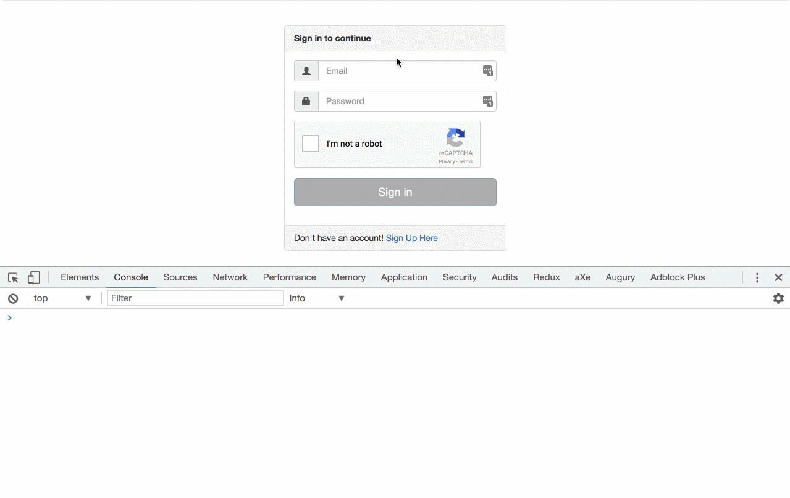

In this article, we are going to implement from scratch a reCAPTCHA directive for Angular applications including the server side with express js. Along the way, we will use features like custom form controls, async validators, zones and other fun stuff.

#### What is reCAPTCHA

reCAPTCHA is a free service that protects your website from spam and abuse.

We will follow the steps from the official [documentation](https://developers.google.com/recaptcha/docs/start). I want the use of the directive to be as transparent as possible to the user, so that will be our final result:

<Embed src="https://gist.github.com/NetanelBasal/8b02403c630a3dc9e0bace7524e66dd2.js" aspectRatio={0.357} caption="" />



### The Client Side

#### Initialization

First, let’s create the directive.

<Embed src="https://gist.github.com/NetanelBasal/752d8beaba0cacab99465f504eb787a7.js" aspectRatio={0.357} caption="" />

We have three inputs, the public key, a config object for which we have defined an interface, and an optional user’s language.

Our next step is to define the `onloadCallback.` This function will get called when all the dependencies have loaded.

Before we do this, let’s create a method that will insert the reCAPTCHA script.

<Embed src="https://gist.github.com/NetanelBasal/303876d2468ba7908c2373eb015adb70.js" aspectRatio={0.357} caption="" />

The code is straightforward. Insert the Javascript resource, setting the `onload` parameter to the name of our `onload` callback function and the `render` parameter to `explicit`.

Now we can implement the `onload` callback (`reCaptchaLoad`).

<Embed src="https://gist.github.com/NetanelBasal/a8622c3990be801eb7c0b7895bee5e02.js" aspectRatio={0.357} caption="" />

When the `onload` callback is executed, we can render the container as a reCAPTCHA widget by calling the `grecaptcha.render()` method with the DOM element and the config object.

#### Type Definitions

At this point, typescript will yell at you because you don’t have type definitions for the `grecaptcha` and the `reCaptchaLoad` objects. A quick fix will be to do the following:

<Embed src="https://gist.github.com/NetanelBasal/355836284b3ea5ca5494a8bd8d434db6.js" aspectRatio={0.357} caption="" />

#### Create Custom Form Control

As you may know, if you want to create custom form control in Angular, you need to implement the `[ControlValueAccessor](https://angular.io/docs/ts/latest/api/forms/index/ControlValueAccessor-interface.html)` interface. I’m not going to go into this topic because it requires an article of its own. You can read more about the subject [here](https://blog.thoughtram.io/angular/2016/07/27/custom-form-controls-in-angular-2.html).

<Embed src="https://gist.github.com/NetanelBasal/6408ab3a89795154069947481b6dd8d3.js" aspectRatio={0.357} caption="" />

We have implemented the three methods that the `ControlValueAccessor` require. In our case, we don’t care about the `writeValue()` method, so we leave it empty.

Now let’s go back for a second. You remember we defined two callbacks in the final `config` object?

```
'callback': this.onSuccess.bind(this),
'expired-callback': this.onExpired.bind(this)
```

`callback` is the name of your callback function to be executed when the user submits a **successful** CAPTCHA response.

`expired-callback` the name of your callback function to be executed when the recaptcha response **expires** and the user needs to solve a new CAPTCHA.

We need to notify the `formControl` that it’s valid if we get the token from the `onSuccess` function or that it’s invalid if the `onExpired` function is called.

<Embed src="https://gist.github.com/NetanelBasal/0afeb6aab33f66045a28be9c64c485bb.js" aspectRatio={0.357} caption="" />

💣, surprise! We come across one of Angular’s _unusual_ cases, in which Angular is unconscious and therefore does not run the change detection. Angular doesn’t know about our global callback. Therefore, we need to wrap our code in the `zone.run()` method.

> Running functions via `run` allows you to reenter Angular zone from a task that was executed outside of the Angular zone

#### Add Validators Programmatically

Remember when I said at first that I wanted everything to be as transparent as possible to the user? This is one of the cases.

We need to add the `required` validation to the form control. We can accomplish this by injecting the `NgControl` into our directive to get the `control` instance.

But there is one problem, we can’t inject the `NgControl` into our directive because we have implemented the directive as a `ControlValueAccessor` and because of that Angular will throw an error:

```
Cannot instantiate cyclic dependency! NgControl
```

We can get around this problem by getting the `NgControl` instance directly from the directive `Injector`.

<Embed src="https://gist.github.com/NetanelBasal/e15fb7a724e08063368857df52a4afaa.js" aspectRatio={0.357} caption="" />

😎 Now we have the control instance and we can add the `required` validator programmatically. We also need to call the `updateValueAndValidity()` method because calling the `setValidators()` doesn’t trigger any update or value change event.

### The Server Side

When the user solves a reCAPTCHA, we also need to verify the token with the Google API to ensure that the token is valid. The required parameters are the secret key and the token. Let’s use `[express](https://expressjs.com/)` for this task.

<Embed src="https://gist.github.com/NetanelBasal/d6a10a825344574c4e9a63c4cbb23f66.js" aspectRatio={0.357} caption="" />

The response will be:

```
{
  "success": true|false,
  "challenge_ts": timestamp,
  "hostname": string
  "error-codes": [...]
}
```

In our case, we only care about the `success` key. Let’s add an async validator that will send the HTTP request to our endpoint with the `token` and will set the `control` status based on the response. I’m going to use the DI for getting the endpoint from our consumer.

<Embed src="https://gist.github.com/NetanelBasal/382015807cfc6b8e320193e82ee00593.js" aspectRatio={0.357} caption="" />

I already wrote a dedicated article on how to implement async validators in Angular, you can find it [here](https://netbasal.com/angular-2-forms-create-async-validator-directive-dd3fd026cb45). In a nutshell, if we have a `success` response we are returning `null` to notify the `control` that it’s `valid` otherwise we are returning the `error` object.

We also need to add the validator to the directive `providers` —

```
@Directive({ 
   selector: '[nbRecaptcha]', 
   providers: [ ReCaptchaAsyncValidator ]
})
```

And to provide the endpoint in our `signin` component —

```
@Component({
  ...
  providers: [{
    provide: RECAPTCHA_URL,
    useValue: 'http://localhost:3000/validate_captcha'
  }]
})
export class SigninComponent { }
```

The last thing is to trigger the validation in our reCAPTCHA directive.

<Embed src="https://gist.github.com/NetanelBasal/009cfb053b5ab6e39610e4b62f692fa8.js" aspectRatio={0.357} caption="" />

When we get a valid token, we need to add the async validator to the `control` validators that will trigger our HTTP request and based on the response will set the control status.

You can find the full source code with a few add-ons, [here](https://gist.github.com/NetanelBasal/f9b91404d92fd3c265cd077e801c2d7f).

_Follow me on_ [_Medium_](https://medium.com/@NetanelBasal/) _or_ [_Twitter_](https://twitter.com/NetanelBasal) _to read more about Angular, Vue and JS!_
