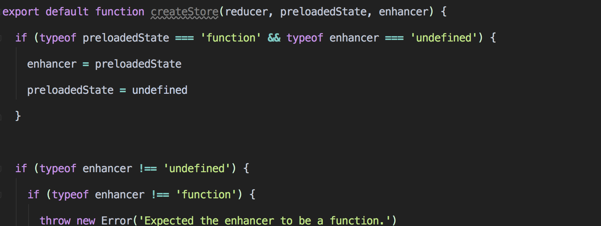
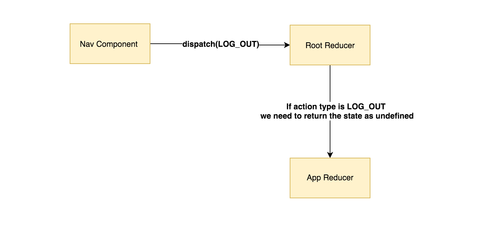

### 👁 The Problem —

There will be times when multiple users will use your application on the same machine.

Imagine that user A logs into your system and receives the data that is only related to him and then logs out.   
After 5 minutes user B logs in and 💣! He still receives the same data as user A.

The situation described above can highly affect your application security especially when you have a caching mechanism to avoid HTTP calls.

_This situation usually will happen in one of the following scenarios:_

1.  _Both of them use the same browser tab, and they didn’t refresh it between the logins._
2.  _They use the same browser, and their data was cached in the local storage._

### 🤔 The Reason—

You **didn’t** clean your store after the `LOG_OUT` action.

### 🤓 The Solution —

Clear your store after the `LOG_OUT` action. Due to the fact that a reducer is just a function, we can implement a globally higher order reducer — “meta reducer”.

The code bellow will work with all redux implementation, including [ngrx/store](https://github.com/ngrx/store) and [angular-redux](https://github.com/angular-redux/ng-redux).

<Embed src="https://gist.github.com/NetanelBasal/1d48a3190956db6ae96d8a1b59c7dd58.js" aspectRatio={0.357} caption="" />

Now your `LOG_OUT` action will return an `undefined` state and therefore all of the reducers will return the initial value as they are supposed to.

_Follow me on_ [_Medium_](https://medium.com/@NetanelBasal/) _or_ [_Twitter_](https://twitter.com/NetanelBasal) _to read more about Angular!_

Thanks to Dan Abramov for this solution.
