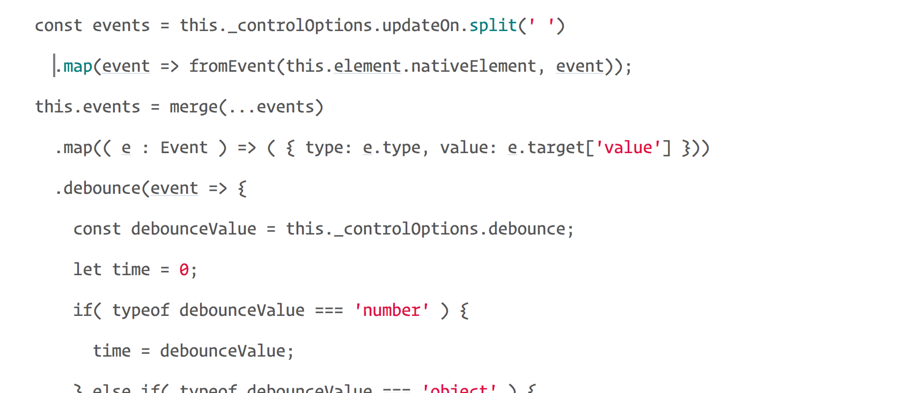
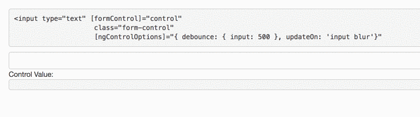

If you’ve worked with AngularJS, you probably remember the `[ng-model-options](https://docs.angularjs.org/api/ng/directive/ngModelOptions)` directive.

The two most useful options in this directive were the `updateOn` and the `debounce` options.

For example, if we wanted to update the model only on blur or add a debounce functionality we could write the following code:

<Embed src="https://gist.github.com/NetanelBasal/a9afb30b36e5553771cf185f298b8506.js" aspectRatio={0.357} caption="" />

Unfortunately, Angular has not implemented this feature in the new version. Let’s try to create our own version of `ng-model-options` in Angular using RxJS and custom form control. We will focus on the two options mentioned above.

### ngControlOptions Directive

Let’s start with the basic template of custom form control. If you are not familiar with creating custom form controls in Angular, you can read my article — [Angular Custom Form Controls Made Easy](https://netbasal.com/angular-custom-form-controls-made-easy-4f963341c8e2).

<Embed src="https://gist.github.com/NetanelBasal/7d7f80dd63af526f5cc273a02613440f.js" aspectRatio={0.357} caption="" />

We are targeting every element with the `formControlName/formControl` and the `ngControlOptions` attributes. (if you are working with `ngModel` ,make sure to add those too).

Our goal is to gain control over the _view->model_ updates, so we need to focus on the `onChange` method which is responsible for this.

We eventually want to achieve the following result:

<Embed src="https://gist.github.com/NetanelBasal/229c95d917d19638e5e365d55c6212d3.js" aspectRatio={0.357} caption="" />

Let’s start with the `ngControlOptions` Input.

<Embed src="https://gist.github.com/NetanelBasal/a38a5514854959e6eac015faa050a40f.js" aspectRatio={0.357} caption="" />

We have a simple `Input` that accepts the options and extends the default ones.

Next, we need to listen to all the events listed in the `updateOn` key and execute the same piece of code when one of them fired. For this task, we will use two handy Rx observables.

`[fromEvent](https://github.com/Reactive-Extensions/RxJS/blob/master/doc/api/core/operators/fromevent.md)` — creates an observable sequence by adding an event listener to the matching DOMElement.  
`[merge](https://github.com/Reactive-Extensions/RxJS/blob/master/doc/api/core/operators/merge.md)` — merges all the observable sequences into a single observable sequence.

<Embed src="https://gist.github.com/NetanelBasal/4ecd2f4fd5534f2f920c0f77918b4294.js" aspectRatio={0.357} caption="" />

Now we just need to take care of the debouncing functionality. We can’t use the `[debounceTime](http://reactivex.io/rxjs/class/es6/Observable.js~Observable.html#instance-method-debounceTime)` operator because we require more control on the timeout duration argument.

Luckily Rx provides the `[debounce](https://github.com/Reactive-Extensions/RxJS/blob/master/doc/api/core/operators/debounce.md)` operator that can also take a `durationSelector` function —

> Selector function to retrieve a sequence indicating the throttle duration for each given element.

<Embed src="https://gist.github.com/NetanelBasal/4fd8f0391102f0073abd7e84b38a7ea3.js" aspectRatio={0.357} caption="" />

We are returning a `[timer](https://github.com/Reactive-Extensions/RxJS/blob/master/doc/api/core/operators/timer.md)` observable that indicates the throttle duration (i.e., the debounce time) based on the `debounce` parameter.

### 🤓 A little improvement

In the above implementation, we always create the `timer`, even if we don’t need the `debounce` functionality. It’s not the end of the world, but we can do better.

We can use the `[let](https://github.com/Reactive-Extensions/RxJS/blob/master/doc/api/core/operators/let.md)` operator to get the whole observable and decide if we need to add the `debounce` functionality to our stream or not.

<Embed src="https://gist.github.com/NetanelBasal/949b19ef99e47c7d0f107636fd726b15.js" aspectRatio={0.357} caption="" />

Much better 💪. You can find the full source code [here](https://gist.github.com/NetanelBasal/8f5dc9fe717929e75e344bf59a163c97).

_Follow me on_ [_Medium_](https://medium.com/@NetanelBasal/) _or_ [_Twitter_](https://twitter.com/NetanelBasal) _to read more about Angular, Vue and JS!_
