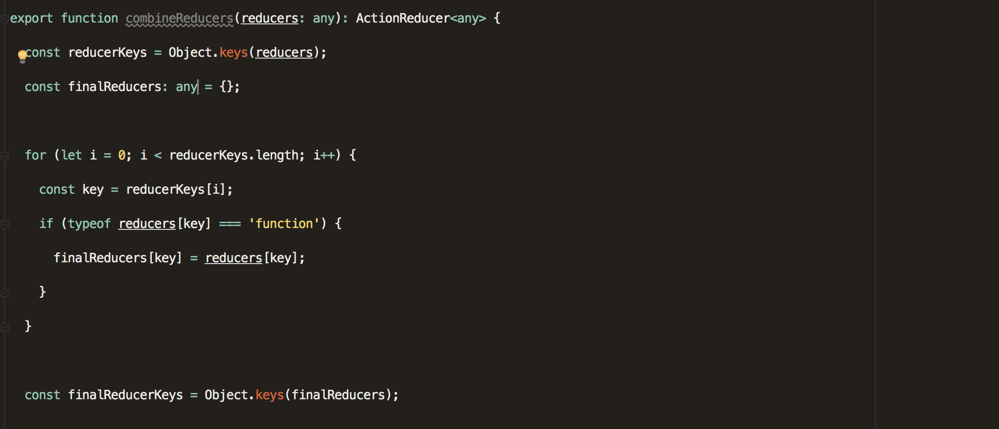
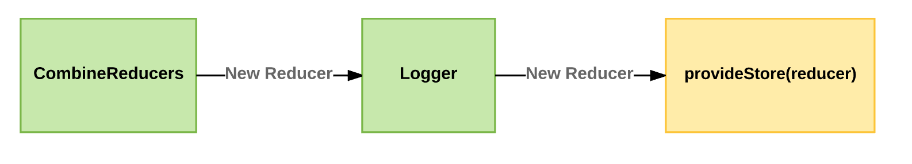
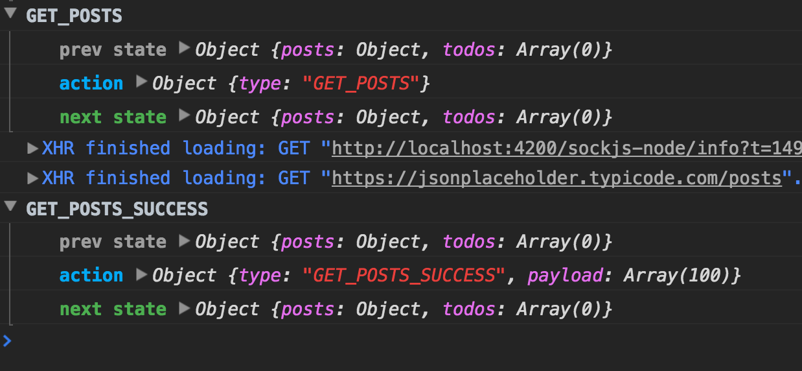
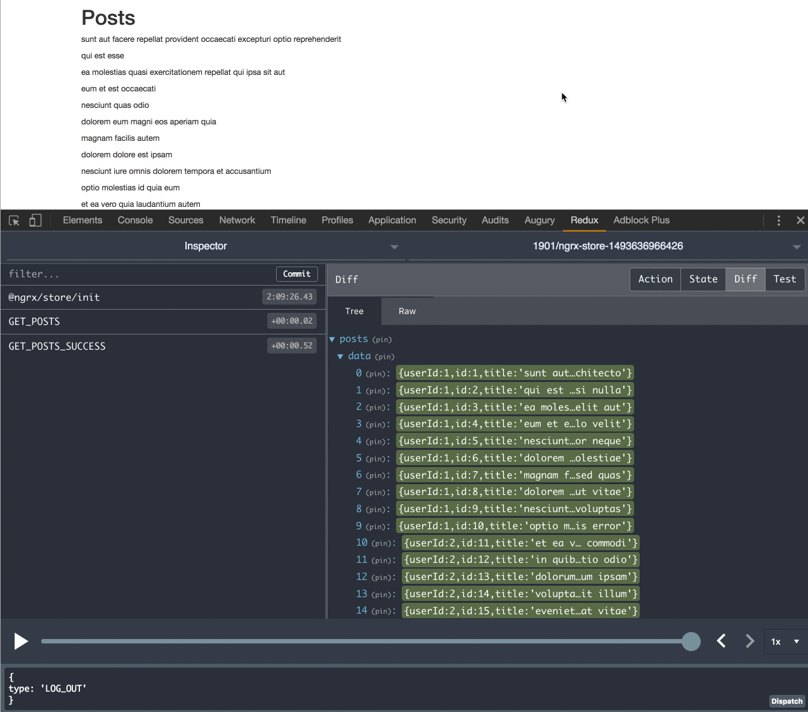

#### You don’t really need middleware

The ngrx team decided that we don’t need middleware anymore, in most cases, we can use meta-reducers to achieve the same effects.

#### What is a meta-reducer?

A meta-reducer is just a fancy name for higher order reducer (i.e., function).

Because a reducer is just a **function**, we can implement higher order reducer — “meta reducer.”

_higher order function_ is a function that may receive a function as parameter or even return a function.

In simple words —

> Take a reducer, do what you need and return a new reducer.

#### Create Logger Meta-Reducer

<Embed src="https://gist.github.com/NetanelBasal/bc98ab94c4b5d6e8e0e67a30bad9eaa4.js" aspectRatio={0.357} caption="" />

This is the basic _signature_ of meta-reducer. The function expects to get a reducer function and needs to return a new reducer.

<Embed src="https://gist.github.com/NetanelBasal/7528d7128d0c806308eca1d2d49d26c5.js" aspectRatio={0.357} caption="" />

The `logger` reducer is just logging the current state, the action, and the next state then we returning the results of the current reducer function (`combineReducers`) without any modification.

Now let’s see how we can add the meta-reducer to our store.

<Embed src="https://gist.github.com/NetanelBasal/97d1d2de33459a3150f707fcdf19ec4e.js" aspectRatio={0.357} caption="" />

First we need to pass the `reducers` to the `combineReducers` function. As you may know, the `combineReducers` will return a _new reducer_ that will call every child reducer, and gathers their results into a single state object.

With the help of the `compose` function we can take the `combineReducers` result ( the new reducer ) and pass it to the `logger` meta-reducer.

If we simplify the `compose` function we will get the following code:

<Embed src="https://gist.github.com/NetanelBasal/bf9a5a9da2a8fc19e30b8f8e37fb1517.js" aspectRatio={0.357} caption="" />

Now let’s see another example. Reset the state when the user logs out.

#### Create Reset Meta-Reducer

We need to [clear](https://netbasal.com/how-to-secure-your-users-data-after-logout-in-redux-30468c6848e8) the store after the `LOG_OUT` action.

<Embed src="https://gist.github.com/NetanelBasal/52500aafba6277730ec58d389f7b82f9.js" aspectRatio={0.357} caption="" />

If the action type is `LOG_OUT` we will return an `undefined` state and therefore all of the reducers will return the initial value as they are supposed to.

Now we can add the `reset` meta-reducer to our store.

<Embed src="https://gist.github.com/NetanelBasal/cdb5281eefb537851acaa29fb11c83d8.js" aspectRatio={0.357} caption="" />

_Follow me on_ [_Medium_](https://medium.com/@NetanelBasal/) _or_ [_Twitter_](https://twitter.com/NetanelBasal) _to read more about Angular!_
