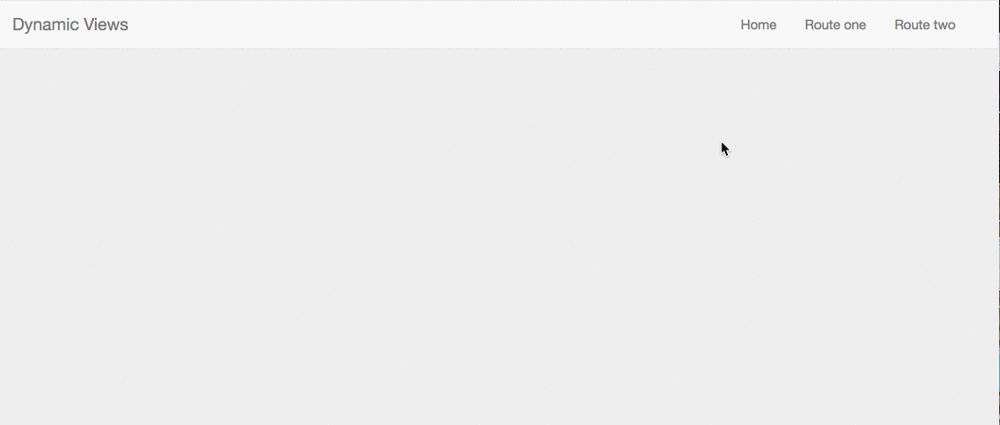
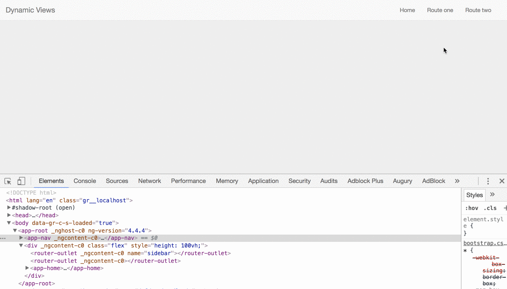

In this article, I will show you how to solve a common problem using the Angular way. Imagine that you have a layout like the following:



You have the main navigation and a sidebar that needs to display different content (in our case, links) based on the current route. Let’s see two ways to tackle this in Angular.

### Auxiliary Routes

You can think of Auxiliary Routes as extra areas for projecting views into the DOM. We have the primary `outlet`, but we can create more `outlets` by giving them a unique name. In our case, we need to create a `sidebar` outlet.

<Embed src="https://gist.github.com/NetanelBasal/841368b2490523801a9559cd808af51d.js" aspectRatio={0.357} caption="" />

Now, we can tell our router which component to render based on the URL. To accomplish this, we need to do two things:

1.  Define the route with the outlet.

<Embed src="https://gist.github.com/NetanelBasal/8f9bcbf2326275895dbf7cae5464105c.js" aspectRatio={0.357} caption="" />

2\. Navigate to the following location:

```
http://website.com/route-one(sidebar:route-one-sidebar)
```

The above syntax activates an Auxiliary route. Let’s break it down.

Inside the parentheses is an auxiliary route. First, we have the name of the outlet to which it refers to: `sidebar`.

Then we have a colon separator followed by the URL that we want to apply to that outlet, in this case `/route-one-sidebar`. This would cause the `RouteOneSidebarComponent` component to render as a sibling to the `sidebar` outlet.

The `RouteOneSidebarComponent` is a simple component with the view that belongs to this route.

<Embed src="https://gist.github.com/NetanelBasal/9b88d0ecd5ffdebd46481158ddb89afa.js" aspectRatio={0.357} caption="" />

You can use the same process to define the remaining routes. For example:

<Embed src="https://gist.github.com/NetanelBasal/92e4397b3ff65127ee7b53964e9227a7.js" aspectRatio={0.357} caption="" />

And the URL for this route will be:

```
http://website.com/route-one(sidebar:route-two-sidebar)
```

You can also use the `routerLink` directive for navigation.

<Embed src="https://gist.github.com/NetanelBasal/1af64b5998ea44db9fb961de9c4e6902.js" aspectRatio={0.357} caption="" />

<Embed src="https://stackblitz.com/edit/angular-router-basic-example-7zmukc?embed=1" aspectRatio={undefined} caption="" />

### Structural Directives

A [Structural](https://netbasal.com/the-power-of-structural-directives-in-angular-bfe4d8c44fb1) directive changes the DOM layout by adding and removing DOM elements. I’ve already written articles that focus on the following topics, so I’m not going to expand.

First, we need to create a `sidebar` component.

<Embed src="https://gist.github.com/NetanelBasal/458553060a64b7831ba971711cf3274a.js" aspectRatio={0.357} caption="" />

We can use the `[ViewChild](https://netbasal.com/understanding-viewchildren-contentchildren-and-querylist-in-angular-896b0c689f6e)` decorator to get a reference to a `[ViewContainerRef](https://netbasal.com/angular-2-understanding-viewcontainerref-acc183f3b682)` where we can inject custom templates/components. We also need to be able to use it in our directive, so it needs to be saved in a service.

Let’s add the `sidebar` component to our application template.

<Embed src="https://gist.github.com/NetanelBasal/454c0e54af37fbe1cf9e8f10fd097e4c.js" aspectRatio={0.357} caption="" />

Next, we need to create the `sidebar` directive.

<Embed src="https://gist.github.com/NetanelBasal/c99578788cbccb4d7f0f3d45df5aef52.js" aspectRatio={0.357} caption="" />

The `SidebarDirective` is a structural directive. We are using the sidebar `ViewContainerRef` to inject the template as a sibling to the `sidebar` container element and then remove it when the component is destroyed.

Now, we can use our directive like this:

<Embed src="https://gist.github.com/NetanelBasal/2c2b2111d29aa70bc53f4f123bbe6420.js" aspectRatio={0.357} caption="" />

<Embed src="https://stackblitz.com/edit/angular-router-basic-example-4ff2mq?embed=1" aspectRatio={undefined} caption="" />

_Follow me on_ [_Medium_](https://medium.com/@NetanelBasal/) _or_ [_Twitter_](https://twitter.com/NetanelBasal) _to read more about Angular, Vue and JS!_
