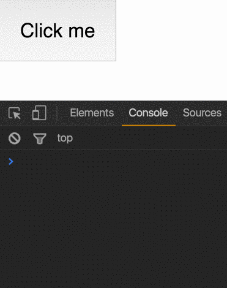
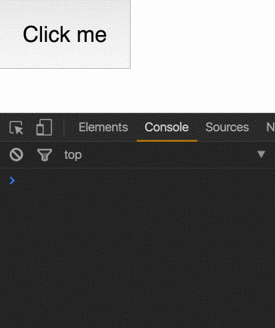

One of my favorite libraries is [Vue](https://vuejs.org/). There’s a cool feature in this library that I want to _steal_ for my Angular projects — Event modifiers.

#### From the Vue documentation —

It is a very common need to call `event.preventDefault()` or `event.stopPropagation()` inside event handlers. Although we can do this easily inside methods, it would be **better** if the methods can be purely about data logic rather than having to deal with DOM event details.

I very much agree with the author, call me crazy, but when I write code like this:

<Embed src="https://gist.github.com/NetanelBasal/0521a2e3d0db544bb97fecd3344e3439.js" aspectRatio={0.357} caption="" />

I want to throw up on the screen. 🙈

_To address this problem, Vue provides event modifiers for v-on. Recall that modifiers are directive postfixes denoted by a dot._

So in Vue you can do this:

<Embed src="https://gist.github.com/NetanelBasal/4cfebc6e9c001f0207fa1df1cec7ca2c.js" aspectRatio={0.357} caption="" />

Let’s implement this in Angular. This will be our final result:

<Embed src="https://gist.github.com/NetanelBasal/30160ac303d8a9430ec5b9d9855a465f.js" aspectRatio={0.357} caption="" />

First, we need to create the directive and inject two things, the `ElementRef` and the `[Renderer](https://netbasal.com/angular-2-explore-the-renderer-service-e43ef673b26c)` service. ( In Angular version 4 you will use `Renderer2` )

<Embed src="https://gist.github.com/NetanelBasal/ac8343f31d3d9045242212a32caa3566.js" aspectRatio={0.357} caption="" />

The next thing that we need is an `Output`. As you may know, you can’t use the _dot notation_ and write something like this:

```
@Output() click.stop = new EventEmitter();
```

The _dot notation_ only works with property names which are valid [**identifier names**](https://mathiasbynens.be/notes/javascript-identifiers)**.**

🙏 Fortunately, `Output` takes an optional parameter that specifies the name used when instantiating a component in the template, or in a simple word — an alias.

```
@Output("click.stop") stopPropEvent = new EventEmitter();
```

When you pass an alias, it’s like using the _bracket notation_ so you can use any character sequence as a property name.

OK, this was the tricky part, the rest should be piece of 🍰.

<Embed src="https://gist.github.com/NetanelBasal/a7b071e86777fd385d1cf9bbd97161f3.js" aspectRatio={0.357} caption="" />

We can register a new click event with the help of the `[Renderer](https://netbasal.com/angular-2-explore-the-renderer-service-e43ef673b26c)` service passing the native element, the event name and handler.

When the user clicks on the element, we call the `stopPropagation()` method and emit the event.

#### Without the directive —



#### With the directive —



**Note:** You can still pass the `$event` and any other data to your handler, it’s the same behavior as the original `(click)` event.

```
<button class="child" (click.stop)="fromChild($event, data)">
   Click me
</button>
```

_Follow me on_ [_Medium_](https://medium.com/@NetanelBasal/) _or_ [_Twitter_](https://twitter.com/NetanelBasal) _to read more about Angular, Vue and JS!_
