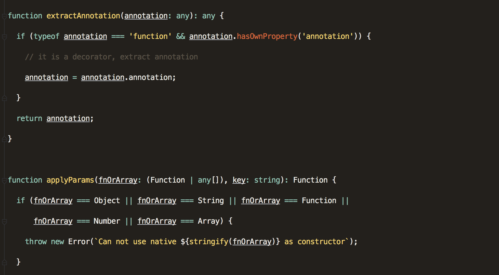
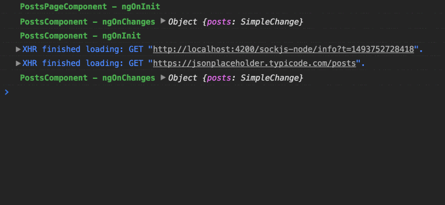
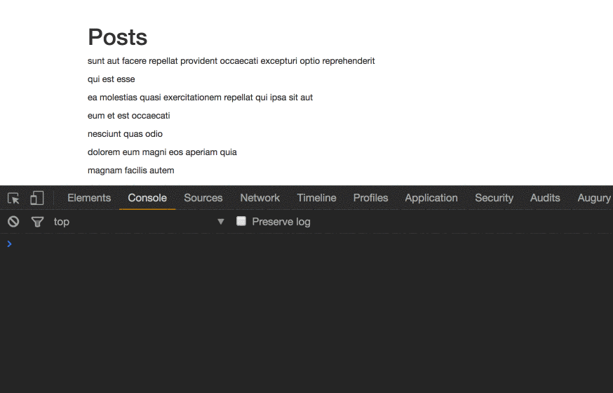
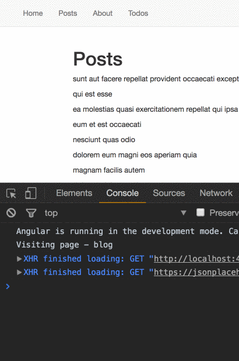
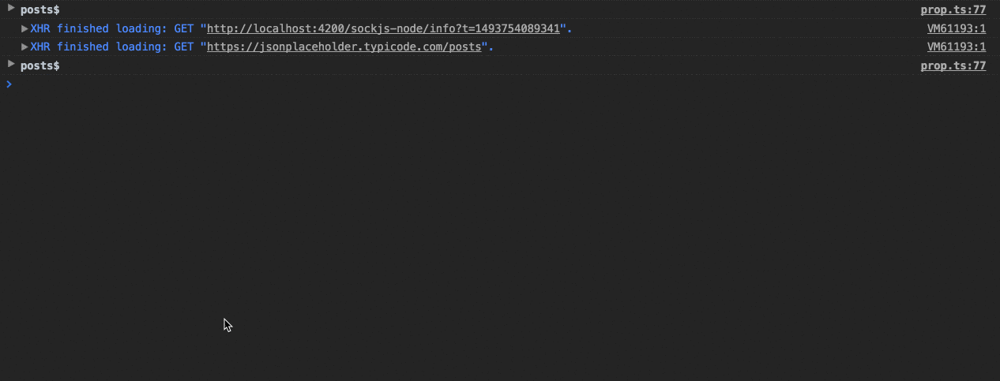

This post assumes that you at least have some working knowledge of Angular and Decorators.

If you have no prior knowledge on the subject, you can read the following articles:

-   [Make your Code Cleaner with Decorators](https://medium.com/front-end-hacking/javascript-make-your-code-cleaner-with-decorators-d34fc72af947)
-   [Automagically Unsubscribe in Angular](https://netbasal.com/automagically-unsubscribe-in-angular-4487e9853a88)
-   [Decorators & metadata reflection in TypeScript: From Novice to Expert](http://blog.wolksoftware.com/decorators-reflection-javascript-typescript)

### NgLog Class Decorator

This decorator will be helpful for debugging purposes. We will log the `ngOnInit`, `ngOnDestroy` and `ngOnChanges` lifecycle hooks.

<Embed src="https://gist.github.com/NetanelBasal/9b949e67c2470d9ccf40c7a6a5cc6879.js" aspectRatio={0.357} caption="" />

We just log the hook and calling the original method. Let’s use the decorator.

<Embed src="https://gist.github.com/NetanelBasal/fc0f546b2df2c0a463aa28b4cd04d4a3.js" aspectRatio={0.357} caption="" />

### Throttle Method Decorator

This decorator will be helpful when working for example with scroll events.

<Embed src="https://gist.github.com/NetanelBasal/db13a56407c76db8fe55d590ca4760c3.js" aspectRatio={0.357} caption="" />

We are using the `[throttle](https://lodash.com/docs/4.17.4#throttle)` helper from `lodash` and replacing the original method with our “throttle” version. Let’s use the decorator.

<Embed src="https://gist.github.com/NetanelBasal/0fcd8ed554c1ae7c9f961766db7465ac.js" aspectRatio={0.357} caption="" />

### Track Page Class Decorator

This decorator will be helpful when you need to report page visits to your analytics provider.

<Embed src="https://gist.github.com/NetanelBasal/50fde8f37b0c04dd991956d6e734fbdc.js" aspectRatio={0.357} caption="" />

Based on the hook we can call the appropriate method from our `Analytics` service then invoke the original method.

<Embed src="https://gist.github.com/NetanelBasal/7d884045e0012237f36652e09fe320d7.js" aspectRatio={0.357} caption="" />

### Log Observable Property Decorator

This decorator will be helpful for debugging purposes. You can also achieve the same thing with a custom operator.

<Embed src="https://gist.github.com/NetanelBasal/e457750f0235adcbead10cd28f609384.js" aspectRatio={0.357} caption="" />

We can get the observable and add the `[do](https://github.com/Reactive-Extensions/RxJS/blob/master/doc/api/core/operators/do.md)` operator to log the value. Based on the value we can choose between `console.table` or `console.log` .

Let’s use the decorator.

<Embed src="https://gist.github.com/NetanelBasal/d07658a3502086fb469d8cba1fcdbb97.js" aspectRatio={0.357} caption="" />

### Conclusion:

You can leverage decorators in your apps and create powerful things with them. Decorators are not only for frameworks or libraries, so be creative and start using them.

_Follow me on_ [_Medium_](https://medium.com/@NetanelBasal/) _or_ [_Twitter_](https://twitter.com/NetanelBasal) _to read more about Angular, JS and Vue._
