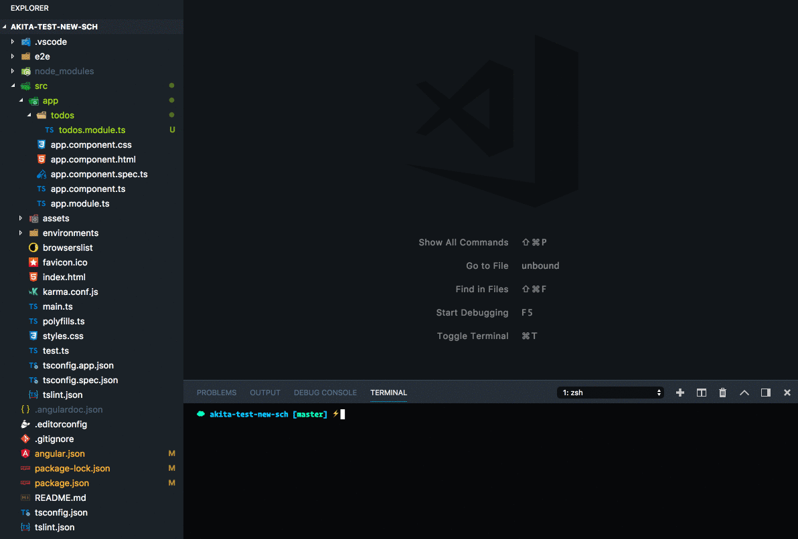

`akita-schematics` provides CLI commands for generating files when building new features with Akita. Built on top of Angular [Schematics](https://blog.angular.io/schematics-an-introduction-dc1dfbc2a2b2), this tool integrates with the Angular [CLI](https://cli.angular.io/).

Whether you want to add Akita to your application or you’re already using it, you can use `schematics` to streamline the generation of Akita features.

### Installation

Install `akita-schematics` from npm:

```
npm install akita-schematics --save-dev
```

### Default Schematics Collection

To use `akita-schematics` as the default collection in your Angular CLI project,  
add it to your `angular.json` file:

```
ng config cli.defaultCollection akita-schematics
```

The `akita-schematics` extends the default `@schematics/angular` collection.

### Create a New Feature

```
ng g akita-schematics:feature todos/todos
```



The default command will output an **entity** based feature, but you can also generate a regular one:

```
ng g akita-schematics:feature todos/todos --plain
```

Note that the `akita-schematics:` prefix is only needed when the default collection isn’t set to `akita-schematics` .

### Generate a Store

```
ng g akita-schematics:store todos
ng g akita-schematics:entity-store todos

Alias:
ng g akita-schematics:as todos
ng g akita-schematics:aes todos
```

### Generate a Query

```
ng g akita-schematics:query todos
ng g akita-schematics:entity-query todos

Alias:
ng g akita-schematics:aq todos
ng g akita-schematics:aeq todos
```

For the full documentation check out the [repo](https://github.com/datorama/akita-schematics).

### Things to not miss:

[**🚀 Introducing Akita: A New State Management Pattern for Angular Applications**  
_Every developer knows state management is difficult. Continuously keeping track of what has been updated, why, and…_netbasal.com](https://netbasal.com/introducing-akita-a-new-state-management-pattern-for-angular-applications-f2f0fab5a8 "https://netbasal.com/introducing-akita-a-new-state-management-pattern-for-angular-applications-f2f0fab5a8")[](https://netbasal.com/introducing-akita-a-new-state-management-pattern-for-angular-applications-f2f0fab5a8)

[**Working with Normalized Data in Akita and Angular**  
_In this article, we’ll build an Angular application which lists movies which arrive from a nested API response. We’ll…_netbasal.com](https://netbasal.com/working-with-normalized-data-in-akita-e626d4c67ca4 "https://netbasal.com/working-with-normalized-data-in-akita-e626d4c67ca4")[](https://netbasal.com/working-with-normalized-data-in-akita-e626d4c67ca4)

[**👷 Building a Shopping Cart in Angular Using Akita**  
_This is the second part of the introduction to Akita (the first part can be found here). In this part, we’ll create…_engineering.datorama.com](https://engineering.datorama.com/building-a-shopping-cart-in-angular-using-akita-c41f6a6f7255 "https://engineering.datorama.com/building-a-shopping-cart-in-angular-using-akita-c41f6a6f7255")[](https://engineering.datorama.com/building-a-shopping-cart-in-angular-using-akita-c41f6a6f7255)

[**The Complete Guide to Authentication in Angular with Akita**  
_Authentication is an essential part of most web applications. These days, the most common way single-page applications…_engineering.datorama.com](https://engineering.datorama.com/the-complete-guide-to-authentication-in-angular-with-akita-dc1b343f7e71 "https://engineering.datorama.com/the-complete-guide-to-authentication-in-angular-with-akita-dc1b343f7e71")[](https://engineering.datorama.com/the-complete-guide-to-authentication-in-angular-with-akita-dc1b343f7e71)
