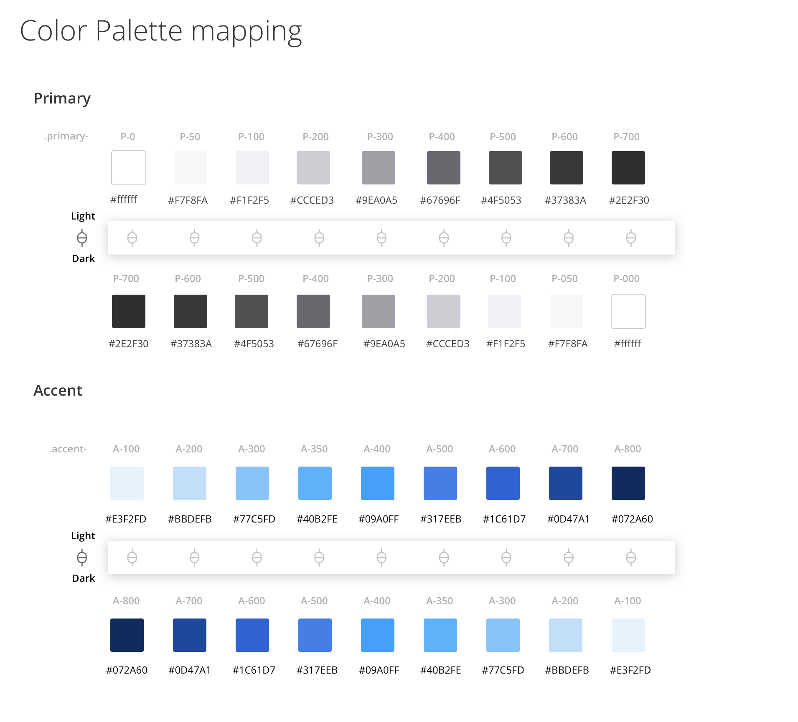
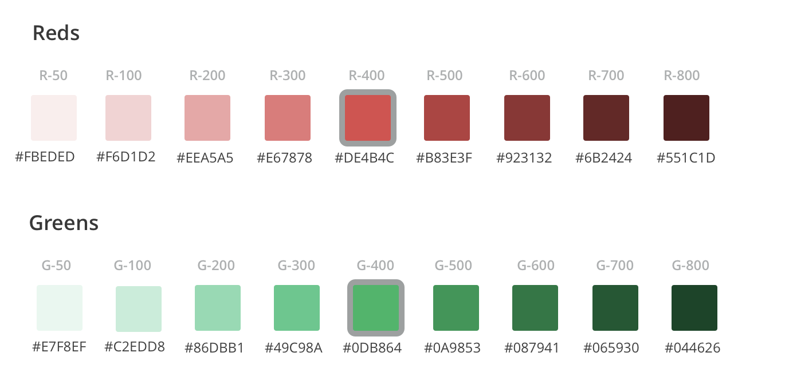

[Themify](https://github.com/datorama/themify) is a new [postcss](https://github.com/postcss/postcss) plugin that generates your application themes during the build phase and lets you manage them in realtime, using a robust solution that’s easily configurable.

Under the hood, themify will replace your CSS colors with CSS variables, and also take care to provide a fallback for unsupported browsers (such as IE11).

#### Here are some of the main features:

-   🖌 Light & Dark palettes — define your themes using a simple JSON format
-   🎨 Replace your colors in runtime — provide your clients with **white-labeling** capabilities. Let them choose their own colors and replace them instantly
-   🏃 Runtime replacement — change the active palette at runtime, either for the entire application or for a specific HTML container
-   🔥 Legacy Browser Support — support for all major browsers including IE11

The main concept behind themify is to provide two palettes, one light and one dark, which resembles the inverse of the light palette.

Let’s look at a real world example from our company’s ([Datorama](https://datorama.com/)) palette.



By using themify and setting the colors of the two palettes, you can provide your clients a light and dark theme with almost no effort.

Let’s see how we can do that.

First, we need to install the library.

```
npm install @datorama/themify
```

Themify supports both webpack and gulp, but for our example we’ll use gulp, just because it’s faster to set up 😆.

<Embed src="https://gist.github.com/NetanelBasal/eebf1f0eab25a3eee83357f654e06cdf.js" aspectRatio={0.357} caption="themify-options" />

We need to provide the palette in a simple JSON format. We also want to support browsers that don’t support CSS variables like IE11, so we set `screwIE11` 😬 to false and provides paths for the fallbacks files.

Next, we need to add themify to our gulp pipeline.

<Embed src="https://gist.github.com/NetanelBasal/c203938047ea6ff62d1ffaae199597fe.js" aspectRatio={0.357} caption="gulpfile.js" />

That’s all the setup we need. Let’s move on to the SCSS usage.

In order to use the themify function and other SASS helpers, you need to import the themify library from your main SASS file:

<Embed src="https://gist.github.com/NetanelBasal/d58c334d17f7c7181071f5af8b13d6fd.js" aspectRatio={0.357} caption="" />

The themify function receives as parameters the name of the color defined in the palette map and an optional opacity parameter. Themify will generate CSS selectors for each palette — one for the light and one for the dark.

For example:

<Embed src="https://gist.github.com/NetanelBasal/b2cfc9372b6527748e73ad56ffa7889b.js" aspectRatio={0.357} caption="" />

The above example will produce the following CSS:

<Embed src="https://gist.github.com/NetanelBasal/2d031e9d1481d64487ef50685928d447.js" aspectRatio={0.357} caption="" />

And the following fallback for IE11:

<Embed src="https://gist.github.com/NetanelBasal/b85d79aa5fe4580439f22f26f970e04c.js" aspectRatio={0.357} caption="" />

#### 👉 But designers will probably want more…

As we all know, designers will not always be satisfied with the idea of the inverse color.

For example, in our application, the designer decided that the colors of the **button** should be the same both in light and dark.


No worries, themify has support for such cases 💪. You can define a specific color for the light version and a specific color for the dark one. For example:

<Embed src="https://gist.github.com/NetanelBasal/bd79315ff90144871513a12fa626a7f5.js" aspectRatio={0.357} caption="" />

Themify supports all CSS properties, gradients, animations, borders, etc.

<Embed src="https://gist.github.com/NetanelBasal/9ab3ff68814e2955a4bee46b503a2f1c.js" aspectRatio={0.357} caption="" />

### 👻 Symbolics

In your application’s colors you probably have static colors that should remain the same no matter which theme is chosen. For example:



We still want to work with the same flow and use the themify function, so we can add them to the light palette and use them like any other variable. For example:

<Embed src="https://gist.github.com/NetanelBasal/dd3d62bdd49c8f76cdcfbe1a39744b2f.js" aspectRatio={0.357} caption="" />

For such variables that are only defined in the light palette, themify will NOT generate a dark version.

### 😇 Theme Class helpers

You can take advantage of your themes not just in your CSS, but also directly in your HTML, by generating a CSS class for each color you define.

In order to achieve this, you can use the `generateThemeHelpers` mixin, passing the CSS properties you want to generate. For example:

<Embed src="https://gist.github.com/NetanelBasal/796ca2d5beaabd0ebe1e43498cb575a1.js" aspectRatio={0.357} caption="" />

The above example will generate the following CSS:

<Embed src="https://gist.github.com/NetanelBasal/d789bb32f2e72c2236a25edfe2889488.js" aspectRatio={0.357} caption="" />

and so on. As you see, you can pass any CSS property, including pseudo classes. See the full list in the [documentation](https://github.com/datorama/themify#theme-class-helpers).

### 🚀 White Label Support

A white label product is a product or service produced by one company (the producer) that other companies (the marketers) [rebrand](https://en.wikipedia.org/wiki/Rebranding "Rebranding") to make it appear as if they had made it. (wikipedia)

For example, if a company like Coca-Cola is one of your clients, they probably would ❤️ to see the colors of your application match their logo colors.

In order to set up this ability you should give your clients a way to set the colors and then you can save the values as a JSON config object. You can do it by exposing a color picker and binding it to each variable, for example.

Once the new colors are defined you can sit back and watch the themify helpers do their magic 🎩.

For example:

<Embed src="https://gist.github.com/NetanelBasal/615155d71ac980e24f0e5687daecadd6.js" aspectRatio={0.357} caption="" />

And call the `setColors()` method with the colors the client chose.

<Embed src="https://gist.github.com/NetanelBasal/0e5dfe9fb1c0bd6c12ce0d7ee4a2bb9f.js" aspectRatio={0.357} caption="" />

That’s all.

Themify is used and developed by Datorama. Feel free to try it, we will love to get your feedback.

💌 Follow us on [medium](https://engineering.datorama.com/) for more goodies.
