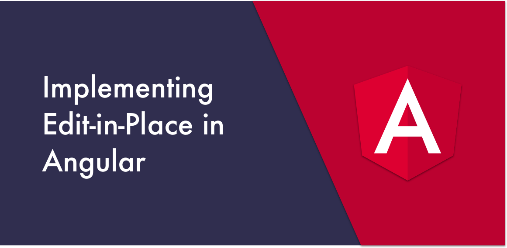
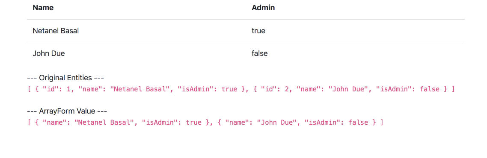

I’ve wanted to write my own edit-in-place implementation for a long time. Luckily, in the last few nights, my kids — the youngster and the newborn — fell asleep early (finally 😅), which gave me some time to experiment with writing it.

In this article, I’ll share with you the solution I came up with. We’ll learn how to write a flexible edit-in-place component and make it work in conjunction with Angular Reactive forms.

In our example, we’ll use a simple HTML table. Whenever a user double-clicks on a cell, we switch to edit mode. There we show a matching control type, giving the user the possibility to edit it. When the cell loses focus, we’ll switch back to view mode, and depending on the control validity, we’ll choose whether to update its value or leave it as-is.

To get the idea of what we’re going to build, here’s an illustration of the final result:

Let’s get started.

First, let’s create mock data so we have something to work with, and then render the table.

<Embed src="https://gist.github.com/NetanelBasal/4189619b6079775bc88b74c2a592bd0f.js" aspectRatio={0.357} caption="" />

We use `ngFor` to iterate over the entities and display each user’s name and whether the user is an admin. Our next step is to create a reactive form presentation of our data.

Since we work with a collection of entities, our best option would be to use a `FormArray` where each element in the array is a `FormGroup` that represents a single entity:

<Embed src="https://gist.github.com/NetanelBasal/4e0da3f5c592c802fdf0cbdb4da40d90.js" aspectRatio={0.357} caption="" />

We iterate over the entities and for each one create a new `FormGroup` which holds two `FormControls`: one for the name property and one for the isAdmin property. We also create a `getControl()` method that receives an entity index and a field name, and returns the form control which corresponds to that entity and its field.

For example, the following code:

<Embed src="https://gist.github.com/NetanelBasal/1583bc21b72c7238a3f5a0e977094ffc.js" aspectRatio={0.357} caption="" />

Returns the name `FormControl` for the second entity. Later, we’ll see how we use it in the template.

Now that we’ve finished with the boring stuff, let’s continue with fun part — creating the edit-in-place component. Your first instinct might be to imagine it would look something like this:

<Embed src="https://gist.github.com/NetanelBasal/cd66efd0dec5df9a501b13aaf8a62b13.js" aspectRatio={0.357} caption="" />

At first glance, this looks accurate. Yes, it could work, but we’re not going down this road for two reasons:

1.  We’d need to expose each one of the internal components’ inputs and events, so our consumers can use it if they need to. For example, if they use a text input type, we must expose its events, like blur, focus, etc.
2.  We’d need to maintain it. I like to give the [open-closed principle](https://en.wikipedia.org/wiki/Open%E2%80%93closed_principle) (part of SOLID design) as a motivation. This principle states:

> “Entities should be open for extension, but closed for modification.”

Or, in our case, **components**. When we say “closed for modification,” we mean we want to be able to change the behavior of a component without modifying that component’s source code. We should always strive to write code that doesn’t have to be changed every time the requirements change.

What if in the future, we’ll need to add a new component type? A switch control for example. To do that, we’ll have to modify the edit-in-place component’s codebase in order to support it; This can lead to side-effects such as unexpectedly breaking the original behavior, and would also require updating the existing specs.

Because of the above reasons, we’ll go with the following markup, which is more flexible and modular:

<Embed src="https://gist.github.com/NetanelBasal/1cd0e5557c3b0092cc1c3f7f5d5798ee.js" aspectRatio={0.357} caption="" />

Let the fun begin 😎

First, we create two structural directives — one responsible for the view mode, and the other responsible for the edit mode:

<Embed src="https://gist.github.com/NetanelBasal/3988b7a83a7f85171e6f01bbfefee411.js" aspectRatio={0.357} caption="" />

They are in charge of exposing a reference to their `TemplateRef`, so that we can access it from the editable parent component. Let’s create that component:

<Embed src="https://gist.github.com/NetanelBasal/821f6767bd88324f01c8446b28c0807c.js" aspectRatio={0.357} caption="" />

We’re using the `ContentChild` decorator to obtain a reference to the `ViewMode` and `EditMode` directives. Then, based on the mode property (which has a default value of `view`), we decide which template should be rendered by the `ngTemplateOutlet` directive.

We also create an `update` output which is emitted whenever an update has occurred.

Let’s continue with the `viewModeHandler()` method implementation:

<Embed src="https://gist.github.com/NetanelBasal/e6e2b656cca285991c22429c717c2243.js" aspectRatio={0.357} caption="" />

We listen to the host’s element `dblclick` event and change the `mode` property to edit, which causes the edit view to be rendered. We also create a `subject` that fires when we change the edit mode. We’ll see in a minute how we use it.

Now, let’s examine the `editModeHandler()` method:

<Embed src="https://gist.github.com/NetanelBasal/c696e5fb292b385170cdbfe43cd62947.js" aspectRatio={0.357} caption="" />

In the first part, we create an observable that fires when we click outside the current element.

We subscribe to the `editMode$` observable. When this observable emits, it means that we’ve entered edit mode and we should activate the `clickOutside$` observable. When the `clickOutside$` observable fires, we emit the update event and switch back to view mode.

This setup will ensure that at all times we have a single event listener for the `document` placed by the component, which isn’t created until the first time we’ve entered edit mode in that component. Now we can use the component:

<Embed src="https://gist.github.com/NetanelBasal/e96b9075a7e6d2aeb1ad49bc0527aa91.js" aspectRatio={0.357} caption="" />

Let’s finish with the `updateField()` method implementation:

<Embed src="https://gist.github.com/NetanelBasal/8c5858e7264760f980e5865459fd5c31.js" aspectRatio={0.357} caption="" />

We check if the control is valid. If it is, we find the corresponding entity based on the index and update its value based on the key. In real life, you’ll probably make a server request, add it to your store, and display to the user an indicator of a successful update.

### 🦊 We Can Do More

At this point, if we switch to edit mode which displays a text input, edit it and press the enter key, nothing will happen. It would be nice to add this functionality to our users.

Our first option is to implement it inside the input element or directive (note that we haven’t created one here, but in your application, you’ll probably have one such as `<app-input>` or `<input appInput>`), however this creates a coupling between the two, and it’s not reusable; therefore, we want to avoid this. We’ll achieve the functionality by using an additional directive:

<Embed src="https://gist.github.com/NetanelBasal/56592f58a93214bda8d7bfdb46ef8ce8.js" aspectRatio={0.357} caption="" />

Nice and clean. The `EditableOnEnterDirective` injects the `EditableComponent` parent and registers an event listener, which calls the component’s `toViewMode()` method whenever the user clicks ‘enter’. Here’s the `toViewMode()` method implementation:

<Embed src="https://gist.github.com/NetanelBasal/73a63a03d989ff8cd8328f58cbb5b5de.js" aspectRatio={0.357} caption="" />

And we’re done. I leave as an exercise to you an additional configuration you can add to the editable component: modify it to allow the component’s consumers the ability to select which event triggers entering into edit mode (click, double-click, right-click, hover, or any custom event they wish).

### 😍 Have You Tried Akita Yet?

One of the leading state management libraries, Akita has been used in countless production environments. It’s constantly developing and improving.

Whether it’s entities arriving from the server or UI state data, Akita has custom-built stores, powerful tools, and tailor-made plugins, which help you manage the data and negate the need for massive amounts of boilerplate code. We/I highly recommend you try it out.

[**🚀 Introducing Akita: A New State Management Pattern for Angular Applications**  
_Every developer knows state management is difficult. Continuously keeping track of what has been updated, why, and…_netbasal.com](https://netbasal.com/introducing-akita-a-new-state-management-pattern-for-angular-applications-f2f0fab5a8 "https://netbasal.com/introducing-akita-a-new-state-management-pattern-for-angular-applications-f2f0fab5a8")

[**Form Fatale: How Akita’s Form Manager Can Do Away with Complex Multistep Form Logic in Angular**  
_Akita’s Angular Form Manager_netbasal.com](https://netbasal.com/form-fatale-how-akitas-form-manager-can-do-away-with-complex-multistep-form-logic-in-angular-329a557cc68 "https://netbasal.com/form-fatale-how-akitas-form-manager-can-do-away-with-complex-multistep-form-logic-in-angular-329a557cc68")

Here’s the final code:

[**Angular demo runner**  
_Online angular editor for building demo._ng-run.com](https://ng-run.com/edit/ITAGsPJhd87XeQwuhaAY?open=app%2Fapp.component.html&layout=1 "https://ng-run.com/edit/ITAGsPJhd87XeQwuhaAY?open=app%2Fapp.component.html&layout=1")

_Follow me on_ [_Medium_](https://medium.com/@NetanelBasal/) _or_ [_Twitter_](https://twitter.com/NetanelBasal) _to read more about Angular, Akita and JS!_
