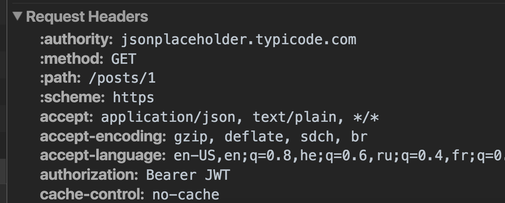

When working with JWT (JSON Web Token) on the client side, you need to send with every request the token to your server. The most common way is to send the token via the `Authorization` header with the Bearer authentication scheme.

Let’s see how we can configure in a single place the `Authorization` header and provide the token with every request in Angular 2.x.x.

First, let’s create simple implementation of the `Auth` service:

<Embed src="https://gist.github.com/NetanelBasal/aba5a09a6fe28c65004c2945cb1b9033.js" aspectRatio={0.357} caption="" />

When you need to add headers to your request you should provide them to the `RequestOptions` object:

```
let options = new RequestOptions({ headers: headers });
this.http.post(url, {}, options)
```

Behind the scenes, Angular uses the `BaseRequestOptions` object to provide the default `RequestOptions`:

```
{ provide: RequestOptions, useClass: BaseRequestOptions }
```

We can take advantage of this and extends the `BaseRequestOptions` to provide **our** default global headers.

From the docs:

> This class could be extended and bound to the RequestOptions class when configuring an Injector, in order to override the default options used by Http to create and send Requests.

Let’s create our own implementation:

<Embed src="https://gist.github.com/NetanelBasal/d392e9d28ff11dddcf796482d3b912da.js" aspectRatio={0.357} caption="" />

<Embed src="https://gist.github.com/NetanelBasal/eec5e40a2297d796c02799ff80b6f999.js" aspectRatio={0.357} caption="" />

Now, when Angular ask for the `RequestOptions` object, Angular will use our implementation.



You can read more about this topic [here](https://angular.io/docs/ts/latest/guide/server-communication.html).

If you don’t understand anything from this article it’s because I’m fucking drunk!

#### Happy New Year!


_☞_ **_Please tap or click “︎_**❤” _to help to promote this piece to others._
