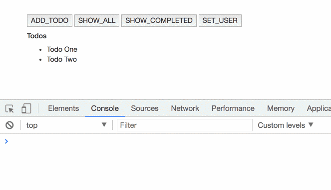
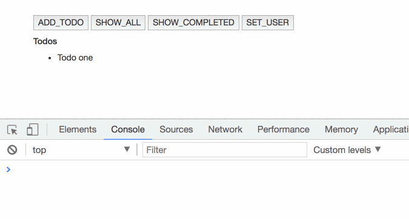
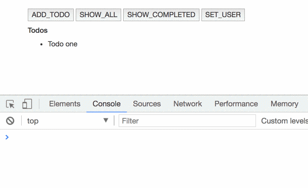

**Recently I released a new state management pattern. You should check it out.**

[**🚀 Introducing Akita: A New State Management Pattern for Angular Applications**  
_Every developer knows state management is difficult. Continuously keeping track of what has been updated, why, and…_netbasal.com](https://netbasal.com/introducing-akita-a-new-state-management-pattern-for-angular-applications-f2f0fab5a8 "https://netbasal.com/introducing-akita-a-new-state-management-pattern-for-angular-applications-f2f0fab5a8")

In this article, we will learn about the `select()` operator and when it is better to use `[reselect](https://github.com/reactjs/reselect)` when querying a normalized state.

Let’s start with a basic example, todos and visibility filter. Say we have a store that looks like this:

<Embed src="https://gist.github.com/NetanelBasal/dd3166424e86bb6b779dfe732b3fc476.js" aspectRatio={0.357} caption="" />

We want to show the user the list of todos according to the selected filter. To accomplish this, we need two things from our store, the selected filter, and all the todos.

Our store is observable, so we can subscribe to it to get the most recent value. Each time the value changes, we can get the new value and update the UI according to the new state.

Let’s start working without the `select()` operator so we can recognize the problem.

<Embed src="https://gist.github.com/NetanelBasal/c9ae17ebb5e9a9fd4e42f2f493d0ee23.js" aspectRatio={0.357} caption="" />

The problem in the above code is that each time the store value changes, we get a new value and the `calcVisibleTodos()` method runs.  
 If we change the current user, our store will change, and the `calcVisibleTodos()` will run **even though the value of the todos or the visibility filter have not changed.**

We only want to run the `calcVisibleTodos()` method if either the todos or the visibility filter changes. That’s where the `select()` operator comes to play.

The `select()` operator gives you an observable that calls `[distinctUntilChanged](https://www.learnrxjs.io/operators/filtering/distinctuntilchanged.html)()` internally, meaning it will **only** fire when the state actually changes. ( a reference check )

Let’s refactor our example to use the `select()` operator mixed with `[combineLatest](https://www.learnrxjs.io/operators/combination/combinelatest.html)`.

<Embed src="https://gist.github.com/NetanelBasal/1b81d22ecb58d8d5d584195bde336207.js" aspectRatio={0.357} caption="" />

In the above case, the selector function ( i.e., `calcVisibleTodos()`) **only** runs if todos or visibility filters change. So, if we change an unrelated part in our state, like the current user, we will see that `calcVisibleTodos()` is not running.

---

Now that we understand the `select()` operator, let’s talk about `reselect` and when it is better to use that.

If you are familiar with the official ngrx [example](https://github.com/ngrx/example-app) repository, you have probably noticed heavy use of the `reselect` library. Let’s look at how we can write the above example with `reselect`.

<Embed src="https://gist.github.com/NetanelBasal/0eaacb7615f057ae4a4d32b030d67c53.js" aspectRatio={0.357} caption="" />

The above code gives you the same result as the `combineLatest` example we just saw.

In both cases, if the reference of `todos` or the `visibilityFilter` does not change, the selector function will NOT run.

At this moment you are likely asking why we need `reselect`. To answer that question, let’s see an example of a normalized state.

<Embed src="https://gist.github.com/NetanelBasal/a154f817023c9098636f75ecbe15997c.js" aspectRatio={0.357} caption="" />

If we want to display the todos list, we first need to denormalized the todos, and then filter the visible todos according to the selected filter.

<Embed src="https://gist.github.com/NetanelBasal/9726f9b1ad679bf5ca3461869289a394.js" aspectRatio={0.357} caption="" />

Imagine that you need to add a new todo. You need to update both the `state.todos.entities` and the `state.todos.result` objects.

Because we need to use `combineLatest`, which will call the selector function if either of the inputs have changed, this will cause the `visibleTodos$` observable to fire **twice** and, as a result, the `calcVisibleTodos()` method will run **twice**.

Now Let’s see the same case with reselect, following the ngrx example pattern.

<Embed src="https://gist.github.com/NetanelBasal/5fa5d5720c2632efb820a2380da19558.js" aspectRatio={0.357} caption="" />

And in our component.

<Embed src="https://gist.github.com/NetanelBasal/2123ceaa943d925721c052bfd6ee22dc.js" aspectRatio={0.357} caption="" />

Because in this case we are using `reselect` and not `combineLatest`, the result is **one** call to the `calcVisibleTodos()` function.

### Summary

We’ve seen that in most cases, using `select()` with `combineLatest` will suffice, but there are special cases like _normalized_ state where `reselect` is a better choice to avoid unnecessary calculations.

I guess the ngrx team went all the way with `reselect` to maintain uniformity, although I find in many cases this is overkill.

_Follow me on_ [_Medium_](https://medium.com/@NetanelBasal/) _or_ [_Twitter_](https://twitter.com/NetanelBasal) _to read more about Angular, Vue and JS!_
