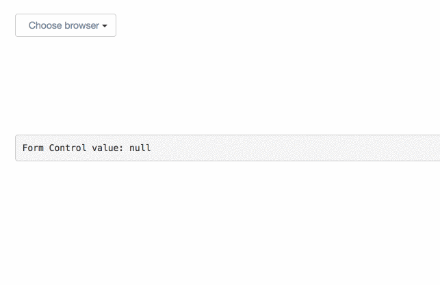

In this article, we’ll learn how to create a powerful drop-down component with the help of structural directives.

Before you start, I highly recommend reading my article — [The Power of Structural Directives in Angular](https://netbasal.com/the-power-of-structural-directives-in-angular-bfe4d8c44fb1).

We aren’t going to waste time on styling. We’ll take the CSS bootstrap [dropdown](http://getbootstrap.com/components/#dropdowns) style.

This will be our final result:

Let’s start with creating the component. I will omit the CSS classes so that we can focus on the important things.

<Embed src="https://gist.github.com/NetanelBasal/5a2989f8ce70c4f554fabcb17d05fad6.js" aspectRatio={0.357} caption="" />

We need a way to inject custom templates from outside one for the selected option and one for each option.

Let’s create two structural directives that will help us with this.

For the selected option:

<Embed src="https://gist.github.com/NetanelBasal/eb39e7ef270f76a89c7ca387107abd86.js" aspectRatio={0.357} caption="" />

For each option:

<Embed src="https://gist.github.com/NetanelBasal/d171f3bd9a3ba32dcb2af81fba9836ee.js" aspectRatio={0.357} caption="" />

Nothing fancy here, we are just injecting the `TemplateRef` in both directives so that we can use them later in the parent component. Notice that in the `NbSelectOptionDirective` we also take as `Input` the option.

Now we can use them in our component.

<Embed src="https://gist.github.com/NetanelBasal/e1784c2f7329d07a0872995176d2b157.js" aspectRatio={0.357} caption="" />

We don’t need additional HTML tags, and that’s why we’re using `[ng-container](https://netbasal.com/getting-to-know-the-ng-container-directive-in-angular-a97b7a33c8ea)`[.](https://netbasal.com/getting-to-know-the-ng-container-directive-in-angular-a97b7a33c8ea) We’ll return soon to the `let-selected` part.

Now let’s get a reference to these directives in the `nb-dropdown` component and render the templates in the appropriate places.

<Embed src="https://gist.github.com/NetanelBasal/48105469a7c3679161129aef4547deb0.js" aspectRatio={0.357} caption="" />

We can use the `@[ContentChild](https://netbasal.com/understanding-viewchildren-contentchildren-and-querylist-in-angular-896b0c689f6e)` and `@[ContentChildren](https://netbasal.com/understanding-viewchildren-contentchildren-and-querylist-in-angular-896b0c689f6e)` decorators to get a reference to the directives instances. Now we can use them in our template.

<Embed src="https://gist.github.com/NetanelBasal/73bf27ed29ae2b1222035bfb1fd2ded9.js" aspectRatio={0.357} caption="" />

We can use the `[ngTemplateOutlet](https://angular.io/docs/ts/latest/api/common/index/NgTemplateOutlet-directive.html)` directive to embed a view from a prepared `TemplateRef` and the `ngOutletContext` input to pass a context to the embedded view ( this is for the `let-selected` part ). We also add an `Input` for a placeholder.

The last thing is to create a custom form control for our component.

<Embed src="https://gist.github.com/NetanelBasal/2f0aea1ff3111108f7145727a8831ee6.js" aspectRatio={0.357} caption="" />

As you may know, if you want to create custom form control in Angular, you need to implement the `[ControlValueAccessor](https://angular.io/docs/ts/latest/api/forms/index/ControlValueAccessor-interface.html)` interface. I’m not going to go into this topic because it requires an article of its own. You can read more about the subject [here](https://netbasal.com/angular-custom-form-controls-made-easy-4f963341c8e2).

Now let’s see the final component but this time we the syntactic sugar syntax.

<Embed src="https://gist.github.com/NetanelBasal/9f8f642c5532a1f5c8d23ad790f64fba.js" aspectRatio={0.357} caption="" />

### Summary

We saw how we could create a powerful component with the help of structural directives. We’ve implemented only the basic of our dropdown, but you can take it from here to do anything that you need.

If you lack an understanding of any part of the article you can find the answer in the article I mentioned at the beginning.

You can play with the code [here](https://plnkr.co/edit/KsVKOO1vpXaTw5DJRqZ6?p=preview).

_Follow me on_ [_Medium_](https://medium.com/@NetanelBasal/) _or_ [_Twitter_](https://twitter.com/NetanelBasal) _to read more about Angular, Akita and JS!_

### 👂🏻 **Last but Not Least, Have you Heard of Akita?**

Akita is a state management pattern that we’ve developed here in Datorama. It’s been successfully used in a big data production environment for over seven months, and we’re continually adding features to it.

Akita encourages simplicity. It saves you the hassle of creating boilerplate code and offers powerful tools with a moderate learning curve, suitable for both experienced and inexperienced developers alike.

I highly recommend checking it out.

[**🚀 Introducing Akita: A New State Management Pattern for Angular Applications**  
_Every developer knows state management is difficult. Continuously keeping track of what has been updated, why, and…_netbasal.com](https://netbasal.com/introducing-akita-a-new-state-management-pattern-for-angular-applications-f2f0fab5a8 "https://netbasal.com/introducing-akita-a-new-state-management-pattern-for-angular-applications-f2f0fab5a8")
