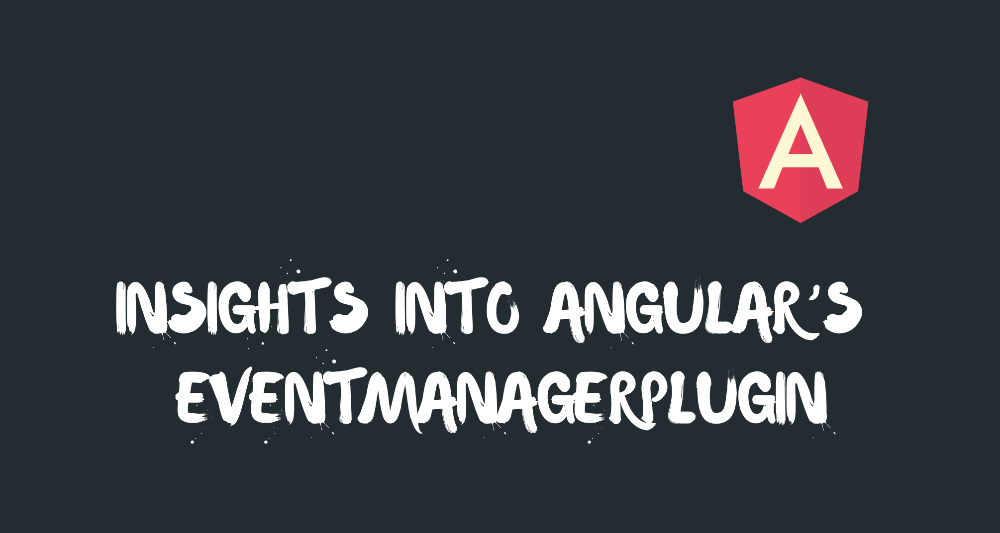

In this article, I will walk you through the steps of extending the Angular events system and providing your own custom events. But first we need to understand how Angular manages events.

When we add an event by using one of the following methods:

1.  Register it on to the template by using [Angular event bindings](https://angular.io/guide/template-syntax#event-binding)
2.  Using the `HostListener()` decorator

Angular calls the Renderer `[listen()](https://github.com/angular/angular/blob/master/packages/platform-browser/src/dom/dom_renderer.ts#L220)` method. Let’s see what this method does:

<Embed src="https://gist.github.com/NetanelBasal/3314195bd1b6c2a7b32d1d36ec73add2.js" aspectRatio={0.357} caption="" />

We can see that it actually delegates the event registration to something called the `eventManager`. The `EventManager` is an injectable service that provides event management for Angular through a browser plug-in.

A plugin is just an object that needs to implement two methods:

1.  `supports()` — This method determines if this plugin should handle the current event. It receives the event name and should return a boolean.
2.  `addEventListener()`— The function that will be called when Angular registers the event. This function accepts three arguments — the target element, the event name, and the handler function. This method should return a disposable function that will be called when Angular removes the element from the DOM.

There is also an optional third method called `addGlobalEventListener()` that is used when Angular should handle events on global elements, for example, `(window:scroll)`.

In order to register a plugin, we need to provide it via DI to the `EVENT_MANAGER_PLUGINS` provider:

<Embed src="https://gist.github.com/NetanelBasal/a3a2cf9a5ccc8a99cdc7ea16ddc59da8.js" aspectRatio={0.357} caption="" />

Angular uses the multi-option to support multiple plugins. If we take a look at the Angular source code, we’ll see that Angular already comes with a couple of built-in plugins that handle common events we’re all familiar with. For example — `[KeyEventsPlugin](https://github.com/angular/angular/blob/f8096d499324cf0961f092944bbaedd05364eea1/packages/platform-browser/src/dom/events/key_events.ts)`.

Now that we understand the basics, let’s examine the `[EventManager](https://github.com/angular/angular/blob/master/packages/platform-browser/src/dom/events/event_manager.ts)` functionality:

<Embed src="https://gist.github.com/NetanelBasal/4dff6419ee58c90f33b76c9cba54e8dd.js" aspectRatio={0.357} caption="" />

We can learn few things from the code above. First, Angular sets the `manager` property on runtime so we can use it in our plugin to retrieve the compilation zone in which event listeners are registered (later, we’ll see how we use it).

Next, Angular reverses the plugin order. (Yes, you know why).

Finally, the `addEventListener()` searches for a matching plugin and delegates the work to it. Let’s understand the `[_findPluginFor()](https://github.com/angular/angular/blob/master/packages/platform-browser/src/dom/events/event_manager.ts#L74)` method:

<Embed src="https://gist.github.com/NetanelBasal/f3f2ccd46410e2467e3a97e94a0d1e39.js" aspectRatio={0.357} caption="" />

The `_findPluginFor()` method retrieves the registered plugins from the `EVENT_MANAGER_PLUGINS` provider, searches through them by calling their `supports()` method, passing on the event name to find a plugin that supports this type of event.

When a valid plugin is found, the manager uses that plugin’s version of `addEventListener()`; otherwise, it throws an error.

And that’s all there is to it. Now, let’s review some useful examples for creating our own plugins. Say we want to add the functionality to `debounce` or `throttle` events.

For example, we want to provide the following functionality:

<Embed src="https://gist.github.com/NetanelBasal/84a085746e9db9f9063ffff8b0551868.js" aspectRatio={0.357} caption="" />

Let’s create a `DeferEventsPlugin`. (I know, you can choose a better name)

<Embed src="https://gist.github.com/NetanelBasal/d24d6eaec1c276a746e88fabf4edada8.js" aspectRatio={0.357} caption="" />

As we learned before, we need to implement the `supports()` method that in our case, tests if the event name contains the words `throttle` or `debounce`. If it does, Angular will invoke our plugin’s `addEventListener()` implementation.

Next, we register an event based on the `method` name, returning a function that when called, removes the event to prevent memory leaks.

Pay attention to the optimization we introduce here. The only code that runs inside the Angular zone is the handler that will be invoked by the `debounce` or `throttle` methods.

I will leave the `addGlobalEventListener()` implementation to you.

---

Let me give you some more ideas for plugins. I’ve already [written](https://netbasal.com/angular-2-escape-from-change-detection-317b3b44906b) about creating the functionality to run events outside the Angular zone by creating a directive, but we can also easily achieve this with a custom event plugin, for example:

<Embed src="https://gist.github.com/NetanelBasal/1fa52a388d4b8dd507b75fb7465fd68b.js" aspectRatio={0.357} caption="" />

Let’s finish by implementing the event delegation pattern. We can register one event listener at the document level and target the current element. Btw, if I remember correctly, that’s a pattern used by React. Here’s a pseudo-code that will give you this kind of functionality for `click` events:

<Embed src="https://gist.github.com/NetanelBasal/16b0a6386648f3c77ed8f7b927d94bea.js" aspectRatio={0.357} caption="" />

And we can use it like the that:

<Embed src="https://gist.github.com/NetanelBasal/0e1444e3a257e55da48d7d7727bc5409.js" aspectRatio={0.357} caption="" />

Note that I’m using POJO for brevity. That’s all.

### **🙀 Last but Not Least, Have you Heard of Akita?**

Akita is a state management pattern that we’ve developed here in Datorama. It’s been successfully used in a big data production environment, and we’re continually adding features to it.

Akita encourages simplicity. It saves you the hassle of creating boilerplate code and offers powerful tools with a moderate learning curve, suitable for both experienced and inexperienced developers alike.

I highly recommend checking it out.

[**🚀 Introducing Akita: A New State Management Pattern for Angular Applications**  
_Every developer knows state management is difficult. Continuously keeping track of what has been updated, why, and…_netbasal.com](https://netbasal.com/introducing-akita-a-new-state-management-pattern-for-angular-applications-f2f0fab5a8 "https://netbasal.com/introducing-akita-a-new-state-management-pattern-for-angular-applications-f2f0fab5a8")

_Follow me on_ [_Medium_](https://medium.com/@NetanelBasal/) _or_ [_Twitter_](https://twitter.com/NetanelBasal) _to read more about Angular, Akita and JS!_
