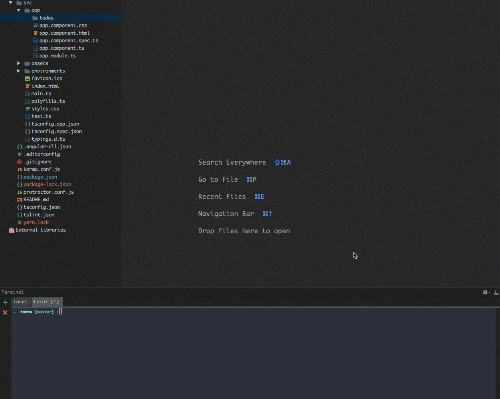

### The Problem

You need to run some code after a particular action has been fired.

For example, you want to reset a form after the `ADD_STORY_SUCCESS` action has been fired.

### The Solutions

#### 🤖 Add New Key

Add one more key to your state.

```
{
  isSuccess: boolean
}
```

Then you can listen to changes like this:

```
this.store.select(state => state.story.isSuccess)
         .filter(v => !!v)
         .subscribe(() => this.form.reset())
```

I do not like this solution because I have to maintain another `key` in my store and every time worry about resetting it.

#### 🙄 Subscribe to Effect

If you are working with `[ngrx/effects](https://github.com/ngrx/effects)` you can inject the `effect` into your component and subscribe to him.

For example:

```
@Effect() addStory$ = this.actions$
  .ofType('ADD_STORY')
  .switchMap(action => this.storyService.add(action.payload)
    .map(story => ({
      type: 'ADD_STORY_SUCCESS'
    }))
  )
```

Then in your component:

```
constructor( private storyEffects : StoryEffects) {}

storyEffects.addStory$
        .filter(action => action.type === 'ADD_STORY_SUCCESS')
        .subscribe(res => this.form.reset());
```

There are two dilemmas with this approach:

1.  Maybe you do not work with `[ngrx/effects](https://github.com/ngrx/effects)`.

2\. You need to use the `[share](https://github.com/Reactive-Extensions/RxJS/blob/master/doc/api/core/operators/share.md)` operator. Otherwise, you will have two subscriptions. (i.e., two HTTP calls in this case)

```
@Effect() addStory$ = this.actions$
  .ofType('ADD_STORY')
  .switchMap(action => this.postsService.add(action.payload)
    .map(story => ({
      type: 'ADD_STORY_SUCCESS'
    }))
  ).share()
```

#### 💪 Subscribe to the Dispatcher

You may not know that, but every action goes through a service called `Dispatcher`. The Dispatcher is a `Subject` which means it is observable.

If we want to be notified when actions are fired, we can subscribe to the `Dispatcher` in our component.

```
constructor(private dispatcher: Dispatcher) {}

dispatcher.filter(action => action.type === 'ADD_STORY_SUCCESS')
          .subscribe(() => this.form.reset())
```

I took a step further and created a more comfortable syntax.

```
@Injectable()
export class AppActions {
  _actions = new Subject<Action>();

  ofType( type : string ) {
    return this._actions.filter(( action : Action )
       => action.type === type);
  }

  nextAction( action : Action ) {
    this._actions.next(action);
  }

}

@Injectable()
export class MyDispacther extends Dispatcher {
  constructor( private actions: AppActions ) {
    super();
  }

  next( action: Action ) {
    super.next(action);
    this.actions.nextAction(action);
  }
}
```

I am extending the original `Dispatcher` and using a new `Subject` to create a slightly cleaner syntax.

We also need to tell Angular to use our `Dispatcher` instead of the original.

```
providers: [{ provide: Dispatcher, useClass: MyDispacther }]
```

Now in our component we can write the following code:

```
constructor( private actions : AppActions) {}

actions.ofType('ADD_STORY_SUCCESS')
       .subscribe(() => this.form.reset())
```

We will see in a future article, how it can help us when I talk about connecting your forms to `ngrx/store`.

### [ngrx-generator](https://github.com/NetanelBasal/ngrx-generator/)

On this occasion, I would like to present you with a new tool that I have been working on lately that will save you the headache of all the Redux boilerplate.



_Follow me on_ [_Medium_](https://medium.com/@NetanelBasal/) _or_ [_Twitter_](https://twitter.com/NetanelBasal) _to read more about Angular, Vue and JS!_
