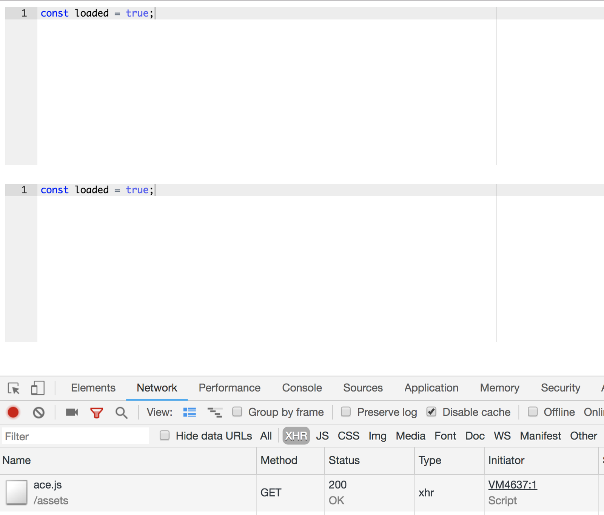

In one of my [previous](https://netbasal.com/using-typescript-dynamic-imports-in-angular-d210547484dd) articles, I showed how to load ECMAScript modules on demand using the typescript `import()` function.

Although in most cases you can make do by using this functionality, there are still cases where you’ll need to use an old library that doesn’t supports JS modules.

### Real World Use Case

For example, in one of my most recent projects, I was required to add the [ace](https://ace.c9.io/) editor. It would be a waste to add the library to our initial bundle, because each client would have to download and parse it, even though he probably wouldn’t have cause to use it.

A better course of action would be to lazy load this library when the user initiates an action or navigates to a state where the library is required.

Let’s see how we can do this.

### Create the Directive

We’ll create a directive that will load the ace library from the `/assets` folder and initialize it.

<Embed src="https://gist.github.com/NetanelBasal/f5d87afc7b73d83f613010a09b8979ad.js" aspectRatio={0.357} caption="" />

Let’s take a look at the `waitForAce()` method implementation:

<Embed src="https://gist.github.com/NetanelBasal/56b2ad05e9d3a3efc6508a872046fcc2.js" aspectRatio={0.357} caption="" />

It’s time to leverage the power of RxJS to help us handle three occurrences:

1.  The first request made in order to load the ace library and inject the source code into the page.
2.  Subsequent requests, which might occur if we have multiple instances of the same directive. In this case, we need to know that a request has already been made and poll until we discover that ace has been defined.
3.  Ace has been defined.

Note that I prefer the usage of `timer(0)` instead of the `of()` observable as I want to be consistent and always return an asynchronous response.

#Tip: If you prefer using [repetitive](http://reallifejs.com/brainchunks/repeated-events-timeout-or-interval/) timers you can change the `interval` to this:

<Embed src="https://gist.github.com/NetanelBasal/6164280a4a8798b277c38498d8e0f977.js" aspectRatio={0.357} caption="" />

A nice improvement as suggested in the comments is to run the interval outside the Angular zone.

Another approach suggested by [Alexey Zuev](https://medium.com/@a.yurich.zuev) is to use a `[ReplaySubject](https://netbasal.com/rxjs-subjects-for-human-beings-7807818d4e4d)` subject.

<Embed src="https://gist.github.com/alexzuza/55f1c7567a0fede48403a5a791661bb7.js" aspectRatio={0.357} caption="" />

That’s it. Open the network tab and you should see that ace was loaded on demand.

You can also add a nice loading indicator by using the [ngx-content-loader](https://github.com/NetanelBasal/ngx-content-loader) library.

> Progress isn’t made by early risers. It’s made by lazy men trying to find easier ways to do something

> \- Robert Heinlein

### 🔥 **Last but Not Least, Have you Heard of Akita?**

Akita is a state management pattern that we’ve developed here in Datorama. It’s been successfully used in a big data production environment and we’re continually adding features to it.

Akita encourages simplicity. It saves you the hassle of creating boilerplate code and offers powerful tools with a moderate learning curve, suitable for both experienced and inexperienced developers alike.

I highly recommend checking it out.

[**🚀 Introducing Akita: A New State Management Pattern for Angular Applications**  
_Every developer knows state management is difficult. Continuously keeping track of what has been updated, why, and…_netbasal.com](https://netbasal.com/introducing-akita-a-new-state-management-pattern-for-angular-applications-f2f0fab5a8 "https://netbasal.com/introducing-akita-a-new-state-management-pattern-for-angular-applications-f2f0fab5a8")

_Follow me on_ [_Medium_](https://medium.com/@NetanelBasal/) _or_ [_Twitter_](https://twitter.com/NetanelBasal) _to read more about Angular, Akita and JS!_
