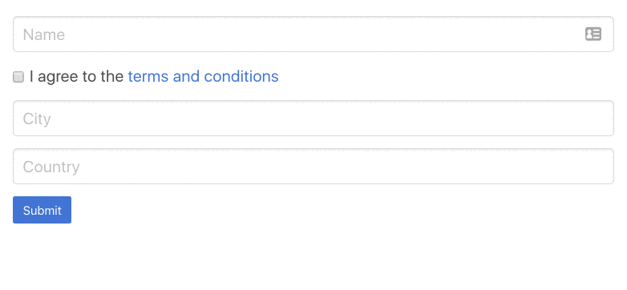

In this article, we’re going to learn how to develop a generic method that displays validation errors in Angular’s form. I will walk you through the process and ideas behind the decisions I made along the way.

As always, to get a taste of what I’m talking about, let’s first take a look at a nice visualization of the final result:

Let’s get started.

First, we need to create a directive. We want to prevent consumers from adding specific selectors to apply our directive, so we take advantage of existing selectors and target them.

<Embed src="https://gist.github.com/NetanelBasal/487c6cd31ebb8d873ed986ecf4ae04b7.js" aspectRatio={0.357} caption="" />

Next, we must obtain a reference to the current control instance in our directive. Luckily, Angular has simplified the process and [provides](https://github.com/angular/angular/blob/master/packages/forms/src/directives/reactive_directives/form_control_name.ts#L25) the injectable — `NgControl`.

<Embed src="https://gist.github.com/NetanelBasal/12ae4c1f17ee4602c58f24791fd0c9c3.js" aspectRatio={0.357} caption="" />

Great, we have the control instance. Now, our goal is to display an error only when the user begins to interact with the field. To do so, we can use the control’s `valueChanges` observable.

<Embed src="https://gist.github.com/NetanelBasal/672e191976dd0a07d2f55602397d9031.js" aspectRatio={0.357} caption="" />

Before we continue, we need to provide an error map. The `key` will be the error name and the `value` the text that will be displayed to the user. We don’t want to repeat this in each control, as the texts will likely be the same for each control. So instead, we’ll provide this via DI.

<Embed src="https://gist.github.com/NetanelBasal/efa9f022b396d9e12a88d78d8147ee66.js" aspectRatio={0.357} caption="form-errors.provider" />

Note that we’re also bypassing the `error` object for more advanced errors. Now that we have the errors, let’s continue with the directive implementation.

<Embed src="https://gist.github.com/NetanelBasal/739f75bd9fd722c4c0a8868f415ff42e.js" aspectRatio={0.357} caption="" />

We’re checking to see if the `control` contains errors. If it does, we grab the first error and find the error text we need to display.

Before we continue and learn how to display the error text, we’re still missing one crucial thing. Currently, we’re showing errors only if the user interacts with the fields. But what will happen if the user clicks on the submit button without any interaction? We need to support this as well by showing errors upon submit. Let’s see how can we do that.

Again, we’ll leverage directives and CSS selectors to expose a stream via a submitting action.

<Embed src="https://gist.github.com/NetanelBasal/e4b2c2f1ecf477b6b727021e0a6c14a2.js" aspectRatio={0.357} caption="" />

The directive is straight-forward. It targets any form in our application and exposes the `submit$` observable. In real life you’ll probably choose a more specific selector, like `form[appForm]`. We’re also using the `shareReplay()` operator, as we always want to create one event listener and not one per control.

Let’s use it in our directive.

<Embed src="https://gist.github.com/NetanelBasal/379789808b210410f094d89e6545f5ff.js" aspectRatio={0.357} caption="" />

First, we ask for Angular’s DI to provide us with a reference to the directive. We mark this directive as `Optional()`, because we also want to support **standalone controls** that don’t exist within a form tag. In such a case, we’re using the `EMPTY` observable that doesn’t do anything and immediately completes.

Ok, now that we’ve obtained the error text, how should we show it to our users? Your initial instinct will probably be to use the native JS API, create a new element, append the text, etc. But, I don’t recommend this, as the code won’t scale.

A better option would be to use Angular, and I will explain why in a minute. Let’s create a component we’ll use in order to show the text.

<Embed src="https://gist.github.com/NetanelBasal/6701de057afc6f39c4f77f5e926abe6f.js" aspectRatio={0.357} caption="control-error.component.ts" />

We’ve created a simple component that takes a text and displays it with proper error styles. The component also applies a display `none` rule if the error text is `null`. Now, let’s render the component in our directive.

<Embed src="https://gist.github.com/NetanelBasal/d6322e2a4473c73a36fdbf693709e9cd.js" aspectRatio={0.357} caption="" />

This first time we’re inside the error handler, we create the component dynamically and set the current text error. If you’re not familiar with creating dynamic components in Angular, I recommend reading one of my [previous](https://netbasal.com/dynamically-creating-components-with-angular-a7346f4a982d) articles: Dynamically Creating Components with Angular.

As I mentioned before, the benefits of using Angular are that (1) we don’t need to clean the DOM by ourselves, but more importantly, (2) we have Angular’s power. Imagine you need to add a tooltip to the error message (`[appTooltip]` directive) or you want to give consumers the ability to override the default component template and provide a custom template (`*ngTemplateOutlet`). **The possibilities are endless.**

Ok, we’re almost there. But our code is still not flexible enough, as we’re limiting the error component to always render as a _sibling_ to our host element, and there will be cases where we don’t want this behavior.

We need to be able to provide a different parent element that will act as our container. Again, directives to the rescue.

<Embed src="https://gist.github.com/NetanelBasal/6ef070ae2045f3bede1bc86b4af5e7de.js" aspectRatio={0.357} caption="control-error.container.ts" />

Yes, That’s about all. The only thing that we need now is a reference to the host `ViewContainerRef`. Let’s use it in our directive.

<Embed src="https://gist.github.com/NetanelBasal/eeb30f21d2f0df608479a7b94a40b8db.js" aspectRatio={0.357} caption="" />

If someone declares the `controlErrorContainer`, we use his container; otherwise we’ll use the current host container.

**Note:** I will use it with caution as it may lead to undesired results. I’ll let you think about why.

Let’s finish by adding the input’s error style. To achieve this, we’ll simply add a `submitted` class to our form and use only CSS.

<Embed src="https://gist.github.com/NetanelBasal/d7783402ee2016da7d7fc3815415c406.js" aspectRatio={0.357} caption="" />

And our CSS will be:

<Embed src="https://gist.github.com/NetanelBasal/9615a214ca3a94377865435fcbb5f74a.js" aspectRatio={0.357} caption="" />

That way we cover both the dirty and the submit behavior.

### Bonus

Currently, our directive supports only `formControl`, but we can easily add support for both `formGroup` and `formArray` by optionally injecting the `ControlContainer` [provider](https://github.com/angular/angular/blob/master/packages/forms/src/directives/reactive_directives/form_group_directive.ts#L20) that provides a reference to the current form group/array instance and using it as the control instance (if it exists).

Also, in the final demo, you can see support for custom local errors via `input`.

### Summary

We learned how to utilize the power of directives in Angular to create a clean form validation errors implementation. We also discussed why you should use Angular’s API so your code can easily scale.

### 🔥 **Last but Not Least, Have you Heard of Akita?**

Akita is a state management pattern that we’ve developed here in Datorama. It’s been successfully used in a big data production environment, and we’re continually adding features to it.

Akita encourages simplicity. It saves you the hassle of creating boilerplate code and offers powerful tools with a moderate learning curve, suitable for both experienced and inexperienced developers alike.

I highly recommend checking it out.

[**🚀 Introducing Akita: A New State Management Pattern for Angular Applications**  
_Every developer knows state management is difficult. Continuously keeping track of what has been updated, why, and…_netbasal.com](https://netbasal.com/introducing-akita-a-new-state-management-pattern-for-angular-applications-f2f0fab5a8 "https://netbasal.com/introducing-akita-a-new-state-management-pattern-for-angular-applications-f2f0fab5a8")

<Embed src="https://stackblitz.com/edit/netanel-control-er?embed=1" aspectRatio={undefined} caption="" />

_Follow me on_ [_Medium_](https://medium.com/@NetanelBasal/) _or_ [_Twitter_](https://twitter.com/NetanelBasal) _to read more about Angular, Akita and JS!_
