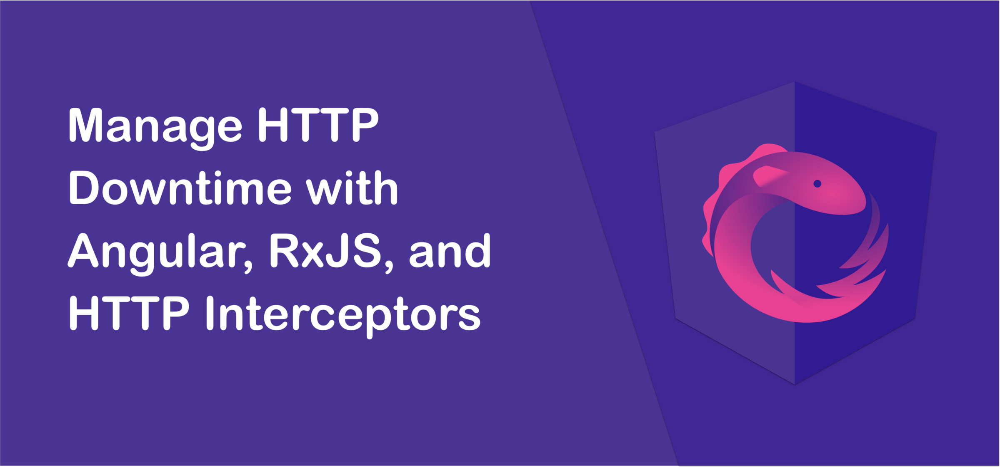
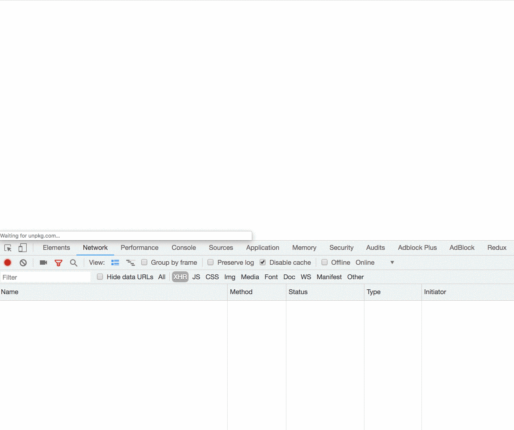
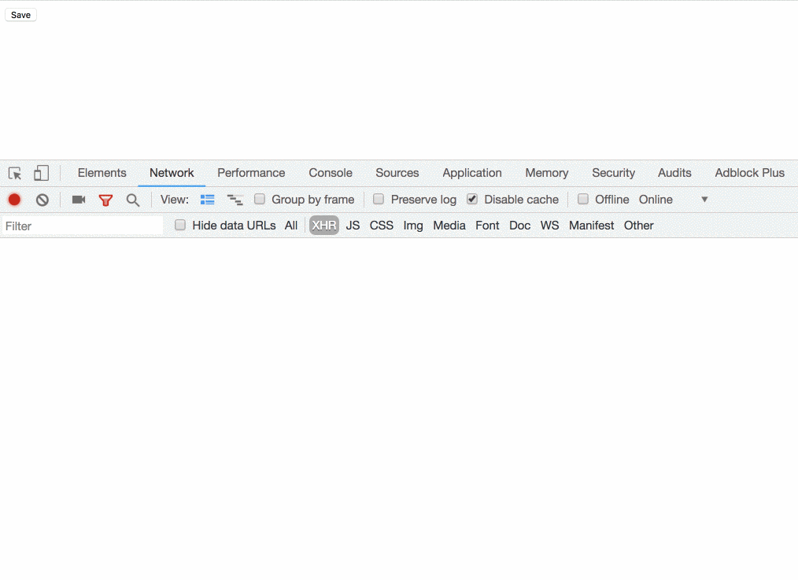

In a perfect world, everybody would have a fast net connection all the time. But at present, your users can find themselves repeatedly banging their heads on their keyboards as they wait for the internet to come back.

But you can prepare for that and have your application identify and deal with failed HTTP requests, ensuring your users have a better experience.

**Warning**: The following code was written during 5 minutes of boredom when _my_ internet was down. Beats banging the keyboard with your head. 🤕

Let’s combine the power of RxJS and HTTP interceptors and learn how we achieve this behavior.

<Embed src="https://gist.github.com/NetanelBasal/ffc05098febbdcc5d95481afe66f898d.js" aspectRatio={0.357} caption="" />

We can use the `retryWhen` operator to tell the application when we want to subscribe to the HTTP request again. That’s done by giving a function where the input is the `error` observable, and the output is an observable that indicates when the application should resubscribe to the source.

First, we check if the user is online. If that’s the case we throw the error so that any subscribers get it as we don’t need to handle it; Otherwise, we want to resubscribe once we get a notification that we’re `[online](https://developer.mozilla.org/en-US/docs/Web/API/NavigatorOnLine/Online_and_offline_events)` again.

Let’s see a live demo:

<Embed src="https://gist.github.com/NetanelBasal/6a0a0413d2e2641d0d866ae4c824d038.js" aspectRatio={0.357} caption="" />

I’m using a [service](http://slowwly.robertomurray.co.uk/) that slows the response so I can simulate an offline mode quickly.

Let’s see another one with POST request:

<Embed src="https://gist.github.com/NetanelBasal/155b4be180266b399d5b2e1a82cbf762.js" aspectRatio={0.357} caption="" />

This is only a taste of what we can do. For instance, we can take it a step further, and also block similar requests, etc.

### 🔥 **Last but Not Least, Have you Heard of Akita?**

Akita is a state management pattern that we’ve developed here in Datorama. It’s been successfully used in a big data production environment, and we’re continually adding features to it.

Akita encourages simplicity. It saves you the hassle of creating boilerplate code and offers powerful tools with a moderate learning curve, suitable for both experienced and inexperienced developers alike.

I highly recommend checking it out.

[**🚀 Introducing Akita: A New State Management Pattern for Angular Applications**  
_Every developer knows state management is difficult. Continuously keeping track of what has been updated, why, and…_netbasal.com](https://netbasal.com/introducing-akita-a-new-state-management-pattern-for-angular-applications-f2f0fab5a8 "https://netbasal.com/introducing-akita-a-new-state-management-pattern-for-angular-applications-f2f0fab5a8")

_Follow me on_ [_Medium_](https://medium.com/@NetanelBasal/) _or_ [_Twitter_](https://twitter.com/NetanelBasal) _to read more about Angular, Akita and JS!_
