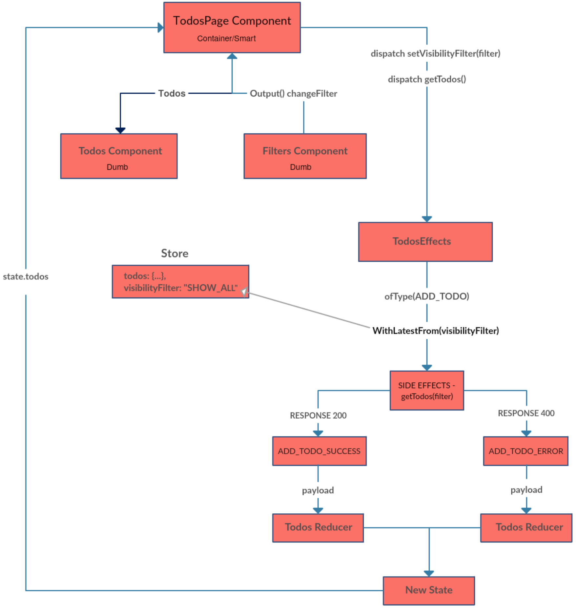
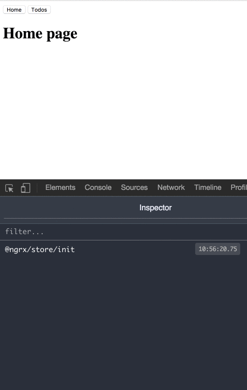

Recently I released a new state management pattern. You should check it out.

[**🚀 Introducing Akita: A New State Management Pattern for Angular Applications**  
_Every developer knows state management is difficult. Continuously keeping track of what has been updated, why, and…_netbasal.com](https://netbasal.com/introducing-akita-a-new-state-management-pattern-for-angular-applications-f2f0fab5a8 "https://netbasal.com/introducing-akita-a-new-state-management-pattern-for-angular-applications-f2f0fab5a8")

In this part, we are going to create the todos filters. This will not be like the Redux official todos [example](http://redux.js.org/docs/basics/ExampleTodoList.html) because I want to prepare you for the real life.

In real life, you are not going to filter your data locally. Usually, you will get the relevant data from the server that holds the entire data.

I also added two routes:

1.  Home page — `HomePageComponent`.
2.  Todos page— `TodosPageComponent` (will replace the `AppComponent`)

#### Build the Filters Component

<Embed src="https://gist.github.com/NetanelBasal/010abd4425053ff4245f930e57e434a6.js" aspectRatio={0.357} caption="" />

The `filters` component is just a dumb component that exposes:

1.  `filters` Input — an array of filters.
2.  `active` Input — Every time the user navigates to the todos page we want to activate his last choice.
3.  `changeFilter` Output — emits the selected filter id.

#### Build the `visibilityFilter` Reducer

<Embed src="https://gist.github.com/NetanelBasal/db368f1bdb916b50e896022d96407bb5.js" aspectRatio={0.357} caption="" />

This should be straightforward to you, don’t forget to add the new sub reducer to your store:

<Embed src="https://gist.github.com/NetanelBasal/187640db2dba3b18be3912c81d9d4f2c.js" aspectRatio={0.357} caption="" />

#### Update TodosPageComponent

Previously our smart component was `AppComponent` now it will be the `TodosPageComponent` .

<Embed src="https://gist.github.com/NetanelBasal/1c6f75b74b92fbde6900fb9f38b0674a.js" aspectRatio={0.357} caption="" />

<Embed src="https://gist.github.com/NetanelBasal/1942929007089ccf15ae4a6a678289bf.js" aspectRatio={0.357} caption="" />

The first thing we’ve added is the `filters`.

The second thing is the `changeFilter` method that just dispatches the `SET_VISIBILITY_FILTER` and `GET_TODOS` actions when the filter changes.

Our goal is always to show the latest value the user has selected.

We only need the filter value once, when Angular creates the component. We can accomplish this with the `[take](https://github.com/Reactive-Extensions/RxJS/blob/master/doc/api/core/operators/take.md)` operator from Rx.

> `Take the first emitted value then complete`

If you remove the `take` operator what will happen is the `active` setter from our `filters` component will trigger the control `setValue` method every time you select a filter, but we don’t need this in our case.

#### Update TodosEffects

<Embed src="https://gist.github.com/NetanelBasal/ae61f5df3e9835585d610cfab565b0bd.js" aspectRatio={0.357} caption="" />

When we are dispatching the `GET_TODO` action, we also need the active filter from our store.

We have access to the store via DI, and we can use the `[withLatestFrom](https://github.com/Reactive-Extensions/RxJS/blob/master/doc/api/core/operators/withlatestfrom.md)` operator from Rx.

Source one — `GET_TODOS` stream.  
Source two — `visibilityFilter` stream.

> When source one emits, give me also the latest value from source two.

The second argument is a `selector` function that will give you both values. We are returning just the filter because that’s the only thing we need.

#### Update TodosService

<Embed src="https://gist.github.com/NetanelBasal/620884b2b12fe66b8ccd10cbbfaf8885.js" aspectRatio={0.357} caption="" />

I just changed the logic to support our new functionally. It just simulates HTTP request with filters.

**Remember**: This is just one method to complete our goal.

Our final smart component is clean and readable 💪 😎. We are done!

<Embed src="https://gist.github.com/NetanelBasal/f4951e4f10093915e951ac0592908a2c.js" aspectRatio={0.357} caption="" />

The source [code](https://github.com/NetanelBasal/ngrx-todos-full).

_Follow me on_ [_Medium_](https://medium.com/@NetanelBasal/) _or_ [_Twitter_](https://twitter.com/NetanelBasal) _to read more about Angular, Vue and JS!_

