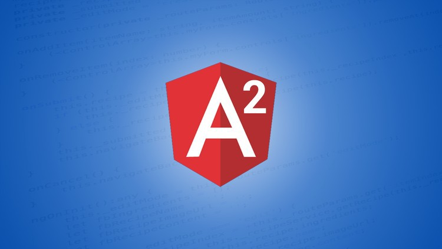
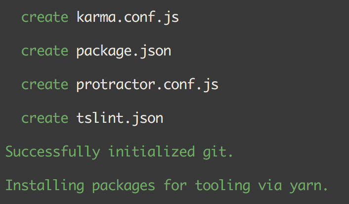
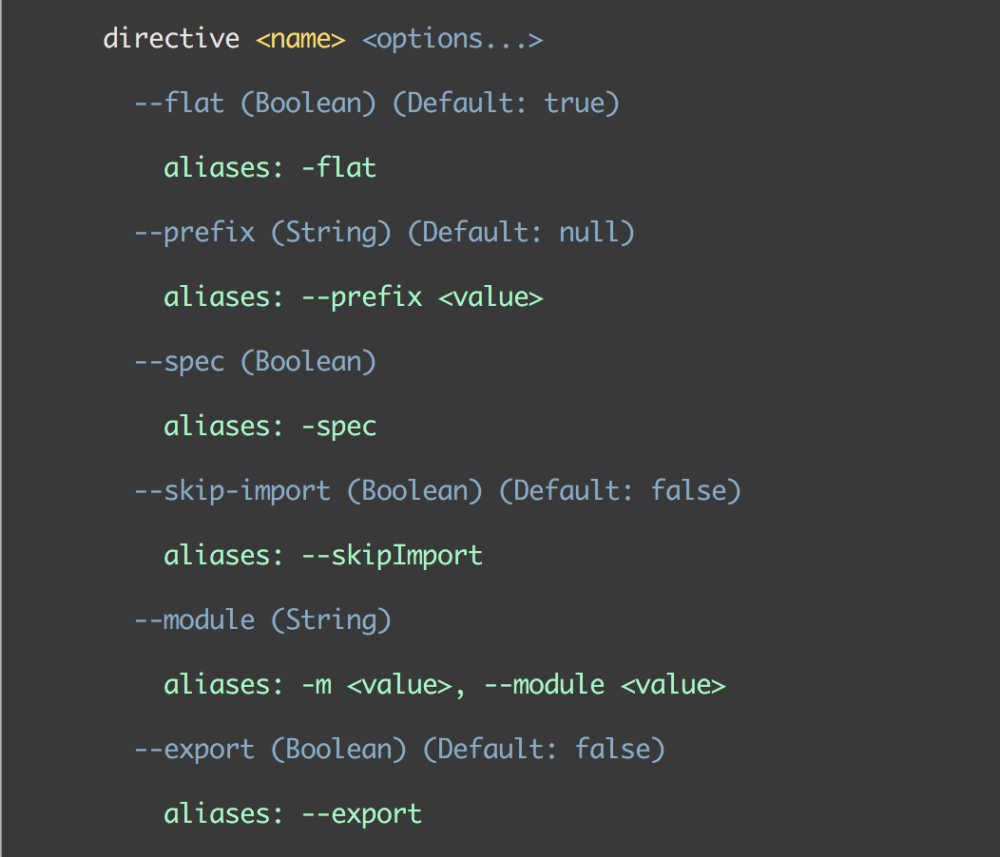

Version 1.0.0-beta.31 (2017–02–09)

### 1\. Create Angular version 4 project —

```
ng new project --ng4
```

### 2\. Add options for third party package manager —

```
ng set --global packageManager=yarn
ng set --global packageManager=cnpm
```

### 3\. Better help support —

```
ng help generate
```

### 4\. Support TS [2.1](https://www.typescriptlang.org/docs/handbook/release-notes/typescript-2-1.html)

_Follow me on_ [_Medium_](https://medium.com/@NetanelBasal/) _or_ [_Twitter_](https://twitter.com/NetanelBasal) _to read more about Vue, Angular and JS!_
