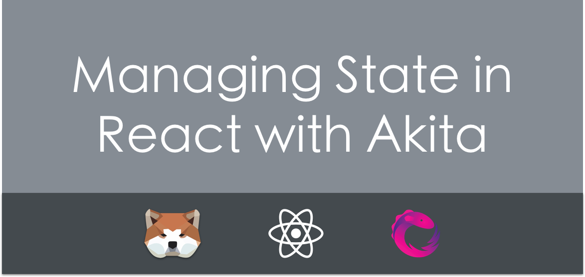
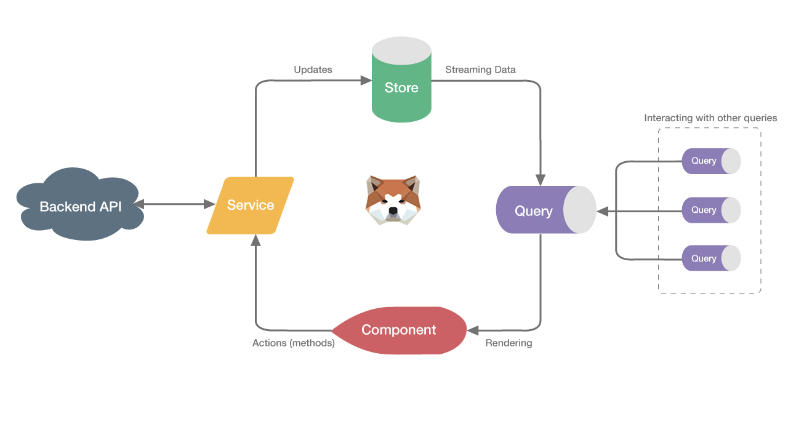
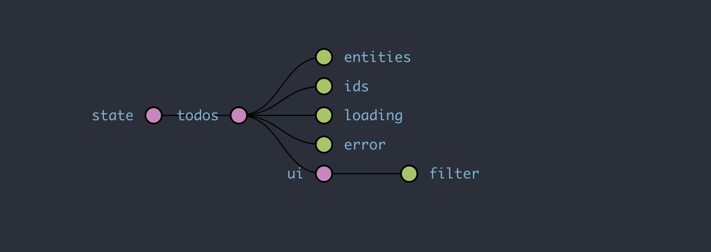
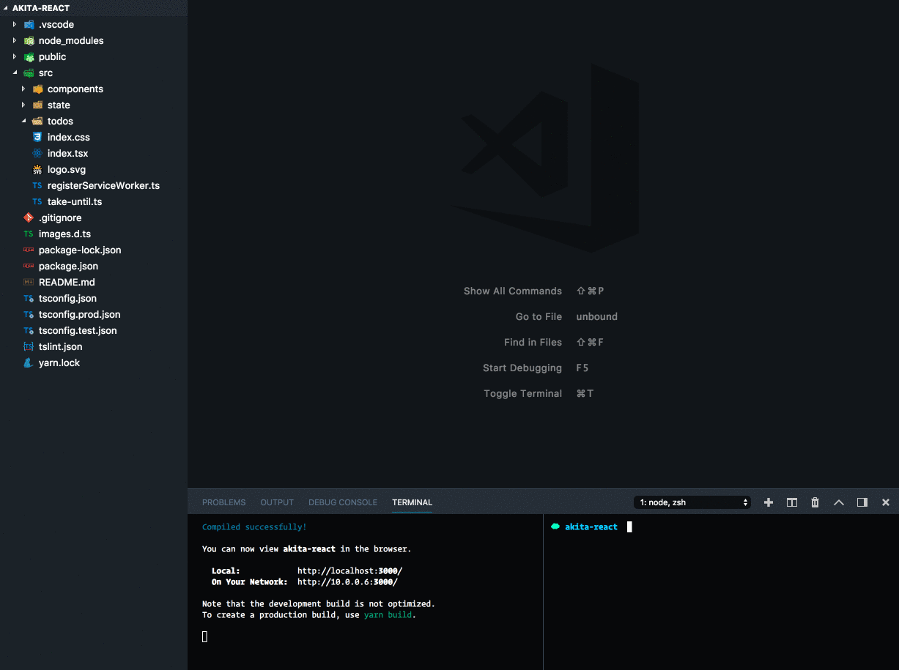
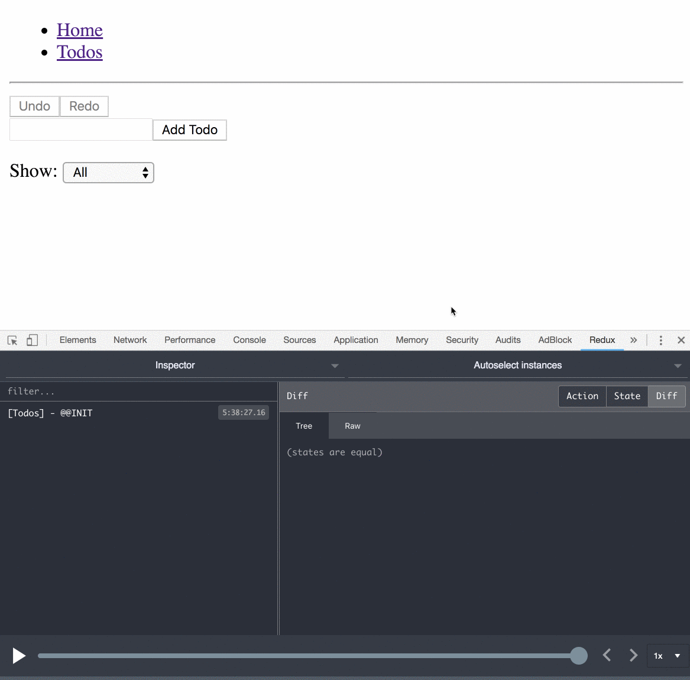

### **🤔** What is [Akita](https://github.com/datorama/akita)?

Akita is a state management pattern, **built on top of RxJS**, which takes the idea of multiple data stores from Flux and the immutable updates from Redux, along with the concept of streaming data, to create the **Observable Data Store model**.

**Akita encourages simplicity**. It saves you the hassle of creating boilerplate code and offers powerful tools with a moderate learning curve, suitable for experienced and inexperienced developers alike.

**Akita is based on object-oriented design principles** instead of functional programming, so developers with OOP experience should feel right at home. Its opinionated structure provides your team with a fixed pattern that cannot be deviated from.

### 👷 Akita’s Architecture

### 👁 High-level Principles

1\. The Store is a single object that contains the store state and serves as the “single source of truth.”

2\. The only way to change the state is by calling `setState()` or one of the update methods based on it.

3\. A component should NOT get data from the store directly but instead use a Query.

4\. Asynchronous logic and update calls should be encapsulated in services and data services.

Let’s learn about Akita’s core concepts by creating the traditional Todo application.

### 🤓 Core Concepts

#### The [Store](https://netbasal.gitbook.io/akita/entity-store/entity-store)

The basic store can contain any form of data that you want, but in most cases, you will prefer working with an entity store. **You can think of an entity store as a table in a database where each row represents an entity.**

Akita entity stores give you all the tools you need to manage your store easily, such as CRUD operations on entities, active entity management, error management, etc.

<Embed src="https://gist.github.com/NetanelBasal/a3b018cd086f08ca54e415b234d7d4b4.js" aspectRatio={0.357} caption="" />

First, we must define the store’s interface. We extend the `EntityState` from Akita, providing it with the `Todo` entity type.

If you are curious, `EntityState` has the following signature:

<Embed src="https://gist.github.com/NetanelBasal/bb55c19b2a9b4c6a29e0ddfa6a00ebd3.js" aspectRatio={0.357} caption="" />

Note that in addition to the todos entities, the store root holds a state that contains the active `ui` filter. Here’s a visualization of our store:

#### The Model

The model is a representation of an entity. Let’s take for example a todo:

<Embed src="https://gist.github.com/NetanelBasal/2eed34986ee93c3dac3b567c5bc689f3.js" aspectRatio={0.357} caption="" />

Akita recommends creating both a type and a factory function in charge of building the entity. ( in a case of an entity store )

#### The [Query](https://netbasal.gitbook.io/akita/entity-store/entity-query)

The Query is how we get data from the store. Like the store, it has two types: query for basic stores, and query for entity stores.

You can classify the query methods into two types. A method that starts with `select`, for which you will **get an observable** for the requested data, and a method that starts with `get`, in which you will receive the requested data once and directly.

It’s important to emphasize that the subscription won’t be triggered unless the value you requested **is changed by reference, freeing you from using something like re-select.**

<Embed src="https://gist.github.com/NetanelBasal/47654345adcdd0d98927d42bb6601a37.js" aspectRatio={0.357} caption="" />

We extended the `QueryEntity` from Akita. Its constructor function receives as parameters its own store and possibly other query classes.

Here, you will receive from Akita a lot of built-in functionality, including methods such as `selectAll()`, `selectEntity()`, `selectMany()`, `selectActive()`, `selectLoading()`, etc.

The built-in `select()` method selects a slice from the store. In our case, we need to combine the active filter with the current todos to find the visible todos and display them to the user.

#### The Service

Akita recommends that asynchronous logic and update calls be encapsulated in services, so let’s continue by creating a service that is responsible for the todos crud operations.

<Embed src="https://gist.github.com/NetanelBasal/e94a6e47a50d63eb6b2ff1a2508b7aec.js" aspectRatio={0.357} caption="" />

The code is self-explanatory. We use Akita’s built-in methods to perform crud operations on our todos store.

### ⌨ Akita CLI

Akita offers a [CLI](https://github.com/datorama/akita/tree/master/cli) tool, enabling you to generate stores based on the specifications quickly.

### ⏱ It’s Time to React

Akita encourages the modeling of smart and dumb (aka stateless and stateful ) components’ architecture. This combination allows us to use React’s `PureComponent` to improve performance.

> If a component depends only on its props, and they are immutable, then this component can change only if one of its props changes.

#### Presentational Components

Presentational components describe **how things look**. Typically, they receive data via props and communicate via events.

Let’s create our presentational components:

<Embed src="https://gist.github.com/NetanelBasal/96087e4c650c1dff66145f2d45ad1462.js" aspectRatio={0.357} caption="" />

#### Container Components

Container components are concerned with **how things work**. They provide the data and behavior to presentational or other container components.

Let’s create a `TodosPage` component in charge of displaying a list of todos filtered by the active filter:

<Embed src="https://gist.github.com/NetanelBasal/030c78abb307c1efe27c192f8b8b2b00.js" aspectRatio={0.357} caption="" />

The component reactively receives data from the query and delegates store updates to the service.

This is how we establish a **one-way data flow** with a precise architecture that you can’t deviate from.

Let’s see it in action with the dev-tools:

As you can see, Akita also supports store-based or **entity-based** redo-undo functionality.

### 😍 Akita in [Datorama](https://datorama.com/)

Behind Akita there is a company — Datorama. Datorama invests a lot of time and effort in developing and improving Akita to make it better for us and the community, allowing us to give back to the community for all that it gives us.

Additionally, before we released it to the community, Akita was used internally here for over eight months, during which it passed our tests, bugs were fixed, and feature requests were added.

Our product is a big data product. We have vast amounts of data on the client, and Akita handles it amazingly.

### 😎 Not Only for Angular

Here in Datorama we work with Angular, so until today, Akita was Angular-oriented, although we’ve built it in such way that it is not coupled to Angular. Our goal was to create Framework-Agnostic state management that can work with Angular, React, Web components and vanilla JavaScript.

Actually we’ve begun to work with React on several internal projects. We feel that we’ve come to the point where we can push non-Angular developers to use it. We believe that, in addition to all Akita’s advantages, the beauty of Akita is that, when you’re migrating from one framework to another or reading our Angular-focused articles, the only thing that you’ll need to replace **is the component implementation**.

### ✋ But Wait, There’s More

#### Plugins ecosystem

-   [Server Side Pagination](https://netbasal.gitbook.io/akita/plugins/server-side-pagination)
-   [State History](https://netbasal.gitbook.io/akita/plugins/state-history)
-   [Dirty Check](https://netbasal.gitbook.io/akita/plugins/dirty-check)

#### Store enhancers

-   [Snapshot Manager](https://netbasal.gitbook.io/akita/enhancers/snapshot-manager) — save the whole application state as a JSON
-   [Persist State ](https://netbasal.gitbook.io/akita/enhancers/persist-state)— automatic stores sync into the local storage

#### Articles

Our team created handful of [articles](https://netbasal.gitbook.io/akita/entity-store/blog-posts) so you can familiarize yourself with Akita quickly. We’ve created articles about infinite scrolling, state normalization, firebase and more.

### Summary

We’ve seen here how the various core concepts of Akita work together to give us an easy way to manage our application state. This is only a small taste of Akita; it has many more additional features, including powerful plugins, dev tools, cli, support for active state, transactions, and web workers.

#### #Example One

<Embed src="https://codesandbox.io/embed/ppo26m383x" aspectRatio={undefined} caption="" />

#### #Example Two

Here is a complete working example including session management:

<Embed src="https://codesandbox.io/embed/2o946nxok0" aspectRatio={undefined} caption="" />

#### #Example Three

Here is a complete working example that demonstrates the active entity management functionality.

<Embed src="https://codesandbox.io/embed/yw8w1x420v" aspectRatio={undefined} caption="" />

_Follow me on_ [_Medium_](https://medium.com/@NetanelBasal/) _or_ [_Twitter_](https://twitter.com/NetanelBasal) _to read more about Angular, Akita and JS!_
