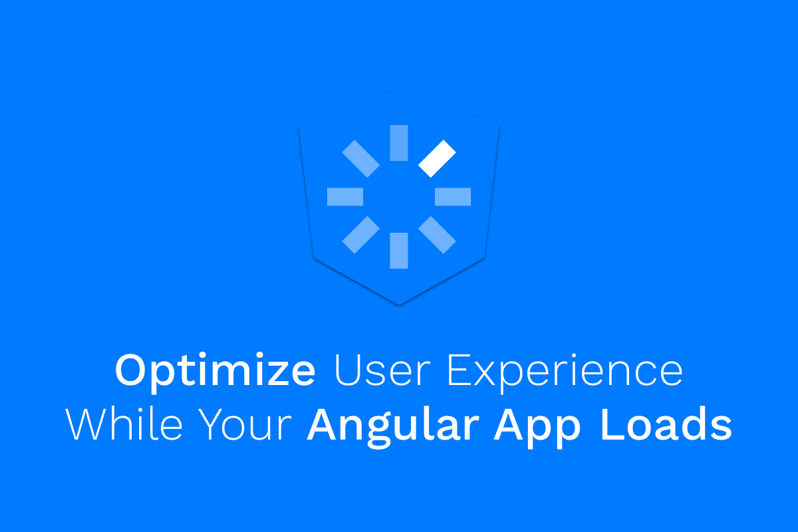

### 💡A Brief Overview

There are applications which require loading some crucial data before users are allowed to use them.

For example, our application has multilingual support and white label capabilities; Therefore, we need to pre-emptively fetch from the server the user’s data, such as localization, internationalization settings, and theme color schema, and make it available to our components, before we allow the user to interact with them.

We want to ensure this because we don’t want to incur a bad user experience, such as jumpy content or flickering CSS.

In such cases, your application may benefit from what’s known as a [splash screen](https://en.wikipedia.org/wiki/Splash_screen) — a loading screen that lets your users know that your application is still working, even though it might a while to perform the initial loading.

In this article, we’ll learn different ways to tackle this.

### 💎 Using an APP\_INITIALIZER Token

`APP_INITIALIZER` is one of the built-in providers in Angular. It is a multi provider, meaning it can provide multiple values for a single token.

What makes it special and useful to us in these cases, is that it can take a function that returns a promise, and only when that promise is resolved, Angular will bootstrap the application.

Let’s [see](https://github.com/angular/angular/blob/7a0f8ac36ceedf751490f55244b3ca6a91f61bb3/packages/core/src/application_ref.ts#L275) it in the [source](https://github.com/angular/angular/blob/b9c6df6da70055f77409be41c6f0f2a7747ce50a/packages/core/src/application_init.ts#L44) code:

<Embed src="https://gist.github.com/NetanelBasal/3b77d4d1a5e6c91f37bc51af960bb092.js" aspectRatio={0.357} caption="" />

When we call the `bootstrapModule()` method in our main file, Angular collects the provided app initializers that are of type promise, waits for all of them to resolve, and only then bootstraps the application. Keep in mind that if one of the initializers fails to resolve, the application will not be bootstrapped.

Let’s use it in conjunction with getting the user’s data from the server and saving it in the store:

<Embed src="https://gist.github.com/NetanelBasal/0c5d6ebbf39088c2bfc148458b2fe591.js" aspectRatio={0.357} caption="app.module.ts" />

In our case, we’re using Akita, so we save the data in our `UserStore`, but this method will work with any other provider.

Now, let’s add the splash screen itself. The idea is to add the splash screen code to our `index.html` file inside the `<app-root></app-root>` or whatever your mount point is, because Angular will remove whatever’s inside when it’s done loading the application:

<Embed src="https://gist.github.com/NetanelBasal/6b799af75771d6d85ac941ce4a3c28d6.js" aspectRatio={0.357} caption="" />

And voilà! Our users have a nice splash screen to look at while we load the data in the background:

The benefit of this approach is that, because we’re inside Angular context, we can use the existing services and framework features.

**A bit of advice:** A nice addition to this feature would be storing the data in local storage, with an expired flag that indicates whether we should re-fetch the data from the server.

### 🦊 Using the Extra Providers Option

The second approach we could take is to go outside of Angular context. In the `main.ts` file, we initialize a request and bootstrap the application only when we have the required data. For example:

<Embed src="https://gist.github.com/NetanelBasal/8cab28300735430761e9f3614c5dbb83.js" aspectRatio={0.357} caption="main.ts" />

This will work, but it’s not very useful as we’re missing the ability to access the data we’ve received in our application. We have two options for how to solve this; Let’s take a quick peek at the `platformBrowserDynamic` [source](https://github.com/angular/angular/blob/7a0f8ac36ceedf751490f55244b3ca6a91f61bb3/packages/core/src/application_ref.ts#L137) code:

<Embed src="https://gist.github.com/NetanelBasal/89914e9fea2614ebcae1cca7e9da3099.js" aspectRatio={0.357} caption="" />

We can see that at this point, we can optionally pass `extraProviders` that will be available in our application. Leveraging this ability, we can do the following:

<Embed src="https://gist.github.com/NetanelBasal/43f6fc3b235095c521d097306e6aafd5.js" aspectRatio={0.357} caption="" />

Note that unlike the previous approach, we don’t have access to other providers at this stage, so we create a new one and initialize it with the data. Then we can use it immediately, everywhere in the application:

<Embed src="https://gist.github.com/NetanelBasal/9871e3fdc7db9d72e6498f4cba8e5381.js" aspectRatio={0.357} caption="app.component.ts" />

The alternative to creating the provider is to add the data to the global `window` object, something I’d rather avoid.

---

There is a third solution, which is wrapping everything with `ngIf` and toggling it based on whether we have the data or not, but it feels less elegant to me.

### 🚀 **Have You Tried Akita Yet?**

One of the leading state management libraries, Akita has been used in countless production environments. It’s constantly developing and improving.

Whether it’s entities arriving from the server or UI state data, Akita has custom-built stores, powerful tools, and tailor-made plugins, which help you manage the data and negate the need for massive amounts of boilerplate code. **We/I highly recommend you try it out**.

[**🚀 Introducing Akita: A New State Management Pattern for Angular Applications**  
_Every developer knows state management is difficult. Continuously keeping track of what has been updated, why, and…_netbasal.com](https://netbasal.com/introducing-akita-a-new-state-management-pattern-for-angular-applications-f2f0fab5a8 "https://netbasal.com/introducing-akita-a-new-state-management-pattern-for-angular-applications-f2f0fab5a8")

[**10 Reasons Why You Should Start Using Akita as Your State Management Solution**  
_State management is ubiquitous in web applications, be they big or small. One of the notable solutions in this field is…_engineering.datorama.com](https://engineering.datorama.com/10-reasons-why-you-should-start-using-akita-as-your-state-management-solution-66b63d033fec "https://engineering.datorama.com/10-reasons-why-you-should-start-using-akita-as-your-state-management-solution-66b63d033fec")

_Follow me on_ [_Medium_](https://medium.com/@NetanelBasal/) _or_ [_Twitter_](https://twitter.com/NetanelBasal) _to read more about Angular, Akita and JS!_
