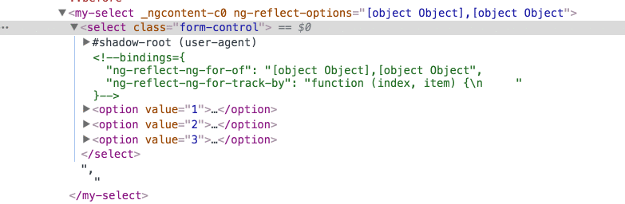

### 1\. Using OnPush

By default, Angular runs change detection on all components every time something changes in your app — from a click event to data received from an ajax call. ( user events, timers, xhr, promises, etc. )

Imagine, for example, that we have a `select` component.

<Embed src="https://gist.github.com/NetanelBasal/74dda69ff32d548b1e1b073fc1c07a84.js" aspectRatio={0.357} caption="" />

We are going to pass an array of skills to the `select` component and will set the properties as “`getters`” so we can see when Angular checks the values.

<Embed src="https://gist.github.com/NetanelBasal/6534cf6cd223084a40e42a23d00eecfb.js" aspectRatio={0.357} caption="" />

When you press the button, Angular will run a change detection cycle. Because we are in development mode, it will happen twice for each binding, so, in our case, the calculation is:

```
option.id * 2
     +
option.name * 2
     *  
  3 options
     =
    12
```

Although Angular is very fast, as your app grows, Angular will have to work harder to keep track of all the changes.

What if we could help Angular and give her a better indication of when to check our component?

We can set the `ChangeDetectionStrategy` of our component to `ChangeDetectionStrategy.OnPush` . This tells Angular that the component only depends on his `Inputs` ( aka pure ) and needs to be checked in only the following cases:

1.  The `Input` reference changes.
2.  An event occurred from the component or one of his children.
3.  You run change detection explicitly by calling `detectChanges()/tick()/markForCheck()` .

<Embed src="https://gist.github.com/NetanelBasal/55efdde21bca83f264e16eccc733f10e.js" aspectRatio={0.357} caption="" />


Because none of the conditions mentioned above occurred, Angular will not check the component at the current change detection cycle. Win win.

### 2\. Using TrackBy

At this stage, we have not yet done as much as we can. If, at some point, we need to change the data in the collection ( `this.skills`), maybe as a result of an API request, we will be faced with a problem, because Angular can’t keep track of items in the collection and has no knowledge of which items have been removed or added.

As a result, Angular needs to remove all the DOM elements associated with the data and create them again. This can mean a lot of DOM manipulations, especially in the case of a **big** collection. And, as we know, DOM manipulations are expensive.

Let’s see this in action.

<Embed src="https://gist.github.com/NetanelBasal/1d0f8092c528271614e0e67626b16939.js" aspectRatio={0.357} caption="" />


If we provide a `trackBy` function, Angular can track which items have been added or removed according to the unique identifier and only create or destroy the things that have changed.



### 3\. Avoid Computing Values in the Template

Sometimes you need to transform a value that comes from the server to something you can display in the UI.

For example:

<Embed src="https://gist.github.com/NetanelBasal/c26da49b3026e5fbf13f96b0c37aa449.js" aspectRatio={0.357} caption="" />

The problem is, because Angular needs to re-run your function in every change detection cycle, if the function performs expensive tasks, it can be costly.

If the value is not changed dynamically at runtime, a better solution would be to:

1.  Use [pure](https://angular.io/guide/pipes#pure-pipes) pipes — Angular executes a _pure pipe_ only when it detects a _pure change_ to the input value.
2.  Creates a new property and set the value once, for example:

<Embed src="https://gist.github.com/NetanelBasal/b71eb0190b3d02e4160c201ade98fc53.js" aspectRatio={0.357} caption="" />

### 4\. Disable Change Detection

Imagine that you have a component that depends on data that changes constantly, many times per second.

Updating the user interface whenever new data arrives can be expensive. A more efficient way would be to check and update the user interface every X seconds.

We can do that by detaching the component’s change detector and conducting a local check every x seconds.

<Embed src="https://gist.github.com/NetanelBasal/224b2524a59e5a1e9bfb3676470af1bd.js" aspectRatio={0.357} caption="" />

### 5\. Using Lazy Loading

In my opinion, lazy loading is one of Angular’s most powerful features, and yet the least used.

By default, Webpack will output all your app’s code into one large bundle. Lazy loading gives you the ability to **optimize your application load time** by splitting the application to feature modules and loading them _on-demand_.

Angular makes this process almost transparent.

<Embed src="https://gist.github.com/NetanelBasal/02b8d3e1f1f0b89d651ed06efae61de2.js" aspectRatio={0.357} caption="" />

We can even prevent whole modules from being loaded based on some condition. For example, don’t load the admin module if the user is not an admin. ( see the `[canLoad](https://angular.io/guide/router#canload-guard-guarding-unauthorized-loading-of-feature-modules)` guard )

### 👂🏻 **Last but Not Least, Have you Heard of Akita?**

Akita is a state management pattern that we’ve developed here in Datorama. It’s been successfully used in a big data production environment for over seven months, and we’re continually adding features to it.

Akita encourages simplicity. It saves you the hassle of creating boilerplate code and offers powerful tools with a moderate learning curve, suitable for both experienced and inexperienced developers alike.

I highly recommend checking it out.

[**🚀 Introducing Akita: A New State Management Pattern for Angular Applications**  
_Every developer knows state management is difficult. Continuously keeping track of what has been updated, why, and…_netbasal.com](https://netbasal.com/introducing-akita-a-new-state-management-pattern-for-angular-applications-f2f0fab5a8 "https://netbasal.com/introducing-akita-a-new-state-management-pattern-for-angular-applications-f2f0fab5a8")[](https://netbasal.com/introducing-akita-a-new-state-management-pattern-for-angular-applications-f2f0fab5a8)

_Follow me on_ [_Medium_](https://medium.com/@NetanelBasal/) _or_ [_Twitter_](https://twitter.com/NetanelBasal) _to read more about Angular, Vue and JS!_
