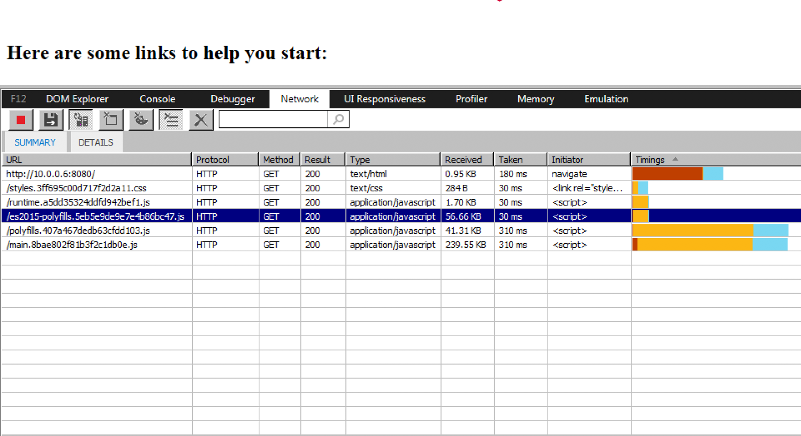

Working with the newest JS language features, such as those which came in ES2015 or later, we are forced to add the transpiled and polyfilled code to our main bundle to support older browsers (mostly IE ).

This code is often more verbose than the original features it’s there to replace, and also parses and runs slower. Since most browsers can handle those features, it seems wasteful to bundle the additional code, simply to support the few browsers that can’t.

Luckily, the new version of the Angular CLI ([v7.3.0](https://github.com/angular/angular-cli/pull/13403)) offers a solution for this situation. It includes a new option — `es5BrowserSupport` — which is enabled by default (in newly generated projects).

When enabled, the CLI extracts the following polyfills to a separate bundle:

<Embed src="https://gist.github.com/NetanelBasal/1753ab979c81ec34f79624d57e464adc.js" aspectRatio={0.357} caption="es2015-polyfills.ts" />

And adds the following markup to the index HTML file:

<Embed src="https://gist.github.com/NetanelBasal/fab917ae9c2187812abe7d29d0301766.js" aspectRatio={0.357} caption="index.html" />

The `es2015-polyfills` bundle is loaded with `<script nomodule>`, which is ignored by browsers that support ES modules. This means that only old browsers that don’t support these features will download the bundle.

Win-win 🙌

With the `es5BrowserSupport` option turned off, the code loading remains as before.

Using this option is estimated to save ~56KB on native ES2015 browsers.

Existing projects can do this manually.

### **🚀 Last but Not Least, Have you Heard of Akita?**

Akita is a state management pattern that we’ve developed here in Datorama. It’s been successfully used in a big data production environment, and we’re continually adding features to it.

Akita encourages simplicity. It saves you the hassle of creating boilerplate code and offers powerful tools with a moderate learning curve, suitable for both experienced and inexperienced developers alike.

I highly recommend checking it out.

[**🚀 Introducing Akita: A New State Management Pattern for Angular Applications**  
_Every developer knows state management is difficult. Continuously keeping track of what has been updated, why, and…_netbasal.com](https://netbasal.com/introducing-akita-a-new-state-management-pattern-for-angular-applications-f2f0fab5a8 "https://netbasal.com/introducing-akita-a-new-state-management-pattern-for-angular-applications-f2f0fab5a8")

_Follow me on_ [_Medium_](https://medium.com/@NetanelBasal/) _or_ [_Twitter_](https://twitter.com/NetanelBasal) _to read more about Angular, Akita and JS!_
