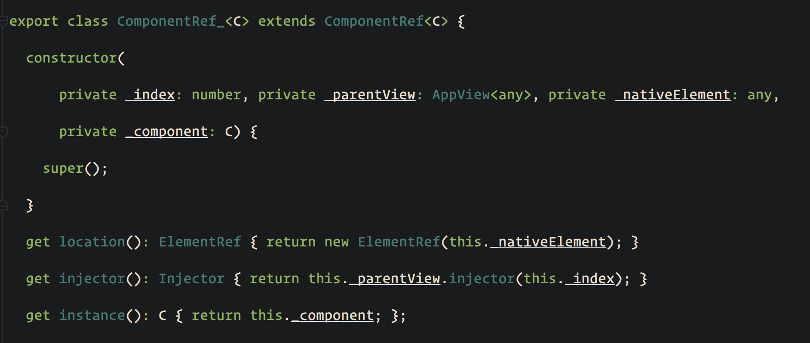
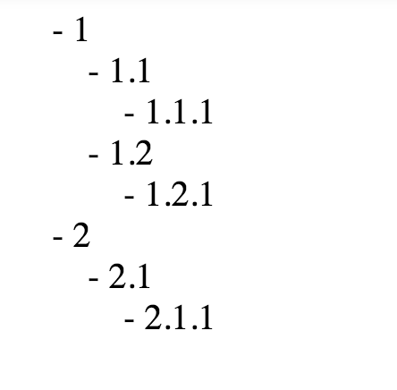

There are times that you need to render a template recursively. For instance, when you have a page with comments, you need to be able to render nested comments and reuse the same component.

In this short article, we are going to create a component that will take as `Input` comments and will know how to display them recursively.

### The Structure:

<Embed src="https://gist.github.com/NetanelBasal/fa77ebcc84bff6273c6fe19eb78db08c.js" aspectRatio={0.357} caption="" />

This is the JSON structure that we expect to get from our server. For this demonstration, we will make it static. ( you can change this structure to how you prefer it )

### Build the Comments Component

<Embed src="https://gist.github.com/NetanelBasal/2985c4465443e1a1ed2ab2f0369a0d95.js" aspectRatio={0.357} caption="" />

As you can see, we can call our component recursively. We don’t want to render the component when there are no comments, so we need to add the `ngIf` directive. ( not required if you don’t have any styles attached to the host )

### Create the App Component

<Embed src="https://gist.github.com/NetanelBasal/3d0541de203998f6f7c31af2de28afeb.js" aspectRatio={0.357} caption="" />

### The Result

### 🔥 **Last but Not Least, Have you Heard of Akita?**

Akita is a state management pattern that we’ve developed here in Datorama. It’s been successfully used in a big data production environment, and we’re continually adding features to it.

Akita encourages simplicity. It saves you the hassle of creating boilerplate code and offers powerful tools with a moderate learning curve, suitable for both experienced and inexperienced developers alike.

I highly recommend checking it out.

[**🚀 Introducing Akita: A New State Management Pattern for Angular Applications**  
_Every developer knows state management is difficult. Continuously keeping track of what has been updated, why, and…_netbasal.com](https://netbasal.com/introducing-akita-a-new-state-management-pattern-for-angular-applications-f2f0fab5a8 "https://netbasal.com/introducing-akita-a-new-state-management-pattern-for-angular-applications-f2f0fab5a8")

_Follow me on_ [_Medium_](https://medium.com/@NetanelBasal/) _or_ [_Twitter_](https://twitter.com/NetanelBasal) _to read more about Angular!_
