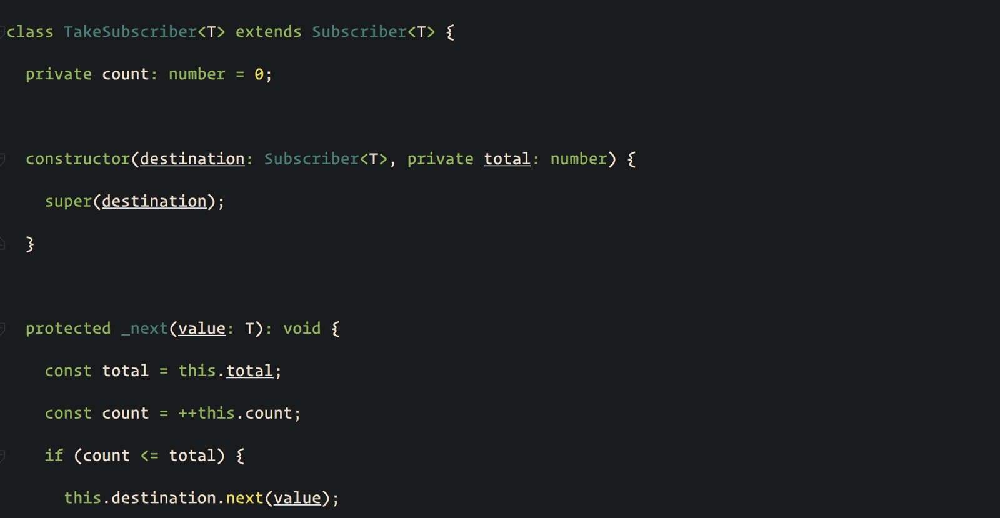
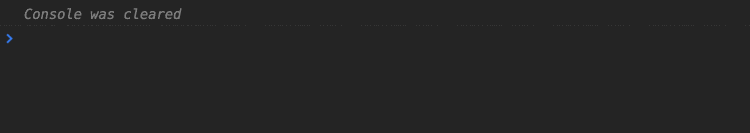
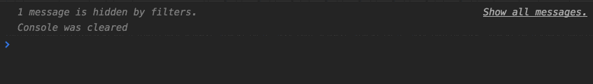
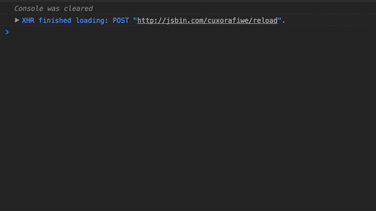

### 1\. Concat —

<Embed src="https://gist.github.com/NetanelBasal/4d142170909e110d6611b402ea7555e4.js" aspectRatio={0.357} caption="" />

> Subscribe to Observables in order but only when the previous completes, let me know, then move to the next one.

Use this operator when the order is important, for example when you need to send HTTP requests that should be in order.

### 2\. forkJoin —

`forkJoin` is the `Promise.all()` of Rx.

<Embed src="https://gist.github.com/NetanelBasal/db3549b70398e3abcdaf826822c1169e.js" aspectRatio={0.357} caption="" />

> Don’t let me know until all the Observables are complete, then give me all the values at once. ( Array )

Use this operator when you need to run the Observables in parallel.

### 3\. mergeMap —

<Embed src="https://gist.github.com/NetanelBasal/01a3445a1fcc66dd7ee38d76b2921b62.js" aspectRatio={0.357} caption="" />

First, let’s understand two terms in the Observables world:

1.  Source ( or outer ) Observable — in this case, this is the `post$` Observable.
2.  Inner Observable — in this case, this is the `getPostInfo$` Observable.

> Only when the inner Observable emits, let me know by merging the value to the outer Observable.

### 4\. pairwise —

<Embed src="https://gist.github.com/NetanelBasal/b6b373fa0d57bb731c8725f1e03a7be3.js" aspectRatio={0.357} caption="" />

> Let me know when the Observable emits, but also give me the previous value. ( Array )

Scrolling…

Triggers on the second and subsequent triggerings of the input Observable.

### 5\. switchMap —

<Embed src="https://gist.github.com/NetanelBasal/134a28c85d0be793e1b4634ff67e877a.js" aspectRatio={0.357} caption="" />

> Like mergeMap but when the source Observable emits cancel any previous subscriptions of the inner Observable.

In our example, every time I’m clicking on the document, the previous `interval` subscription will cancel, and a new one will start.

### 6\. combineLatest —

<Embed src="https://gist.github.com/NetanelBasal/a990adef7ce266a02b886c400ca8f1b8.js" aspectRatio={0.357} caption="" />

> Let me know when any Observable emits but also give me the latest value from the others. ( Array )

This operator is very useful when you need for example to deal with filters in your app.

If you want to know more about Observables you can read my articles:

1.  [Observables under the hood](https://netbasal.com/javascript-observables-under-the-hood-2423f760584#.ptzobjg31).
2.  [Understanding Subjects In Rx](https://netbasal.com/understanding-subjects-in-rxjs-55102a190f3#.302oa6o3w).

#### 👉 Give me some ♥️ by clicking the heart below
