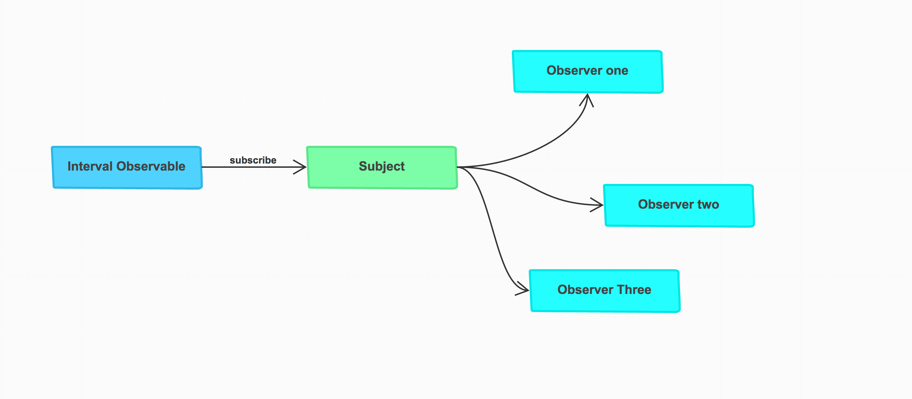
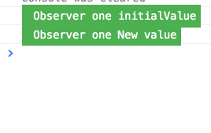
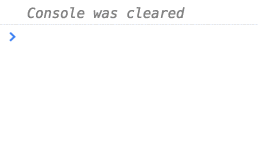

I have already published an [article](https://netbasal.com/understanding-subjects-in-rxjs-55102a190f3) on the subject, but this time I want to take a different approach.

The easiest way to understand what `Subject` is is to re-create one. Let’s create a simple version of `Subject` .

Let’s look at the facts.

> Subject is both an Observable and Observer

### Subject is Observable

It means he has all the operators (`map`, `filter`, etc. ) and you can subscribe to him.

<Embed src="https://gist.github.com/NetanelBasal/0965f7976580b53f5333ef08182dfc9f.js" aspectRatio={0.357} caption="" />

That’s all you need for the first part. You can be `Observable` by extending the `Observable` class.

### Subject is Observer

It means he must implement the `next()`, `error()`, and the `complete()` methods.

<Embed src="https://gist.github.com/NetanelBasal/b58e683075a3487fbdda3fac954be4b6.js" aspectRatio={0.357} caption="" />

OK, let’s move to the next fact.

Subject can act as a bridge/proxy between the source observable and many observers, making it possible for multiple observers to **share** the same observable execution.

<Embed src="https://gist.github.com/NetanelBasal/2f80304ffe2856b691c557f1bb67ae99.js" aspectRatio={0.357} caption="" />

When you call the `subscribe()` method you only push an `observer` into an array. The `next()`, `error()` and `complete()` methods will push the **_same_** value to each `observer` in the array.

Let’s use our Subject.

<Embed src="https://gist.github.com/NetanelBasal/73a2bcbd9655aa94d12402f8bf37b2d5.js" aspectRatio={0.357} caption="" />

When using a `Subject`, it does not matter when you `subscribe` you will always get the same execution as opposed to the typical observable where you will start a new execution upon every subscription. ( in our case it means that you will have two **unrelated** intervals )

> **Subject let you share** the same observable execution

Let’s summarize what happened here.

When you call `subscribe` on a subject, you just push the `observer` into an array.

When the `subject` act as an `observer`, he will call `next()` on every `observer` in the array when the source emits. ( in our case the `interval` )

### BehaviorSubject

Now let’s try to implement a simple version of `BehaviorSubject` .

Let’s look at the [facts](http://stackoverflow.com/a/40231605/7330592).

-   `BehaviorSubject` needs an initial value as it must always return a value on subscription even if it hasn’t received a `next()`.
-   Upon subscription it returns the last value of the subject.
-   At any point you can retrieve the last value of the subject in a non-observable code using the `getValue()` method.

<Embed src="https://gist.github.com/NetanelBasal/2cb0c030116f28ced631ec395cf4effa.js" aspectRatio={0.357} caption="" />

Let’s use our `BehaviorSubject` .

<Embed src="https://gist.github.com/NetanelBasal/ca63e7ea392d3fc5d4f7d8cc620de136.js" aspectRatio={0.357} caption="" />

### `ReplaySubject`

Now let’s try to implement a simple version of `ReplaySubject` .

Let’s look at the [facts](https://github.com/Reactive-Extensions/RxJS/blob/master/doc/api/subjects/replaysubject.md).

-   `ReplaySubject` represents an object that is both an observable sequence as well as an observer.
-   Each notification is broadcasted to all subscribed and future observers, subject to **buffer** trimming policies.

<Embed src="https://gist.github.com/NetanelBasal/acd33cf8f01cc476ff67394367bfd779.js" aspectRatio={0.357} caption="" />

Let’s use our `ReplaySubject` .

<Embed src="https://gist.github.com/NetanelBasal/843d56889ae6b94842f159e1ca6ea528.js" aspectRatio={0.357} caption="" />

### When to use Subject

-   You need to share the same observable execution.
-   When you need to decide what to do when an observer arrives late, do we use `ReplaySubject`, `BehaviorSubject`?
-   You need full control over the `next()`, `error()` and `complete()` methods.

_Note: The following examples are just to illustrate the concept, they are not production ready, and they are not the real or the full implementation of Subjects in Rx._

### 🔥 **Last but Not Least, Have you Heard of Akita?**

Akita is a state management pattern that we’ve developed here in Datorama. It’s been successfully used in a big data production environment, and we’re continually adding features to it.

Akita encourages simplicity. It saves you the hassle of creating boilerplate code and offers powerful tools with a moderate learning curve, suitable for both experienced and inexperienced developers alike.

I highly recommend checking it out.

[**🚀 Introducing Akita: A New State Management Pattern for Angular Applications**  
_Every developer knows state management is difficult. Continuously keeping track of what has been updated, why, and…_netbasal.com](https://netbasal.com/introducing-akita-a-new-state-management-pattern-for-angular-applications-f2f0fab5a8 "https://netbasal.com/introducing-akita-a-new-state-management-pattern-for-angular-applications-f2f0fab5a8")

_Follow me on_ [_Medium_](https://medium.com/@NetanelBasal/) _or_ [_Twitter_](https://twitter.com/NetanelBasal) _to read more about Angular, Vue and JS!_
