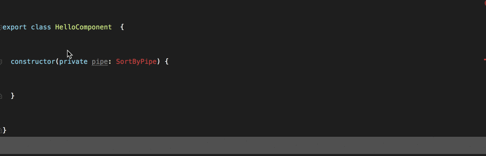

In almost every application that does not use the technique we’ll talk about, we’ll see imports such as the following:

```
import { forIn } from '../../../../../utils/array'
```

Yes, it’s part of our routine, but there are three problems with this:

1.  The deeper it gets, the worse it gets.
2.  It makes it harder to refactor the code.
3.  If we want to extract the code to an npm module so other applications in our company can use it, we’ll have to change the entire codebase.

What if we could just write something like this:

```
import { forIn } from '@datorama/utils/array'
```

Actually we can 😍. TypeScript allows the use of [path mapping](https://www.typescriptlang.org/docs/handbook/module-resolution.html) which allows arbitrary module paths (that doesn’t start with “/” or “.”) to be specified and mapped to physical paths in the filesystem.

The TypeScript compiler can resolve these paths from `tsconfig` so it will compile OK.

Let’s see how we use it.

### Use with Angular

If you are working with the `angular-cli`, you need to add two properties to the **main** `tsconfig.json` file.

<Embed src="https://gist.github.com/NetanelBasal/c59719f470667334dbc8edb6449a44a3.js" aspectRatio={0.357} caption="tsconfig.json" />

The first property that we must add is the `baseUrl` property. Notice that `paths` are resolved relative to `baseUrl` .

The second property is the `paths` property. This tells the compiler for any module import that matches the pattern `"@datorama/utils/*"` , to look in the following location:

```
<moduleName> => <baseUrl>/utils/<moduleName>
```

### Use with Webpack

If you are working with `[awesome-typescript-loader](https://github.com/s-panferov/awesome-typescript-loader)` you need to add the `TsConfigPathsPlugin` to your `webpack` config file.

<Embed src="https://gist.github.com/NetanelBasal/362fd0348d525f1ed78ee730097579bd.js" aspectRatio={0.357} caption="webpack.config.js" />

That’s all.

**The biggest advantage** is that if we want to extract reusable code — like utils, pipes, directives to a private npm module so other projects in our company can use it too — we don’t need to change anything in our codebase. We just need to give the module the same name.

_Follow me on_ [_Medium_](https://medium.com/@NetanelBasal/) _or_ [_Twitter_](https://twitter.com/NetanelBasal) _to read more about Angular, Vue and JS!_
