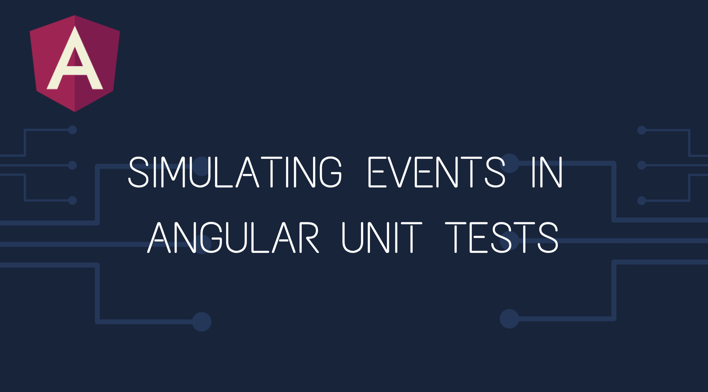
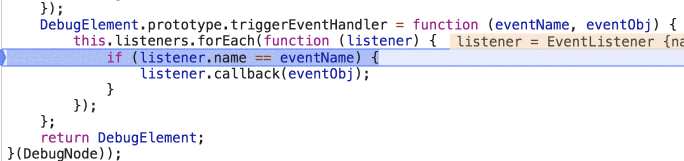

In this article, I will walk you through the process of triggering events when writing unit tests for Angular components. We’ll also learn about a misconception that I see a lot when I look at developer codes.

There are two ways to trigger events in unit tests. Let’s examine both of them.

### 1️⃣ Angular’s triggerEventHandler() Method

The Angular `DebugElement` instance provides a handy method for triggering events — `triggerEventHandler()`. Let’s see how we can use it.

<Embed src="https://gist.github.com/NetanelBasal/f261c13acadc644e9ef85877ce85dd74.js" aspectRatio={0.357} caption="" />

We have a simple test for a component that, upon a click, sets an emoji. We use the `query()` method to obtain a reference to the element and triggers the click event handler using the `triggerEventHandler()` method.

Three important facts about the `triggerEventHandler()` method:

1.  It will invoke the event handler only if it was declared on the native element by using [Angular event bindings](https://angular.io/guide/template-syntax#event-binding), the `@HostListener()` or `@Output` decorators (and the less used `Renderer.listen()`). For example:

<Embed src="https://gist.github.com/NetanelBasal/e564eee3e94bd30b82e2c81bf85c4743.js" aspectRatio={0.357} caption="" />

Note that the second parameter is the actual event object that will pass to the handler.

2\. It will not trigger change detection automatically; we need to call it ourselves.

3\. Different from what developers [think](https://stackoverflow.com/a/43419738/7330592) or do, there is no need to use `fakeAsync`** — The handler will be executed synchronously**. We can see it when debugging the code:

### 2️⃣ Using the Native APIs

What about the other cases, like when we define events via the JS native API? For example, let’s use the RxJS `fromEvent` observable:

<Embed src="https://gist.github.com/NetanelBasal/2c78725dbf793ff494b4f96ac02b465a.js" aspectRatio={0.357} caption="" />

Now, as we mentioned before, if we use Angular’s `triggerEventHandler()` method, this will not work because Angular doesn’t know about this event. Luckily, it’s a `click` event and we can trigger a click programmatically by using the native HTMLElement [click](https://developer.mozilla.org/en-US/docs/Web/API/HTMLElement/click)() method.

<Embed src="https://gist.github.com/NetanelBasal/2121ca1151575d4d3bc88dd7f6d4d2b6.js" aspectRatio={0.357} caption="" />

Cool, but what about other events, like `mouseenter`, `input`, etc.? We can use the native [Event](https://developer.mozilla.org/en-US/docs/Web/Guide/Events/Creating_and_triggering_events) APIs in conjunction with the `dispatchEvent()` method to trigger events programmatically. For example:

<Embed src="https://gist.github.com/NetanelBasal/6d2d06a37a7b402b70d0de7315de95d4.js" aspectRatio={0.357} caption="" />

**We can see again that I’m not using** `**fakeAsync**`, and this is due to [MDN](https://developer.mozilla.org/en-US/docs/Web/API/EventTarget/dispatchEvent):

> Unlike “native” events, which are fired by the DOM and invoke event handlers asynchronously via the [event loop](https://developer.mozilla.org/en-US/docs/Web/JavaScript/EventLoop), `dispatchEvent` **invokes event handlers synchronously**. All applicable event handlers will execute and return before the code continues on after the call to `dispatchEvent`.

That’s all.

### 🔥 **Last but Not Least, Have you Heard of Spectator?**

[Spectator](https://github.com/NetanelBasal/spectator) is written on top of the Angular Testing Framework and provides a cleaner API for testing and set of custom matchers that will help you test DOM elements more easily.

Spectator helps you remove all the boilerplate grunt work, leaving you with readable, sleek and streamlined unit tests.

It’s been successfully used in a production environment, and we’re continually adding features to it. For example, we now fully support Jest. It’s also very popular, with more than 116k downloads. Make sure to check it out.

_Follow me on_ [_Medium_](https://medium.com/@NetanelBasal/) _or_ [_Twitter_](https://twitter.com/NetanelBasal) _to read more about Angular, Akita and JS!_
