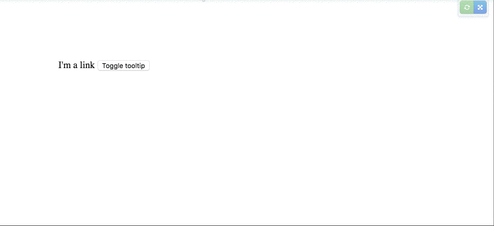

You wake up in the morning, and you decide to be a good developer by creating an open source Angular directive.

The directive will allow his consumers to create dynamic tooltips quickly.

You start working on your code, and you end up with something similar to this simple example:

<Embed src="https://gist.github.com/NetanelBasal/5e9ac215990665b700f31bdf08e3abdb.js" aspectRatio={0.357} caption="" />

Our focus here is not about how to implement a tooltip with Angular, so I don’t go over the code.

**Note**: I’m using JQuery to speed up my example and for demonstration purpose only.

Next, you write some tests to check that your code is working, then you publish your package to the npm registry.

#### The “problem”:

The day after that, your are receiving an email from GitHub, someone requests the ability to toggle the tooltip on a button click and not only on hover.

You are a good developer, and you want to satisfy the need of your directive consumers.

#### Angular solution:

Angular helps us to solve this problem by allowing us to set the **exportAs** property on the Directive decorator.

> The exportAs takes the name under which the component instance is exported in a template.

In simple words, you can expose your directive/component public API to your template.

So we can expose are tooltip instance by doing this:

<Embed src="https://gist.github.com/NetanelBasal/ec4320b75ae693cd15564bf189ef9ca4.js" aspectRatio={0.357} caption="" />

Now we can access our tooltip instance anywhere in our template:

<Embed src="https://gist.github.com/NetanelBasal/256ea7647aa729616eb8b1eff5593c09.js" aspectRatio={0.357} caption="" />

We are creating a local variable named `tooltip` that provides access to the tooltip instance. When the user clicks on the button, the `toggleTooltip` function will run.

### Victorious!

Our consumers can trigger the tooltip however they want without the need to add or change the code.

That’s all.

_Follow me on_ [_Medium_](https://medium.com/@NetanelBasal/) _or_ [_Twitter_](https://twitter.com/NetanelBasal) _to read more about Angular, Vue and JS!_
