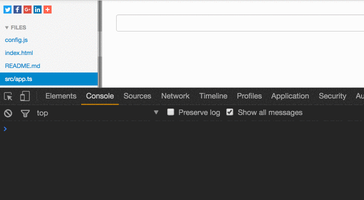

Imagine that you have a general input component for your application.

<Embed src="https://gist.github.com/NetanelBasal/66ef102b3c0b72fbad9d037baaddd223.js" aspectRatio={0.357} caption="" />

Our `input` is a dumb component that will emit the input value every time the value changes.

But we have one problem, what if the consumer wants to combine other Rx operators like `debounce`, `filter` or any other sequence to the `valueChanges` observable?

Rx has operator exactly for this kind of problem.

### The [Let](https://github.com/Reactive-Extensions/RxJS/blob/master/doc/api/core/operators/let.md) Operator —

> [Let](https://www.learnrxjs.io/operators/utility/let.html) me have the whole observable

> Returns an observable sequence that is the result of invoking the selector on the source sequence.

<Embed src="https://gist.github.com/NetanelBasal/1eef129bf93214a9ad66e4f30caca181.js" aspectRatio={0.357} caption="" />

We have new Input called `middleware` that is a function that takes the `valueChanges` observable and needs to return a new observable.

If the consumer does not use the `middleware` Input, we are returning the same observable.

#### The Usage —

<Embed src="https://gist.github.com/NetanelBasal/65d39e275690ebdb27057a6a0034276a.js" aspectRatio={0.357} caption="" />

**Remember:** This approach is relevant to any observable in your application.

The full [example](https://plnkr.co/edit/0juApbj3sLnVUUVaQ8Kq?p=preview).

_Follow me on_ [_Medium_](https://medium.com/@NetanelBasal/) _or_ [_Twitter_](https://twitter.com/NetanelBasal) _to read more about Angular, Vue and JS!_
