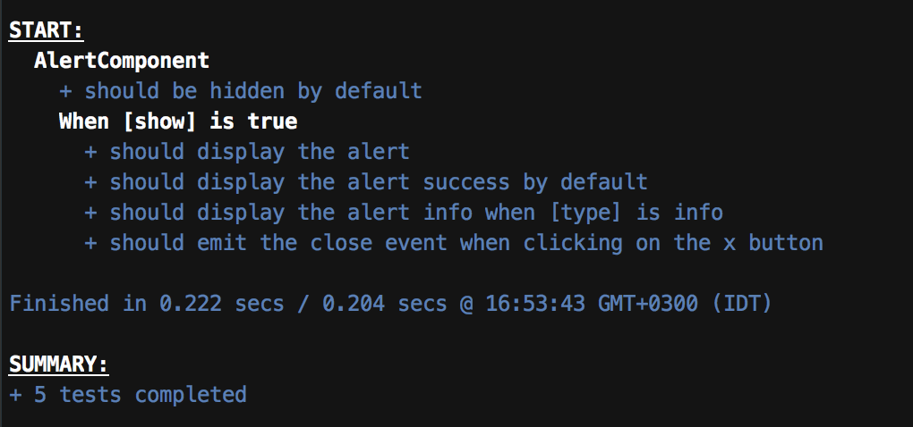

#### Why Test my Code

Before we begin let’s highlight the main reasons for writing tests.

-   Unit Tests help you understand the design of the code you are working on and to think about all the possibilities.
-   Unit Tests can help document and define what something is supposed to do.
-   If you change something in the code and the tests still pass you can be sure you have not broken anything.

Now that you are convinced that you need to test your code we can start 😀.

Presentational (aka Dumb) components are _usually_ only responsible for displaying data based on their `Inputs` and communicating with their parent through `Outputs`. Therefore they are much easier ( and fun ) to test.

Let’s start by creating a dumb component for the [alert](http://getbootstrap.com/components/#alerts) style of bootstrap css.

<Embed src="https://gist.github.com/NetanelBasal/5a197db1a55b4f0021ad67a668b73d4d.js" aspectRatio={0.357} caption="" />

There’s nothing to explain here. The code is very simple. Let’s start with the tests.

<Embed src="https://gist.github.com/NetanelBasal/3732a65a0dd64ae33c78018babcdc2d7.js" aspectRatio={0.357} caption="" />

`TestBed` is an Angular utility that helps you create a module for tests. The `configureTestingModule` method takes an `@NgModule`\-like metadata object.

In our case, we only need two things, the component that we want to test ( `AlertComponent` ) and a host component.

We need to call `configureTestingModule` within a `beforeEach` so that `TestBed` can reset itself to a base state before each test runs.

Now let’s think about the process. Most of your `it` blocks will do something like this:

1.  Change the host template (i.e., inputs)
2.  Run change detection.
3.  Make assertions as to what should have happened.

It would be 😎 if we can change the host template in every `it` block. In fact, we can, let’s see how.

<Embed src="https://gist.github.com/NetanelBasal/24c4458cb77a52c76ecb37ae1d4504a4.js" aspectRatio={0.357} caption="" />

After configuring `TestBed`, you can create an instance of the component that you want to test by calling the `createComponent` method with the component blueprint.

> The `createComponent` method returns a `**ComponentFixture**`, a handle on the test environment surrounding the created component. The fixture provides access to the component instance itself and to the `**DebugElement**`, which is a handle on the component's DOM element.

`[TestBed](https://angular.io/docs/ts/latest/api/core/testing/index/TestBed-class.html)` also provides several methods to allow us to **override** dependencies that are being used in a test module, one of them is the `overrideComponent` .

Let the fun begin.

<Embed src="https://gist.github.com/NetanelBasal/6b0e72c72d551837d92c7645eaa2597d.js" aspectRatio={0.357} caption="" />

Just look at it, who needs documentation? Sweet! 😋

Now let’s see how to test the `close` output.

<Embed src="https://gist.github.com/NetanelBasal/d2ef0f437bd247290ea7a844369b2850.js" aspectRatio={0.357} caption="" />

As you may [know](https://netbasal.com/event-emitters-in-angular-13e84ee8d28c#.twxldy2y7) `Outputs` in Angular are `Subjects` ( i.e., observables ) so we can subscribe to them to get the value. In our case, we need to subscribe to the `close` emitter that we can get from the component instance, save the value in a local variable, trigger the event and make our assertion.

_Note: As opposed to promises, observables are not always called asynchronously. By default Angular emitters are synchronous, and that’s why we don’t need to use the_ `_fakeAsync_` _utility in our case._

#### Summary

In this article, we saw **_one_** of the methods of writing tests for dumb components in Angular. Now that you know the concept you can do all sorts of abstractions to reduce the repeating code. Good Luck!

_Follow me on_ [_Medium_](https://medium.com/@NetanelBasal/) _or_ [_Twitter_](https://twitter.com/NetanelBasal) _to read more about Angular, Vue and JS!_
