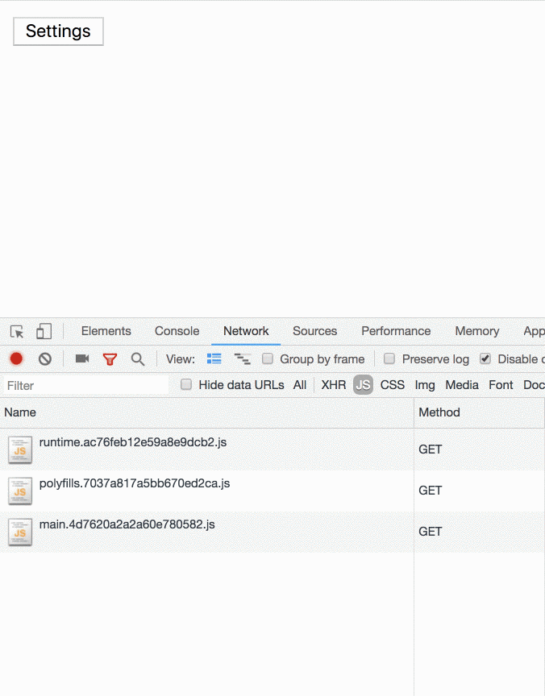

As you probably know, Angular comes with a functionality that allows you to lazy load routable modules out of the box. Although in most cases this functionality is sufficient, it’s still only a small piece of the pie. What about situations where we want to lazy load modules that aren’t routable?

We can study one real-world case like this from our application. We have a page that displays a list of widgets. Each widget comes with a settings button that, when clicked, opens a side panel and allows the user to customize the widget’ settings.

The widget settings panel contains a world of components, directives, pipes, and providers. It would be a waste to add the module to our main bundle, because then all clients would have to download and parse it, even though most would probably never use it.

A better decision would be to lazy load the module when the user clicks on the edit settings button.

Let’s learn how can we do that.

First, we need to create the module:

<Embed src="https://gist.github.com/NetanelBasal/b77aa1f6b2cd0b683378f27d33419708.js" aspectRatio={0.357} caption="" />

We created a `WidgetSettingsModule` and provided it with everything it needs (i.e., components, directives, etc.).

Our next step is to instruct Angular to ask Webpack to create a separate chunk for our module so we can lazy load it later on. We can do this by adding the module path to the `angular.json` file:

<Embed src="https://gist.github.com/NetanelBasal/3b534e55854c29bfc2ce74472f67397e.js" aspectRatio={0.357} caption="" />

Great, now we can see that Webpack extracts our module, with all of its dependencies, to a separate chunk.

Next, we need “something” that knows how to load our modules. We can learn from the [router](https://github.com/angular/angular/blob/master/packages/router/src/router_module.ts#L71) itself and use the `SystemJsNgModuleLoader` loader. Let’s declare it in our `AppModule`:

<Embed src="https://gist.github.com/NetanelBasal/3893baa4e400b454718340ff64e331ca.js" aspectRatio={0.357} caption="" />

To load the module, we’ll use a custom directive that takes the module name as input, then loads the module and injects the root component to the current `ViewContainerRef`. Here’s an example of the final result:

<Embed src="https://gist.github.com/NetanelBasal/fb13c5c59e5fef0ecb1c79e0a3762e12.js" aspectRatio={0.357} caption="" />

First, let’s create a provider that holds the lazy load modules map:

<Embed src="https://gist.github.com/NetanelBasal/51ba9d011750099a09098c6527743c64.js" aspectRatio={0.357} caption="" />

Now, we can build the final piece in the puzzle — the directive:

<Embed src="https://gist.github.com/NetanelBasal/998f92202183f60bdc9d30ff5f14e03f.js" aspectRatio={0.357} caption="" />

We inject the `loader` provider and call the `load()` method passing the module path that we grab from the `LAZY_MODULES_MAP` injection token.

If we take a look at the [source](https://github.com/angular/angular/blob/master/packages/core/src/linker/system_js_ng_module_factory_loader.ts#L58) code we’ll see that the `load()` method uses `[SystemJS](https://github.com/systemjs/systemjs)` to load and compile the module. Then, it returns the result, an object of type `NgModuleFactory`.

A bit of advice — try to always understand how things work under the hood. Yes, you likely won’t completely understand everything, but still, it’s just JavaScript, so you should get a general sense of what’s going on.

Ok, we have a module factory, now we need to create an instance of it. We call the `create()` method passing the current injector, and we get a reference to the module.

At this stage, we have a module, but we still need to create the root component and inject it to the view. How do we do that?

Our first option would be to add it to the module’s `bootstrap` property:

<Embed src="https://gist.github.com/NetanelBasal/7aeb705c662c62ff02d9920d617acc21.js" aspectRatio={0.357} caption="" />

And then get it from the `moduleRef`:

<Embed src="https://gist.github.com/NetanelBasal/b91acab2b031130272b141441d96e03f.js" aspectRatio={0.357} caption="" />

But I don’t like to use a private API, as it might be changed. I mean, there is a reason it’s private, right? Instead, I recommend storing the root component in a static property on the module itself:

<Embed src="https://gist.github.com/NetanelBasal/2434a32e0e648327f50443ce2fd41f52.js" aspectRatio={0.357} caption="" />

And get it from the `moduleFactory`:

<Embed src="https://gist.github.com/NetanelBasal/da2a4cd9dec90c80d42dc5f2a1c4693b.js" aspectRatio={0.357} caption="" />

Finally, let’s get the component factory and [create](https://netbasal.com/dynamically-creating-components-with-angular-a7346f4a982d) the component:

<Embed src="https://gist.github.com/NetanelBasal/9933e2a23b26a1aaee57fd01c0eab3cf.js" aspectRatio={0.357} caption="" />

And let’s not forget to destroy the module:

<Embed src="https://gist.github.com/NetanelBasal/acc99cbdae3c80d3246f557f81bc3875.js" aspectRatio={0.357} caption="" />

And really, that’s all there is to it.

Here’s a live AOT example:

### 🔥 **Last but Not Least, Have you Heard of Akita?**

Akita is a state management pattern that we’ve developed here in Datorama. It’s been successfully used in a big data production environment, and we’re continually adding features to it.

Akita encourages simplicity. It saves you the hassle of creating boilerplate code and offers powerful tools with a moderate learning curve, suitable for both experienced and inexperienced developers alike.

I highly recommend checking it out.

[**🚀 Introducing Akita: A New State Management Pattern for Angular Applications**  
_Every developer knows state management is difficult. Continuously keeping track of what has been updated, why, and…_netbasal.com](https://netbasal.com/introducing-akita-a-new-state-management-pattern-for-angular-applications-f2f0fab5a8 "https://netbasal.com/introducing-akita-a-new-state-management-pattern-for-angular-applications-f2f0fab5a8")

_Follow me on_ [_Medium_](https://medium.com/@NetanelBasal/) _or_ [_Twitter_](https://twitter.com/NetanelBasal) _to read more about Angular, Akita and JS!_
