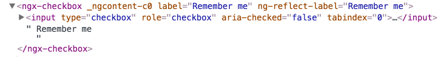

When working with third-party components, there are times when you need to add missing functionality.

Let’s take, for example, a custom checkbox component.

```
@Component({
  selector: 'ngx-checkbox',
  template: `
    <input type="checkbox" class="ngx-checkbox"> {{label}}
  `,
})
export class CustomCheckboxComponent {
  @Input() label;
}
```

You need this component, but the problem is that it does not support accessibility.

What you are not going to do is to change the source code, so how can we overcome the problem in the Angular way?

> We have the power of **selectors**.

We can create a directive that targets this input by classname, and then we can use the Angular API to add what we need. ( you can find [here](https://angular.io/api/core/Directive#selector) the supported types of selectors )

```
@Directive({
  selector: '.ngx-checkbox'
})
export class CustomCheckboxAddonsDirective {
  @HostBinding('attr.role') role = 'checkbox';
  @HostBinding('attr.aria-checked') checked = false;
  @HostBinding('attr.tabindex') tabIndex = 0;

  @HostListener('change', ['$event.target.checked'])
  change( checked ) {
    this.checked = checked;
  }

}
```

Okay, it’s cool, but we still have one problem. Angular will check the directive bindings for each change detection cycle in our application. We probably do not need this in most cases, unless we have a dynamic value like `aria-checked` for example.

We can use the `ChangeDetectorRef` API to resolve the problem.

```
@Directive({
  selector: 'ngx-checkbox input[type="checkbox"]'
})
export class CustomCheckboxAddonsDirective {
  @HostBinding('attr.role') role = 'checkbox';
  @HostBinding('attr.aria-checked') checked = false;
  @HostBinding('attr.tabindex') tabIndex = '0';

  constructor( private cdr : ChangeDetectorRef ) {}

  ngAfterViewInit() {
    this.cdr.detach();
  }

  @HostListener('change', ['$event.target.checked'])
  change( checked ) {
    this.checked = checked;
    this.cdr.detectChanges();
  }

}
```

We are using the `[detach](https://angular.io/api/core/ChangeDetectorRef)()` method that detaches the change detector from the change detector tree. The detached change detector will not be checked until it is `reattached`.

In our case, we can use the `detectChanges()` method to implement local change detection checks only for the dynamic parts. ( like `aria-checked` )

_Follow me on_ [_Medium_](https://medium.com/@NetanelBasal/) _or_ [_Twitter_](https://twitter.com/NetanelBasal) _to read more about Angular, Vue and JS!_
