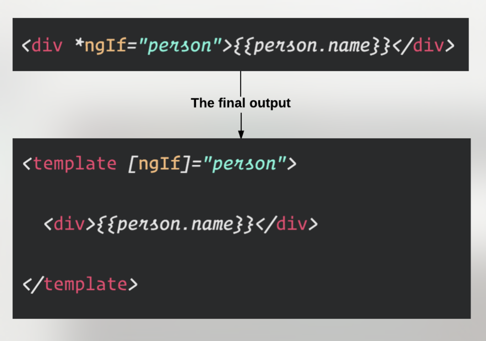
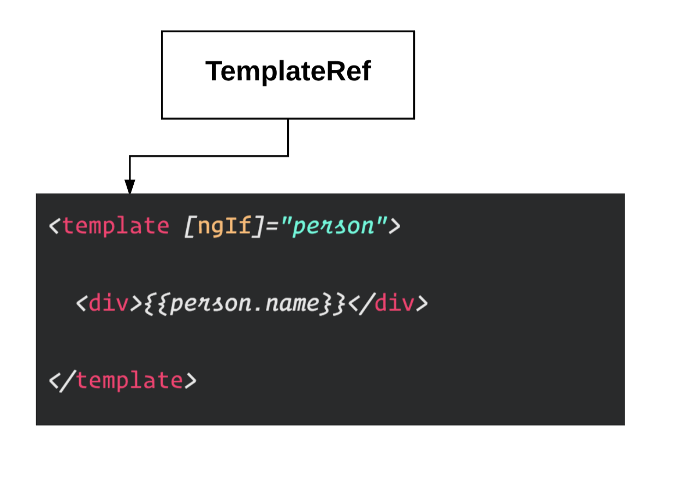
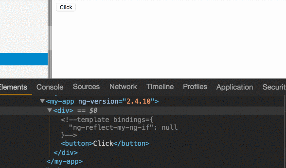
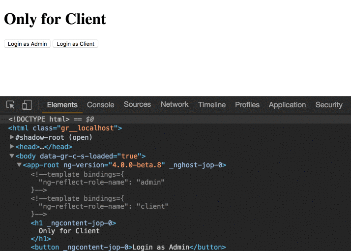
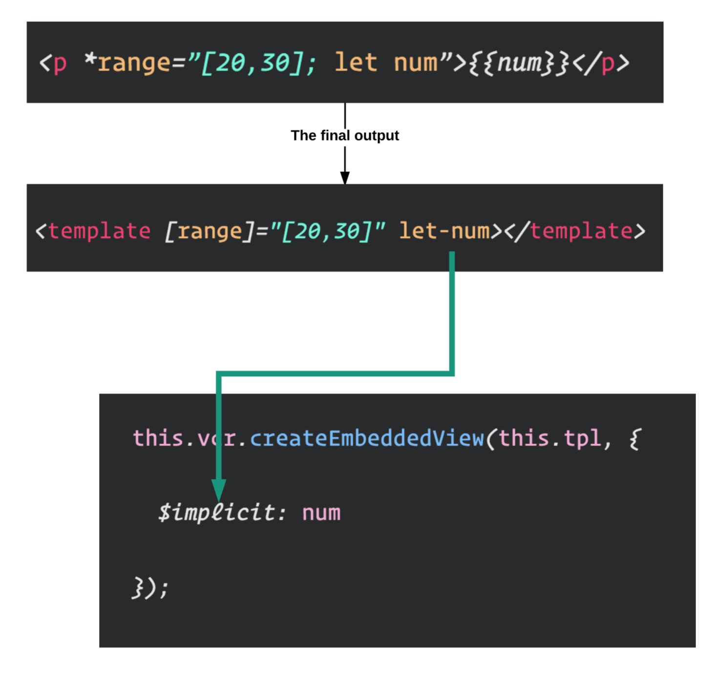
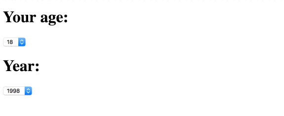

### What’s a Structural Directive?

> _A Structural directive changes the DOM layout by adding and removing DOM elements._

The two most common structural directives you’ll come across are `ngIf` and `ngFor`.

### Understanding the asterisk

> The asterisk is syntactic sugar for something a bit more complicated

Let’s take for example the `ngIf` directive:



-   Angular will wrap the `host` element with a `template` tag.
-   Angular will transform the `ngIf` to be a property binding.

### Create a Structural Directive

First, let’s understand how to create a structural directive. We are going to implement our simple copy of the `ngIf` directive.

<Embed src="https://gist.github.com/NetanelBasal/4507f75cdf8507b5ff91a46163f59ccb.js" aspectRatio={0.357} caption="" />

We can use our directive like this:

```
<div *myNgIf=”condition”></div>
```

Let’s explain what is happening piece by piece.

`**TemplateRef**` — As the name suggest the `TemplateRef` is just a reference to the `template`.



`**ViewContainerRef**` —

If you think about it, eventually templates contain DOM elements, so if you need to insert an element, you need a place to “put” it. In Angular, this place is called a **container.**`[ViewContainerRef](https://netbasal.com/angular-2-understanding-viewcontainerref-acc183f3b682#.rf5f05b5p)` is a reference to the **container**.

_Which element is the container in this case?_

_Angular will replace the_ `_template_` _with a diagnostic comment that will represent the container._

Let’s see this in action.

<Embed src="https://gist.github.com/NetanelBasal/a1430c325cd749dd83c59b2f281b91e3.js" aspectRatio={0.357} caption="" />

The code above will generate this output —



The `ViewContainerRef` also exposes the `createEmbeddedView()` method that takes a `template` and renders its content as a **sibling** to the container. ( in our case the comment )

The final step is to create a setter as `Input` and based on the condition to create/clear the template.

Now that you understand how to create a structural directive let’s see two real life examples.

### Show Content Based on the User Role —

Imagine that you need to show/hide content based on the user role. Let’s say you have a user stream that will give you the current user and you want to determine if he has permission to see the content based on his role.

<Embed src="https://gist.github.com/NetanelBasal/187c66894faad903595681bd756fc2f2.js" aspectRatio={0.357} caption="" />

**Note**: `authService.user` returns an observable.

The usage —

<Embed src="https://gist.github.com/NetanelBasal/cea192439e4a1e66bc6a70f56e5a1b78.js" aspectRatio={0.357} caption="" />



Very cool 😎 !

### Create Range Directive —

<Embed src="https://gist.github.com/NetanelBasal/84c300d130a8c675d97cad994d792bd7.js" aspectRatio={0.357} caption="" />

You can see that in this case, we are passing the second parameter to the `createEmbeddedView()` method. Angular 2 templates have a special `let` syntax that allows you to define and pass a `context` when they’re being generated.

This will allow us to reference the variable we declared back on the `*range=”[20,30]; let num”` as local variable on that view. We use `$implicit` because we don’t know what name the consumer will assign to it when he uses the directive. ( it’s like we use `ngFor=”**let todo** of todos”` )



The second approach is to expose your context as keys that you defined, for example:

<Embed src="https://gist.github.com/NetanelBasal/c9111d20562529564f9e74de64eecf17.js" aspectRatio={0.357} caption="" />

Now we can use our directive:

<Embed src="https://gist.github.com/NetanelBasal/90d3bf5839e1d1d2961648a4ff51b512.js" aspectRatio={0.357} caption="" />



You can create more advanced directives like `ngFor` but this is for another post.

### Things to not miss:

[**🚀 Introducing Akita: A New State Management Pattern for Angular Applications**  
_Every developer knows state management is difficult. Continuously keeping track of what has been updated, why, and…_netbasal.com](https://netbasal.com/introducing-akita-a-new-state-management-pattern-for-angular-applications-f2f0fab5a8 "https://netbasal.com/introducing-akita-a-new-state-management-pattern-for-angular-applications-f2f0fab5a8")[](https://netbasal.com/introducing-akita-a-new-state-management-pattern-for-angular-applications-f2f0fab5a8)

[**NetanelBasal/spectator**  
_spectator - 👻 Angular Tests Made Easy 🤓_github.com](https://github.com/NetanelBasal/spectator "https://github.com/NetanelBasal/spectator")[](https://github.com/NetanelBasal/spectator)

_Follow me on_ [_Medium_](https://medium.com/@NetanelBasal/) _or_ [_Twitter_](https://twitter.com/NetanelBasal) _to read more about Angular, Vue and JS!_
