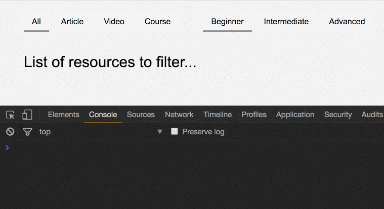

We can use the `[ViewChildren](https://netbasal.com/understanding-viewchildren-contentchildren-and-querylist-in-angular-896b0c689f6e)` decorator to get the `[QueryList](https://angular.io/api/core/QueryList)` of elements or directives from the view DOM. In this article, we’ll examine how can we leverage this technique in order to manage our application filters in a reusable, efficient and clean way.

Here is an illustration of the final result:



Imagine that we’re on a page that displays a list of resources and the users can filter the list by resource `type` or by resource `level`.

To inform the server how to filter the resource, we’ll use the query string style where we define what the current filters are. For example:

```
https://api.com/resources?type=video&level=beginner
```

### Our goal:

Each time the user clicks on a filter we need to get the latest value from each filter and create the new query string.

Fortunately, we have an Rx operator precisely for this kind of functionality — `combineLatest`.

> _Let me know when any Observable emits but also give me the latest value from the others. ( Array )_

Let’s create the `filters` component. This will be our final markup:

<Embed src="https://gist.github.com/NetanelBasal/f736b005a61a4e07d235bae2e1788c66.js" aspectRatio={0.357} caption="" />

#### The Interfaces

<Embed src="https://gist.github.com/NetanelBasal/abb75b87f1917dc48595213215c5ebd4.js" aspectRatio={0.357} caption="" />

The `Filter` interface is mostly for the UI. The `ActiveFilter` is for the server. The `group` is referring to the query string key, for example:

```
https://api.com/resources?level=beginner
```

In the about URL, the `group` is referring to `level`.

#### **The Filters Component**

<Embed src="https://gist.github.com/NetanelBasal/5fbbe865aa51df2301fccfad8da4f2dc.js" aspectRatio={0.357} caption="" />

We have two `Inputs`, the group name and array of filters.

The `combineLatest` operator expects to receive a list of observables. We need to create an observable that will emit the active filter each time the user clicks on a filter.

But there is one catch, we need to get the initial data, so we also need to emit the value from each at the component initialization phase. We can tackle this problem with `[BehaviorSubject](https://netbasal.com/understanding-subjects-in-rxjs-55102a190f3)`.

`[BehaviorSubject](https://github.com/Reactive-Extensions/RxJS/blob/master/doc/api/subjects/behaviorsubject.md)` takes an initial value and emits it immediately.

<Embed src="https://gist.github.com/NetanelBasal/4d01e69881bec019c251c9a693c79c0a.js" aspectRatio={0.357} caption="" />

We need to find the active `filter` from the `filters` Input; then we need to create our `BehaviorSubject` and emit the current filter `id` with the `group`.

Now let’s check the HTML and add the `click` event.

<Embed src="https://gist.github.com/NetanelBasal/5567b0268da17e65d08f340e61d97fd7.js" aspectRatio={0.357} caption="" />

The code is straightforward, let’s move to the `select()` method that will run each time the user clicks on a filter.

<Embed src="https://gist.github.com/NetanelBasal/969171b4b8db680d6573263930833cc9.js" aspectRatio={0.357} caption="" />

We need to change the `active` state on every filter; then we need to emit the new active `filter`.

The component is ready for use. Finally the fun part.

<Embed src="https://gist.github.com/NetanelBasal/cd88b51854c7a890bd60d5c763a7912c.js" aspectRatio={0.357} caption="" />

Now we need to get the observable from each `filters` component. We are going to use the `ViewChildren` decorator to grab the filters components from the current view.

<Embed src="https://gist.github.com/NetanelBasal/731c15c65a0261a7beb0f27885cf6557.js" aspectRatio={0.357} caption="" />

Great! Now we have the filters instances so we can get access to the `changeFilter` observable. The final step is to use `combineLatest` .

<Embed src="https://gist.github.com/NetanelBasal/062214a7f2e36bc10a5955e1aedcdbc9.js" aspectRatio={0.357} caption="" />

Every time one of the filters emits value, we’re going to receive an array containing each filter value, transform them to a query string and send to our server.

That’s all.

You can extract this code to a self-contained module and use it.

_Follow me on_ [_Medium_](https://medium.com/@NetanelBasal/) _or_ [_Twitter_](https://twitter.com/NetanelBasal) _to read more about Akita, Angular and JS!_

### 👂🏻 **Last but Not Least, Have you Heard of Akita?**

Akita is a state management pattern that we’ve developed here in Datorama. It’s been successfully used in a big data production environment for over seven months, and we’re continually adding features to it.

Akita encourages simplicity. It saves you the hassle of creating boilerplate code and offers powerful tools with a moderate learning curve, suitable for both experienced and inexperienced developers alike.

I highly recommend checking it out.

[**🚀 Introducing Akita: A New State Management Pattern for Angular Applications**  
_Every developer knows state management is difficult. Continuously keeping track of what has been updated, why, and…_netbasal.com](https://netbasal.com/introducing-akita-a-new-state-management-pattern-for-angular-applications-f2f0fab5a8 "https://netbasal.com/introducing-akita-a-new-state-management-pattern-for-angular-applications-f2f0fab5a8")[](https://netbasal.com/introducing-akita-a-new-state-management-pattern-for-angular-applications-f2f0fab5a8)
