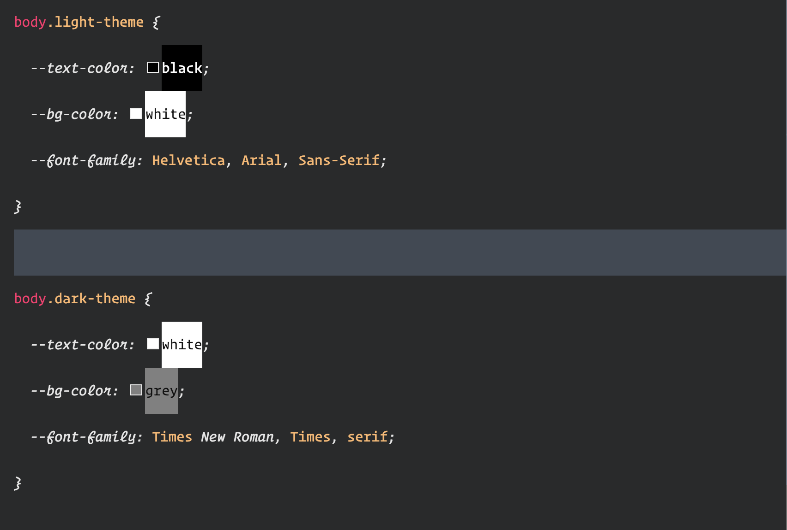
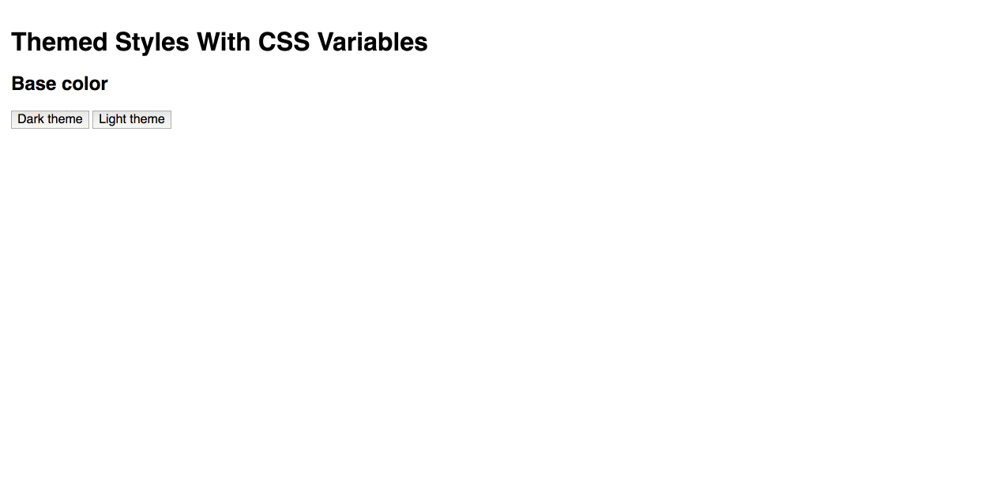
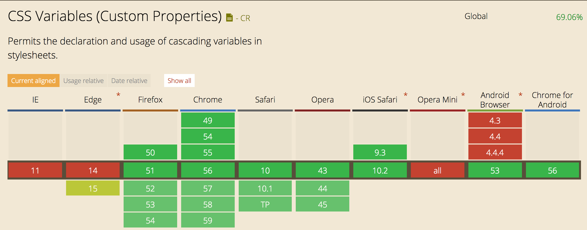

If you worked with a tool like SASS/LESS to gain themes support in your apps, you must know that this is not an easy task.

CSS variables, or more accurately, as they are called in the [spec](https://drafts.csswg.org/css-variables/), CSS custom properties, can be useful for creating **_themes_**.

This will not be an introduction to CSS variables; you can read more about them [here](https://developers.google.com/web/updates/2016/02/css-variables-why-should-you-care).

### 💪 The power of CSS variables 💪

> The ability to change variables at runtime

<Embed src="https://gist.github.com/NetanelBasal/e3b5842b13ef598205037003120ba4b9.js" aspectRatio={0.357} caption="" />

We can define different values for every theme. Now the only thing to do is to apply the class to our body in **_runtime_** with JavaScript, and we are done.

Currently, we have great support for CSS variables except for IE as usual.

You can play with code [here](http://codepen.io/phpnetanel/pen/gmrWgb).

_Follow me on_ [_Medium_](https://medium.com/@NetanelBasal/) _or_ [_Twitter_](https://twitter.com/NetanelBasal) _to read more about Angular, Vue and JS!_
