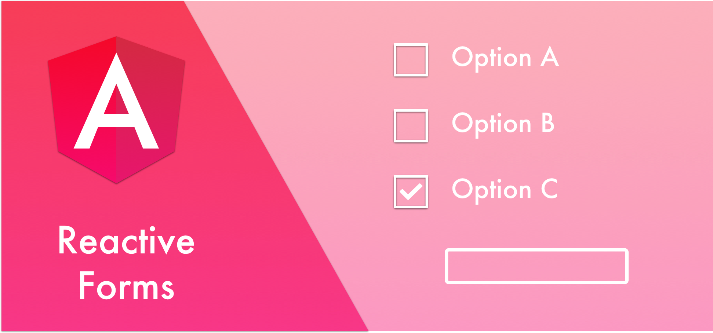
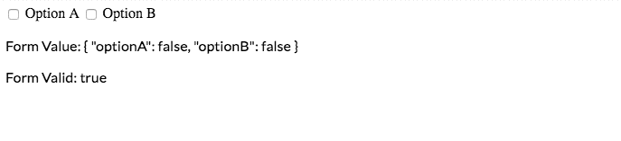

There are times where we need to “activate” a form control based on the value of another control.

For example, let’s say a user has multiple options, and if he marks the second option, we want to display an additional text input, where he’s required to add a reason.

<Embed src="https://gist.github.com/NetanelBasal/6ed5c896d7371b7c450e05c9db108898.js" aspectRatio={0.357} caption="" />

Now, let’s say the user doesn’t mark `optionB` and submits the form. The form will still be invalid even though, from our perspective, it’s valid.

Let’s see three ways to solve this problem:

### Dynamically Add a Control

The FormGroup class exposes an API that enables us to add controls dynamically.

<Embed src="https://gist.github.com/NetanelBasal/3208c2821f9c7e1e6a466e9aeed6f3e5.js" aspectRatio={0.357} caption="addControl" />

In the initial definition of the form group, we exclude the `optionExtra` control. We need to listen to `optionB` value changes and based on that we are add or remove the `optionExtra` control.

We also call the form’s `updateValueAndValidity()` method, as we need to recalculate the value and validation status of the form.

If you choose this way, remember that you also you’ll also need to call `optionExtra.setErrors(null)` before removing the control.

### Dynamically Add Validators

The FormGroup class exposes an API that enables us to set validators dynamically.

<Embed src="https://gist.github.com/NetanelBasal/afc962f7ef2d04755220e83a8bd4c062.js" aspectRatio={0.357} caption="setValidators" />

We need to listen to `optionB` value changes and based on that we add or remove the validators we require.

We also call the control’s `updateValueAndValidity()` method, as we need to recalculate the value and validation status of the control.

### Disable the Control

This option is the least known one and also my favorite. When we mark a control as `disabled`, Angular excludes its value and won’t take it into account when running the validation process.

<Embed src="https://gist.github.com/NetanelBasal/efd2236d19d04dd6e82dd23843d37154.js" aspectRatio={0.357} caption="Disable control" />

If you need the complete form value including the disabled controls, you can use the form’s `getRawValue()` method.

And of course, don’t forget to unsubscribe!

Here are all the cases at work:

<Embed src="https://stackblitz.com/edit/condi-control-addcontrol?embed=1" aspectRatio={undefined} caption="addControl" />

<Embed src="https://stackblitz.com/edit/condi-control-setvalidators?embed=1" aspectRatio={undefined} caption="setValidators" />

<Embed src="https://stackblitz.com/edit/condi-control-disabled?embed=1" aspectRatio={undefined} caption="disable" />

### 👂🏻 Last but Not Least, Have you Heard of Akita?

Akita is a state management pattern that we’ve developed here in Datorama. It’s been successfully used in a big data production environment for over seven months, and we’re continually adding features to it.

Akita encourages simplicity. It saves you the hassle of creating boilerplate code and offers powerful tools with a moderate learning curve, suitable for both experienced and inexperienced developers alike.

I highly recommend checking it out.

[**🚀 Introducing Akita: A New State Management Pattern for Angular Applications**  
_Every developer knows state management is difficult. Continuously keeping track of what has been updated, why, and…_netbasal.com](https://netbasal.com/introducing-akita-a-new-state-management-pattern-for-angular-applications-f2f0fab5a8 "https://netbasal.com/introducing-akita-a-new-state-management-pattern-for-angular-applications-f2f0fab5a8")

_Follow me on_ [_Medium_](https://medium.com/@NetanelBasal/) _or_ [_Twitter_](https://twitter.com/NetanelBasal) _to read more about Angular, Akita and JS!_
