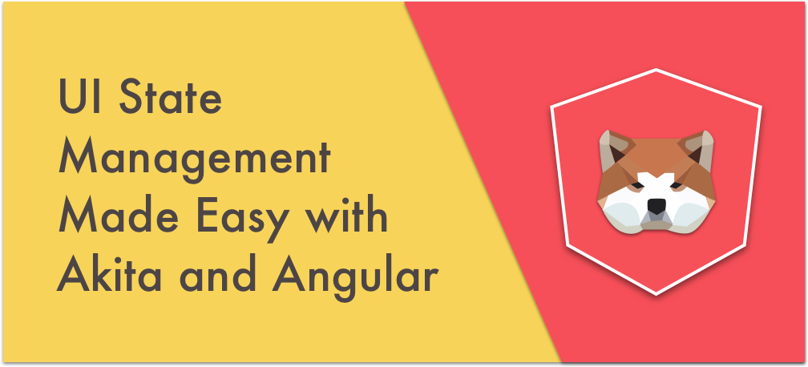
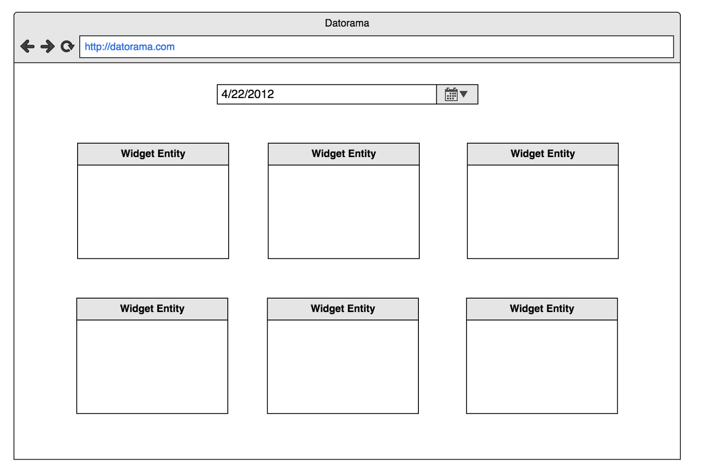
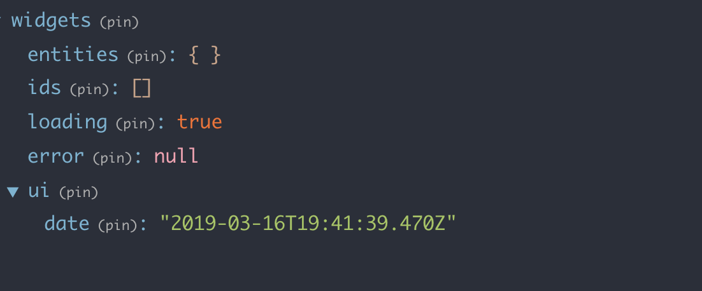
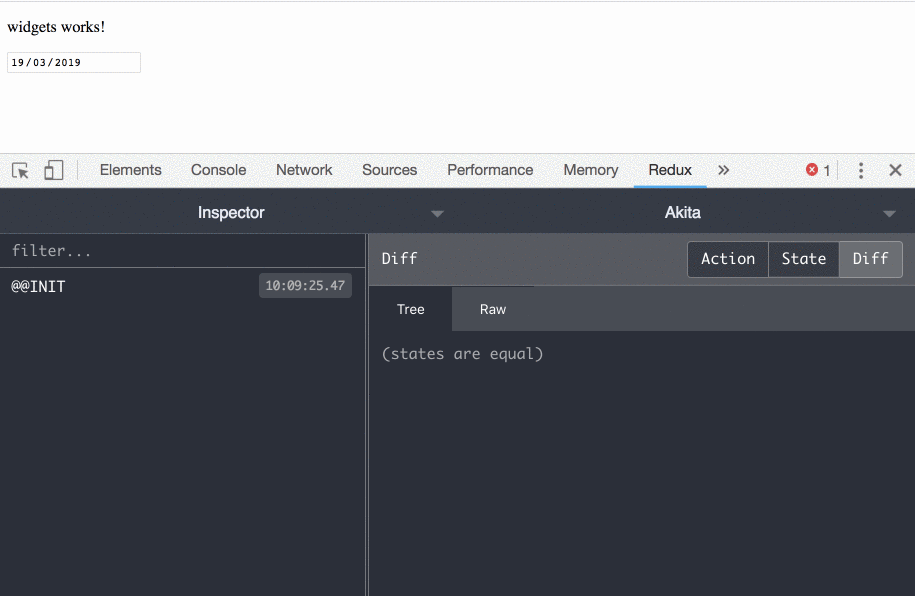
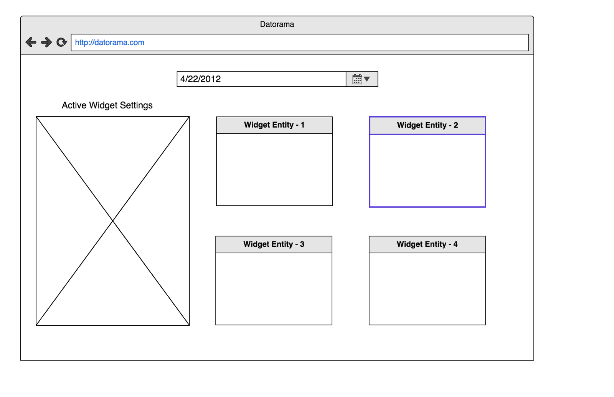
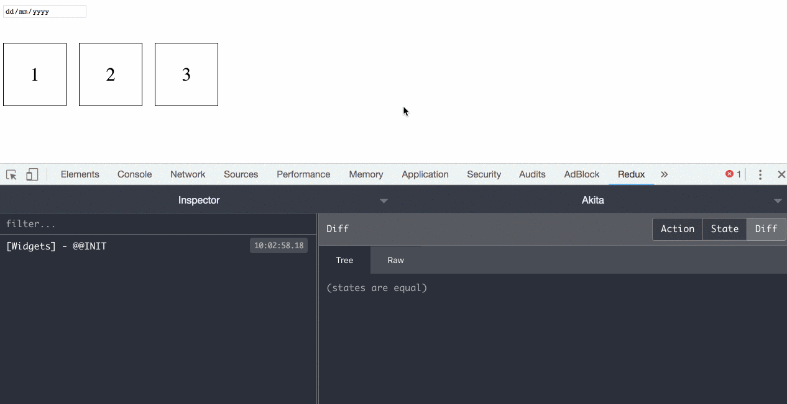
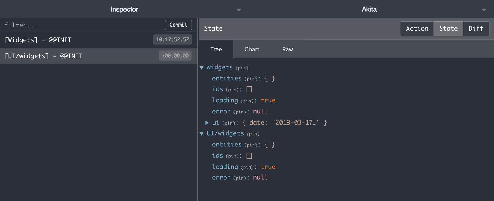
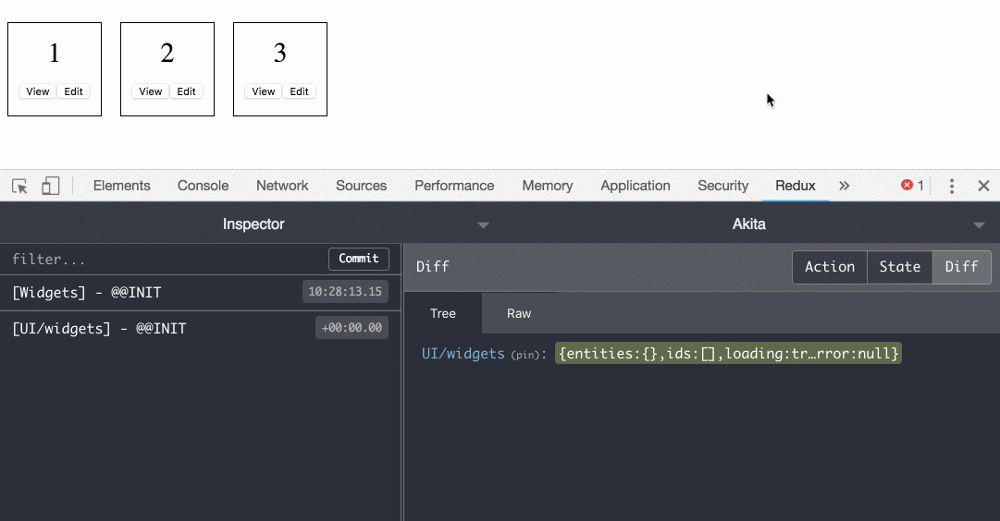

As a best practice, Akita recommends separating the Domain State from the UI State. Domain State is the state of your application in the server side, while the UI state is information that’s relevant to the UI alone, and therefore not stored in the server. Some examples of that are the current time based on the user’s machine, which tab is the active one, or whether a drop-down is open.

Let’s examine two types of UI states by looking at real-world examples from our application, and how we manage them with Akita:

### Global UI State

Here we have a page where we display a list of widgets. Each widget shows the user’s data differently, depending on what the user has selected. It can be a bar chart, a pie, a simple list, etc.

At the top of the page, there’s a date picker component responsible for filtering the widgets\` data.

First, we know that we need to maintain a collection of widgets so we’ll create an `EntityStore` :

<Embed src="https://gist.github.com/NetanelBasal/96d69e35534b67ce3bd668ac9d286b11.js" aspectRatio={0.357} caption="" />

In addition to the widget entities, we know that we need to maintain the user’s selected date. This date is applied globally to all widgets, rather than per widget, so the best place to store it is on the store root state:

<Embed src="https://gist.github.com/NetanelBasal/1d17b96e476e7162fcb301b8478e221f.js" aspectRatio={0.357} caption="" />

We can extend our entity store and add more properties to it. In our case, we’ve added the date, and set the default value to be the current date.

As you can see, we put the date under a `ui` key, to make it clear that the values it holds belong to a UI state.

At this point, our store state looks like the following:

We have the default properties that comes with `EntityStore` and our extended `ui` object.

Now, we can use the store’s `update()` method to update the `date` property and the query’s `select()` method to get the date reactively:

<Embed src="https://gist.github.com/NetanelBasal/14d05790971a8b5f9e08d95be700aa63.js" aspectRatio={0.357} caption="" />

When we have multiple UI properties in the store, it’s recommended to create a helper `updateUI()` method, for example:

<Embed src="https://gist.github.com/NetanelBasal/2565b00ff1a343e4ad015a38f1bf689f.js" aspectRatio={0.357} caption="" />

### Entity UI State

There are times when we need to have an entity-based UI state. For example, if we need to know various ui-related data on the current entity — whether it is open, loading, etc.

There are two reasons we’d want to have this separation of concerns:

-   We don’t want to interfere with the entity that we get from the server, because otherwise we’ll need to clean up what we added when sending it back, to avoid sending a redundant payload over the network.
-   If we keep the data in the entity and don’t clean it up, it can end up as part of the entity’s database entry (since it’s not uncommon in databases to allow for free-formed JSON data fields to be stored). In this scenario we might end up with a lot of of garbage in our database.

#### Active Entity Management

Continuing with the example from our application, when a user selects a widget, we need to open a sidebar panel and display its settings within it:

Luckily, Akita comes with built-in support for an active attribute, used to hold the active entity’s id, which make managing the active entity a breeze.

Akita supports both single and multiple active entity management. In our case we need to maintain one active entity, so we need to extend the `ActiveState` interface to our store:

<Embed src="https://gist.github.com/NetanelBasal/d4d46577e4b2411577077680f8b90a0d.js" aspectRatio={0.357} caption="" />

Now we can use the [API](https://netbasal.gitbook.io/akita/entity-store/entity-store/active-state) that Akita provides to update and query the active entity, for example:

<Embed src="https://gist.github.com/NetanelBasal/98087071521859c84a88dd455190c2b3.js" aspectRatio={0.357} caption="" />

And here’s how we can use that API in our example:

<Embed src="https://gist.github.com/NetanelBasal/ec84ea18d0e0d16ec98726f1f6ea0873.js" aspectRatio={0.357} caption="" />

#### Managing More Complex UI Entity States

So far so good, but there are times when we need more than that. In our example application, each widget entity requires managing a lot more UI state properties (for instance: whether the widget is interactive, if its data is cached, what mode it’s in etc.).

For cases like these, Akita provides a built-in UI store and an accompanying UI query, which you can create on demand.

<Embed src="https://gist.github.com/NetanelBasal/a70a3f4d182de42bdcecc2c65e1080d8.js" aspectRatio={0.357} caption="" />

The only thing we need to do is to add the ui property, passing the entity UI interface, and then call the `createUIStore()` in the entity store’s constructor and `createUIQuery()` in the entity query’s constructor.

With this setup, Akita will instantiate a new `EntityStore` and `EntityQuery` under the `ui` property, which will be responsible for managing the entity UI state.

Now, when we want to update a property in our UI store, we can call any store method we want, for example:

<Embed src="https://gist.github.com/NetanelBasal/cdfd0a2b55dfb802a7d7ddbcdf01b682.js" aspectRatio={0.357} caption="" />

And observe every change in the Redux dev-tools:

#### Hot update: Initial UI Entity State

Today, we’ve added new functionality based on a feature request that was submitted yesterday. Starting from v3.2, it’s possible to pass an initial entity state in the UI store:

<Embed src="https://gist.github.com/NetanelBasal/2ed9f9e2864e0817ee1d1a6238856b86.js" aspectRatio={0.357} caption="" />

With this setup, each time we create a new entity for the encompassing entity store, by calling the `set()` or `add()` methods, Akita automatically generates an accompanying UI entity for this entity with the values we specified. In addition, whenever we remove the related entity from the model, Akita automatically removes the UI entity associated with it.

#### Querying a UI Entity

There are several ways to query a UI entity. The first option is to create a method in the component:

<Embed src="https://gist.github.com/NetanelBasal/69acc96f93bb6ee61d641fc0e0b1106a.js" aspectRatio={0.357} caption="" />

Note that we employ memoization because we don’t want to return a new observable upon each change detection (this functionality isn’t specific to Akita, it’s how Angular CD works).

The second option is to create a dedicated component or directive, pass the `id` as input, and query the required part from the UI entity:

<Embed src="https://gist.github.com/NetanelBasal/a182c905e2f0be367ec61115d1bac93b.js" aspectRatio={0.357} caption="" />

This way we’ll have one instance per entity and we can keep our component compact.

Last but not least, we can create a derived query method that merges both the model and the UI, by using the `combineLatest` operator:

<Embed src="https://gist.github.com/NetanelBasal/ed0df7c630b1aac816b9fdcd522c0fa7.js" aspectRatio={0.357} caption="" />

When using this option, consider including the `auditTime` operator. You can find a detailed explanation for why you might need it in the following article:

[**Working with Normalized Data in Akita and Angular**  
_In this article, we’ll build an Angular application which lists movies which arrive from a nested API response. We’ll…_netbasal.com](https://netbasal.com/working-with-normalized-data-in-akita-e626d4c67ca4 "https://netbasal.com/working-with-normalized-data-in-akita-e626d4c67ca4")

[!We’re Hiring](https://goo.gl/forms/J0oY5iDnyG8frFJq2)

We’re looking for great front-end developers. If you’re one of them, you’re passionate about technology, and you want to work for the best [company](https://www.salesforce.com/blog/2018/02/salesforce-fortune-100-best-companies-to-work.html) in the world, come and join me.

### Additional Resources

[**Form Fatale: How Akita’s Form Manager Can Do Away with Complex Multistep Form Logic in Angular**  
_Akita’s Angular Form Manager_netbasal.com](https://netbasal.com/form-fatale-how-akitas-form-manager-can-do-away-with-complex-multistep-form-logic-in-angular-329a557cc68 "https://netbasal.com/form-fatale-how-akitas-form-manager-can-do-away-with-complex-multistep-form-logic-in-angular-329a557cc68")

[**😍 You Asked for It, We Listened, and Now it’s Here - Akita v3**  
_Akita 3.0 is finally here! We’ve listened to your feature requests and incorporated them in this brand new version of…_engineering.datorama.com](https://engineering.datorama.com/you-asked-for-it-we-listened-and-now-its-here-akita-v3-92740d0d72e4 "https://engineering.datorama.com/you-asked-for-it-we-listened-and-now-its-here-akita-v3-92740d0d72e4")
