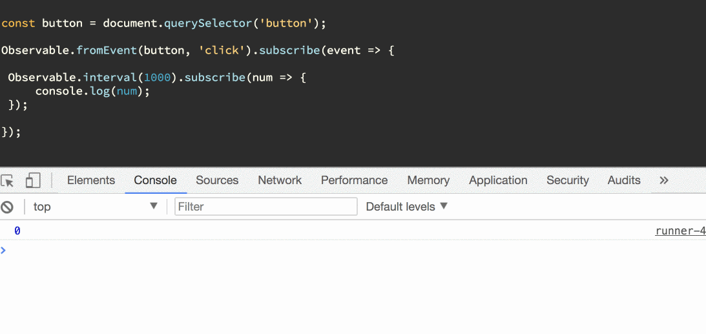
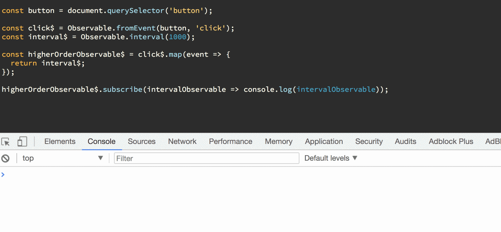
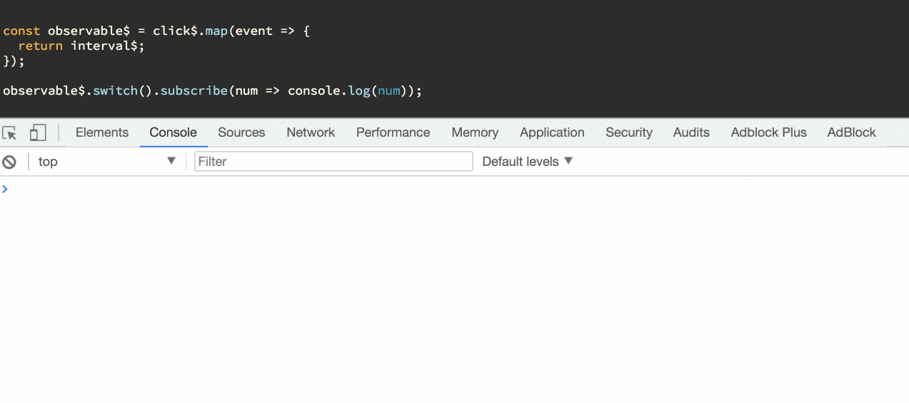
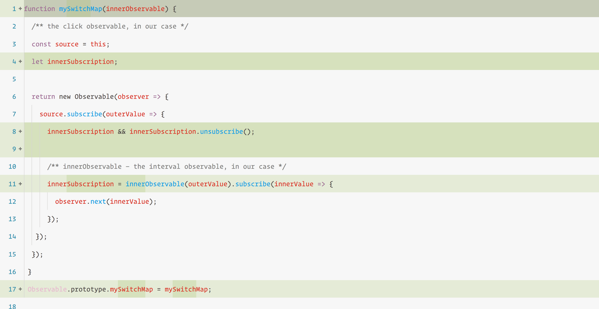

Higher order observables are one of the most influential features in Rx. They’re also one of the most difficult to understand.

In this article, I will try to explain the subject in my own way. Hopefully, it will shine some light in the dark.

Let’s say you have a simple task. You have a button, and when you click on it, you need to start an interval. Let’s see how we would implement this the simple way.

<Embed src="https://gist.github.com/NetanelBasal/0bbcdd0ed7cf09be345467de887ed327.js" aspectRatio={0.357} caption="click to interval" />

We need to subscribe to the `fromEvent()` observable, which internally adds a new click event listener to our button. When the user clicks on the button, we need to subscribe to the `interval()` observable, which internally invokes the native JS `setInterval()` function.

While it works fine, there are two drawbacks to the code above.  
1\. It’s starting to look like [callback hell](http://callbackhell.com/).   
2\. We need to handle the disposal of every subscription by ourselves.

Let’s see how higher order observables make things easier for us.

### Higher Order Observables

An observable can emit values of any type: numbers, strings, objects, etc. This means an observable can also emit values that are, themselves, observables too.

A higher order observable is just a fancy name for an observable that emits observable. Let’s change the example a little bit so you can see what I’m talking about.

<Embed src="https://gist.github.com/NetanelBasal/b6f807c138b150545690bca8c9770ca0.js" aspectRatio={0.357} caption="clicks$ to interval$" />

When the user clicks on the button, we leverage the `map()` operator to return an `interval()` observable to the stream.

When we subscribe, the `clicks$` observable will `next()` an interval observable.

You may notice that, in this case, we never invoke the interval. In contrast, in the first example, we saw the numbers running in the console.

That’s because we **never called subscribe() on our** `**interval$**` **observable**. Remember that observables are **lazy** — if we want to pull a value out of an observable, we must `subscribe()`.

<Embed src="https://gist.github.com/NetanelBasal/4aa3a108dd0540cb914c79153b3aeb8f.js" aspectRatio={0.357} caption="clicksToIntervals subscribe" />

Now, we are going to once again see the numbers from our interval observable.

Now that we understand the nature of higher order observables, let’s introduce two useful operators to help us with the problems mentioned above.

### mergeAll

> _When the inner observable emits, let me know by merging the value to the outer observable._

Under the hood, the `mergeAll()` operator basically does what we did in the last example. It takes the inner observable, subscribes to it, and pushes the value to the observer.

<Embed src="https://gist.github.com/NetanelBasal/a7f52ac7308ec0bfbfef37cf6494c79f.js" aspectRatio={0.357} caption="mergeAll" />

_In our case, the source ( or outer ) observable is the_ `_clicks$_` _observable and the inner observable is the_ `_interval$_` _observable._

Because this is a common pattern in Rx, there is a shortcut that achieves the same behaviour — `mergeMap()`.

<Embed src="https://gist.github.com/NetanelBasal/887f9c4f73c55371671bbc44b2051f0d.js" aspectRatio={0.357} caption="mergeMaP" />

So `mergeMap()` is just `map()` + `mergeAll()`.

Here’s a very basic implementation of `mergeMap()`:

<Embed src="https://gist.github.com/NetanelBasal/123170d981bd160e4b7866c62e56e1f0.js" aspectRatio={0.357} caption="mergeMap" />

From the above code, we can learn that each time we click on the button, we are invoking the `subscribe()` method of the inner `interval()` observable — **which leads to multiple independent intervals in our page.**

If this is what you’re after, you are good to go. But, if you want to cancel the previous subscriptions and keep only one, you’ll need the `switch()` operator.

### switch

> _Like mergeMap() but when the source observable emits cancel any previous subscriptions of the inner observable._

As the name suggests, `switch()` switches to the new subscription and cancels the previous one.

If we change our code to `switch()` and click on the button multiple times, we’ll see that each time we click we are given a new `interval` and the previous one is **canceled**.

<Embed src="https://gist.github.com/NetanelBasal/77cf4b2f713ab1b1648a746656b54f07.js" aspectRatio={0.357} caption="switch" />

As you can see, even after clicking three times, we have only **one** `interval` running. In contrast, with the `merge()` operator, we would have three independent intervals. Essentially, the key difference between `merge()` and `switch()` is one important line.

When the source emits, we need to unsubscribe from the previous inner subscription.

Because this is a common pattern in Rx, there is a shortcut to achieve the same behaviour — `switchMap()`.

So `switchMap()` is just `map()` + `switch()`.

### Summary

We learned about higher order observables and the difference between `mergeMap()` and `switchMap()`. As a rule of thumb, if you don’t know what you’re doing, `switchMap()` is a better choice.

_Follow me on_ [_Medium_](https://medium.com/@NetanelBasal/) _or_ [_Twitter_](https://twitter.com/NetanelBasal) _to read more about Angular, Vue and JS!_

### **Things to not miss**:

[**🚀 Introducing Akita: A New State Management Pattern for Angular Applications**  
_Every developer knows state management is difficult. Continuously keeping track of what has been updated, why, and…_netbasal.com](https://netbasal.com/introducing-akita-a-new-state-management-pattern-for-angular-applications-f2f0fab5a8 "https://netbasal.com/introducing-akita-a-new-state-management-pattern-for-angular-applications-f2f0fab5a8")

[**datorama/akita**  
_akita — 🚀 Simple and Effective State Management for Angular Applications_github.com](https://github.com/datorama/akita "https://github.com/datorama/akita")

[**NetanelBasal/spectator**  
_spectator — 👻 Angular Tests Made Easy 🤓_github.com](https://github.com/NetanelBasal/spectator "https://github.com/NetanelBasal/spectator")
