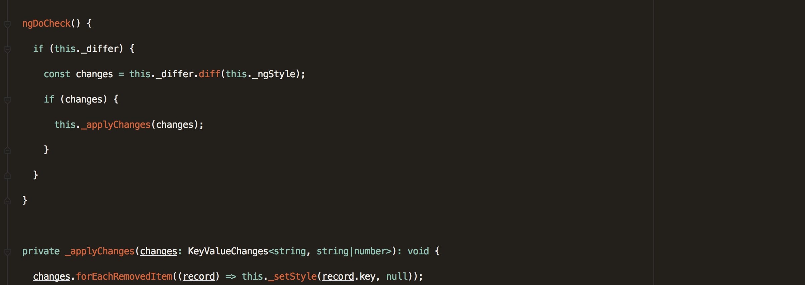

In this article, we are going to learn why we need the `ngDoCheck` life cycle hook and the `KeyValueDiffers` service by recreating the `ngStyle` directive from scratch.

#### The KeyValueDiffers service:

The `KeyValueDiffers` service is a differ that tracks changes made to an object over time and also expose an API to react to these changes. ( we are going to see later how we can use this service )

#### The ngDoCheck lifecycle:

We are all familiar with the `ngOnChanges` lifecycle hook. You can implement `ngOnChanges` to be notified of changes if your `Input` is a primitive type or your `Input` reference changes ( using some immutability strategy ).

If the model reference doesn’t change, but some property of the `Input` model changes, you may implement the `ngDoCheck` lifecycle hook to construct your change detection logic manually.

Ok, enough we the talks let’s start coding.

<Embed src="https://gist.github.com/NetanelBasal/e71085bdf42bd517bb37074ecdc700a0.js" aspectRatio={0.357} caption="" />

We are creating the `ngStyle` directive and implementing the `DoCheck` interface. We also inject our services, `KeyValueDiffers`, `Renderer`, and reference to the host element ( `ElementRef` ).

<Embed src="https://gist.github.com/NetanelBasal/31519c6543d57f8054b9fd2bd8172270.js" aspectRatio={0.357} caption="" />

We are creating the `ngStyle` Input as a setter. If we don’t have a differ we are creating a new differ by calling:

```
this._differ = this._differs.find(value).create(null);
```

The `find()` method just searching for a differ to our value.

If you are curious, this is how Angular checks if she has a proper differ for our value:

```
return obj instanceof Map || isJsObject(obj);
```

The `create()` method just creating the differ and returns an instance of `DefaultKeyValueDiffer`. ( the null is for `ChangeDetectorRef`)

<Embed src="https://gist.github.com/NetanelBasal/68dcb06cfc481963d568e7e96640ba16.js" aspectRatio={0.357} caption="" />

We need to implement the `ngDoCheck` lifecycle hook because as we say before we are **not** changing our object reference so we cannot use `ngOnChanges`.

For example:

```
<div [ngStyle]=”style”></div>

// In our component constructor
this.style = { color: 'red' };

// After click event
this.style.color = 'blue'
```

Next, we are checking if our object is changed by calling the `diff()` method with the new value. If there aren’t any changes, the return value will be null. If there any changes the return value will be an object that exposes three methods that we can use to react to these changes.

<Embed src="https://gist.github.com/NetanelBasal/39ad0cd2aa3d78cd49e856a5a7d3ec99.js" aspectRatio={0.357} caption="" />

The methods are self-explanatory, we can pass a callback to every change that we need to know. Every callback gives you a record of type `KeyValueChangeRecord.`This is an object with three useful keys, the `key`, the `currentValue` and the `previousValue.`

Now every time we have a change we are calling the `_setStyle()` method that calls the `setElementStyle()` from our Renderer service to set the new element style.

You can read more about the `Renderer` service [here](https://netbasal.com/angular-2-explore-the-renderer-service-e43ef673b26c#.f57hf79da).

<Embed src="https://gist.github.com/NetanelBasal/fe010e374677a34665f3c2ab4b006f55.js" aspectRatio={0.357} caption="" />

**The truth** is that this is the Angular source code for `ngStyle`. I did not write this code and do not take any credit of this; I am just explaining the concepts and how it’s working under the hood.

You can see the full source code [here](https://github.com/angular/angular/blob/1c85e9958874402b404909056bec64a13763984d/modules/@angular/common/src/directives/ng_style.ts).

### 😱  🚀 **Have You Tried Akita Yet?**

One of the leading state management libraries, Akita has been used in countless production environments. It’s constantly developing and improving.

Whether it’s entities arriving from the server or UI state data, Akita has custom-built stores, powerful tools, and tailor-made plugins, which help you manage the data and negate the need for massive amounts of boilerplate code. We/I highly recommend you try it out.

[**🚀 Introducing Akita: A New State Management Pattern for Angular Applications**  
_Every developer knows state management is difficult. Continuously keeping track of what has been updated, why, and…_netbasal.com](https://netbasal.com/introducing-akita-a-new-state-management-pattern-for-angular-applications-f2f0fab5a8 "https://netbasal.com/introducing-akita-a-new-state-management-pattern-for-angular-applications-f2f0fab5a8")[](https://netbasal.com/introducing-akita-a-new-state-management-pattern-for-angular-applications-f2f0fab5a8)

_Follow me on_ [_Medium_](https://medium.com/@NetanelBasal/) _or_ [_Twitter_](https://twitter.com/NetanelBasal) _to read more about Angular, Akita and JS!_
