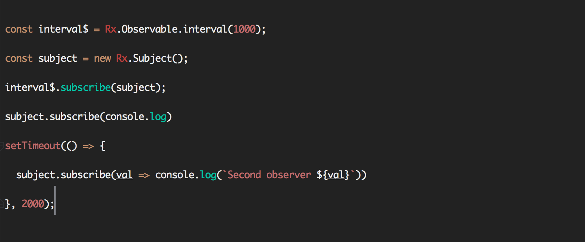

Before we start, this article requires basic knowledge in Rx.

Let’s say we have two observables:

<Embed src="https://gist.github.com/NetanelBasal/249045521cd485bfe241096902299c46.js" aspectRatio={0.357} caption="" />

Every time we call subscribe with new observer we are creating a new execution. You can think of it as a normal function that executes twice. For example:

<Embed src="https://gist.github.com/NetanelBasal/fb30f024adb970d029e970b9dafdd28f.js" aspectRatio={0.357} caption="" />

We are creating two intervals that are independent of each other. But what if we need the second observer to get the same events has the first?

This is the case when you are going to need to use Subject in Rx.

### What are Subjects?

Subject is both an observable and observer.

1.  Observer — it has the next, error, and complete methods.
2.  Observable — it has all the observable operators, and you can subscribe to him.

A subject can act as a bridge/proxy between the source observable and many observers, making it possible for multiple observers to **share** the same observable execution.

Let’s see how we can **share** the same execution in our first example:

<Embed src="https://gist.github.com/NetanelBasal/f073dd37760ff69a95698d8ecb9932ef.js" aspectRatio={0.357} caption="" />

First, we are creating a new Subject. Now, remember that a subject is also an observer, and what observers can do? They can listen to observables with the `next()`, `error()` and `complete()` methods. If you log the subject, you can see that the subject has these methods.

So in our case, the subject is observing the interval observable. In simple words when you have new values let me know.

Now let’s move on to the next part.

<Embed src="https://gist.github.com/NetanelBasal/08c4bfc1b3327486cd057ad364dcf8c4.js" aspectRatio={0.357} caption="" />

A subject is also observable, and what we can do with observables? We can subscribe to them.

In our case, we are subscribing to the subject. But what values the subject gives us?

If you remember the subject is observing the `interval` observable, so every time the `interval` send values to the subject, the subject send this values to all his observers.

The subject acts as a proxy/bridge, and because of that, there is only one execution.

> Oh, I got new value from the interval observable, I am passing this value to all my observers (listeners)

Don’t forget that every subject is also an observer so we can use the observer methods `next()`, `error()`, `complete()`. Let’s see an example:

<Embed src="https://gist.github.com/NetanelBasal/216ab7cf8a939d5c3392cc5c334dacbd.js" aspectRatio={0.357} caption="" />

We can subscribe to the subject, and we can manually trigger the `next()` method. When you call the `next()` method every subscriber will get this value. (you can also trigger `error()` and `complete()`)

We learned about the simplest subject in Rx. More types of subjects can solve more complex situations, `BehaviorSubject`, `AsyncSubject`, and `ReplaySubject`.

The most common one is the `BehaviorSubject`, and you can read about him in my latest [article](https://netbasal.com/angular-2-persist-your-login-status-with-behaviorsubject-45da9ec43243#.fpj4h4phq).

### **Things to not miss**:

[**🚀 Introducing Akita: A New State Management Pattern for Angular Applications**  
_Every developer knows state management is difficult. Continuously keeping track of what has been updated, why, and…_netbasal.com](https://netbasal.com/introducing-akita-a-new-state-management-pattern-for-angular-applications-f2f0fab5a8 "https://netbasal.com/introducing-akita-a-new-state-management-pattern-for-angular-applications-f2f0fab5a8")

[**NetanelBasal/spectator**  
_spectator - 👻 Angular Tests Made Easy 🤓_github.com](https://github.com/NetanelBasal/spectator "https://github.com/NetanelBasal/spectator")

_Follow me on_ [_Medium_](https://medium.com/@NetanelBasal/) _or_ [_Twitter_](https://twitter.com/NetanelBasal) _to read more about Angular, Vue and JS!_
