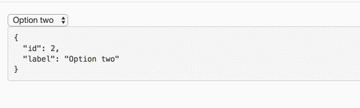
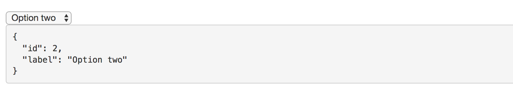

The `compareFn` input comes to solve a specific problem. Imagine that you have a select box in your application, For example:

```
<select [formControl]="control">
  <option [ngValue]="option" *ngFor="let option of options">
    {{option.label}}
  </option>
</select>

export class HomeComponent {

  options = [
    { id: 1, label: 'Option one' },
    { id: 2, label: 'Option two' },
    { id: 3, label: 'Option three' }
  ]

  control = new FormControl(this.options[1]);

}
```

You set the second option as the default option by passing the object reference from the `options` array.

Until now, everything is fine. But imagine that your users have the ability to add new options. You submit a POST request and update the state with the new data that was returned from the server. ( Assuming you are working with immutable state )

Let’s simulate this:

```
ngOnInit() {
  setTimeout(() => {
    this.options = [
      { id: 1, label: 'Option one' },
      { id: 2, label: 'Option two' },
      { id: 3, label: 'Option three' },
      { id: 4, label: 'Option four' }
    ]
  }, 2000);
}
```

At this point, we have a problem. The object reference has **changed (this.options\[1\])**, so we lost the model bindings.



The solution is to provide the `compareFn` function that tells Angular how to compare the values.

```
<select [formControl]="control" [compareWith]="compareFn">
  <option [ngValue]="option" *ngFor="let option of options">
    {{option.label}}
  </option>
</select>

compareFn( optionOne, optionTwo ) : boolean {
  return optionOne.id === optionTwo.id;
}
```

_Follow me on_ [_Medium_](https://medium.com/@NetanelBasal/) _or_ [_Twitter_](https://twitter.com/NetanelBasal) _to read more about Angular, Vue and JS!_

### 👂🏻 **Last but Not Least, Have you Heard of Akita?**

Akita is a state management pattern that we’ve developed here in Datorama. It’s been successfully used in a big data production environment for over seven months, and we’re continually adding features to it.

Akita encourages simplicity. It saves you the hassle of creating boilerplate code and offers powerful tools with a moderate learning curve, suitable for both experienced and inexperienced developers alike.

I highly recommend checking it out.

[**🚀 Introducing Akita: A New State Management Pattern for Angular Applications**  
_Every developer knows state management is difficult. Continuously keeping track of what has been updated, why, and…_netbasal.com](https://netbasal.com/introducing-akita-a-new-state-management-pattern-for-angular-applications-f2f0fab5a8 "https://netbasal.com/introducing-akita-a-new-state-management-pattern-for-angular-applications-f2f0fab5a8")[](https://netbasal.com/introducing-akita-a-new-state-management-pattern-for-angular-applications-f2f0fab5a8)
