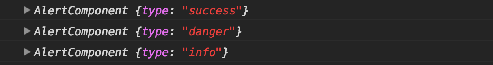
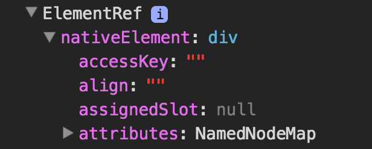
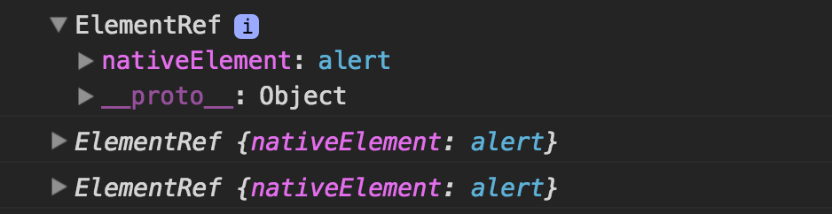
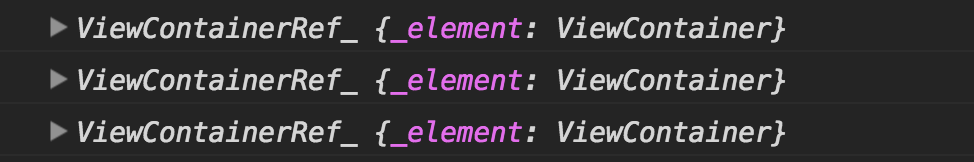
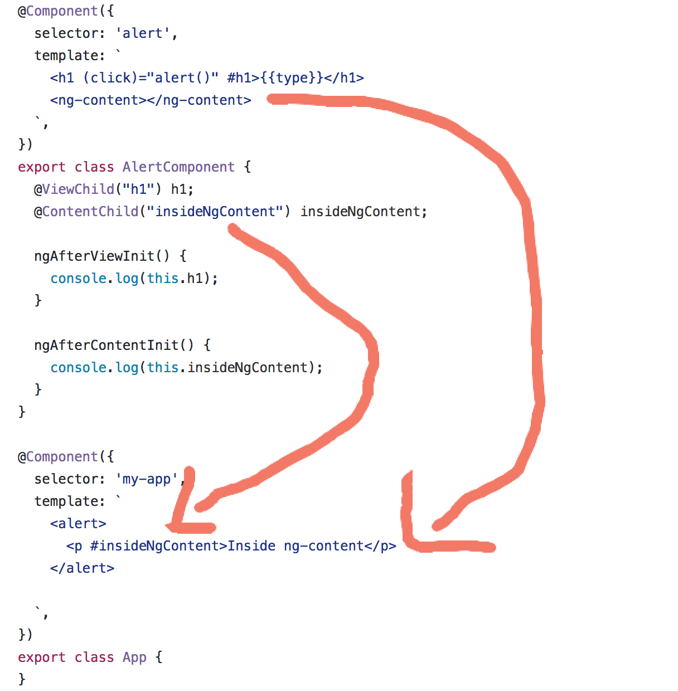

There are times when a parent component needs access to his children. Let’s see how we can handle this with Angular.

### @ViewChildren —

> _Returns the specified elements or directives from the view DOM as QueryList_

For example, let’s create a simple `alert` component.

<Embed src="https://gist.github.com/NetanelBasal/ca16c455bb13acfb69daee09122ea581.js" aspectRatio={0.357} caption="" />

Now let’s use this component multiple times in our `app` component and use the `@ViewChildren` decorator.

<Embed src="https://gist.github.com/NetanelBasal/2478f309a6f830a07aea5bddf527a3c2.js" aspectRatio={0.357} caption="" />

We can use the `@ViewChildren` decorator to grab elements from the host view.

The `@ViewChildren` decorator supports directive or component type as parameter, or the name of a template variable.

When the parameter is a component/directive the return value will be the component/directive instance.

When the parameter is the name of a template variable, the return value will be a reference to the native element.

<Embed src="https://gist.github.com/NetanelBasal/b19728bae8b14786c31996149fa7435d.js" aspectRatio={0.357} caption="" />

**Note:** In this case, it will make more sense to use the `@ViewChild` decorator because this is only a single element.

### The read parameter —

As we said by default, the `ViewChildren` decorator will return the component instance, but you can ask for other tokens:

-   The native DOM element —

<Embed src="https://gist.github.com/NetanelBasal/c5dd5f1e2e17de240ea1d589b3814c38.js" aspectRatio={0.357} caption="" />

-   [ViewContainerRef](https://www.google.co.il/url?sa=t&rct=j&q=&esrc=s&source=web&cd=14&cad=rja&uact=8&ved=0ahUKEwjQyqX67NbSAhVHuhQKHeH2Dt04ChAWCCkwAw&url=https%3A%2F%2Fnetbasal.com%2Fdynamically-creating-components-with-angular-a7346f4a982d&usg=AFQjCNF-3pJQ-kDTlmQaw8NC3FPVyftJLA&sig2=Vc10x9lR4tk4uorupwCnfQ&bvm=bv.149397726,d.d24) — You need this token when you need to create templates or components dynamically

<Embed src="https://gist.github.com/NetanelBasal/65bd8e818777c9cf3b647fe06913e736.js" aspectRatio={0.357} caption="" />

### QueryList —

The return type of `ViewChildren` is `QueryList`. `QueryList` is just a fancy name for an object that stores a list of items. What is special about this object is when the state of the application changes Angular will automatically update the object items for you.

`QueryList` implements an `iterable` interface, therefore, it can be used in Angular templates with the `ngFor` directive. ( you can read more about this topic [here](https://netbasal.com/angular-2-ngfor-array-with-unique-values-6b15478d6484#.letjx3svz) )

#### QueryList API —

Getters —

-   `first` — get the first item
-   `last` — get the last item
-   `length` — get the items length

Methods —

`[map](https://developer.mozilla.org/en-US/docs/Web/JavaScript/Reference/Global_Objects/Array/map)()`, `[filter](https://developer.mozilla.org/en-US/docs/Web/JavaScript/Reference/Global_Objects/Array/filter)()` , `[find](https://developer.mozilla.org/en-US/docs/Web/JavaScript/Reference/Global_Objects/Array/find)()`, `[reduce](https://developer.mozilla.org/en-US/docs/Web/JavaScript/Reference/Global_Objects/Array/reduce)()`, `[forEach](https://developer.mozilla.org/en-US/docs/Web/JavaScript/Reference/Global_Objects/Array/forEach)()`, `[some](https://developer.mozilla.org/en-US/docs/Web/JavaScript/Reference/Global_Objects/Array/some)().`

-   `toArray()` — returns the items as javascript array
-   `changes()` — Changes can be observed by subscribing to the changes Observable. Any time a child element is added, removed, or moved, the query list will be updated, and the changes observable of the query list will emit a new value.

#### Remember —

The `QueryList` is initialized only before the `ngAfterViewInit` lifecycle hook, therefore, is available only **from** this point.

### ViewChildren vs ContentChildren —

`ViewChildren` **don’t** include elements that exist within the `ng-content` tag.

`ContentChildren` includes **only** elements that exists within the `ng-content` tag.

### @ContentChildren —

> _Returns the specified elements or directives from the content DOM as QueryList_

<Embed src="https://gist.github.com/NetanelBasal/6bcc10d5c7108e476639bb3ff866fb92.js" aspectRatio={0.357} caption="" />

#### Remember —

The `QueryList` is initialized only before the `ngAfterContentInit` lifecycle hook, therefore, is available only from this point.

### **Things to not miss**:

[**🚀 Introducing Akita: A New State Management Pattern for Angular Applications**  
_Every developer knows state management is difficult. Continuously keeping track of what has been updated, why, and…_netbasal.com](https://netbasal.com/introducing-akita-a-new-state-management-pattern-for-angular-applications-f2f0fab5a8 "https://netbasal.com/introducing-akita-a-new-state-management-pattern-for-angular-applications-f2f0fab5a8")

[**NetanelBasal/spectator**  
_spectator - 👻 Angular Tests Made Easy 🤓_github.com](https://github.com/NetanelBasal/spectator "https://github.com/NetanelBasal/spectator")

_Follow me on_ [_Medium_](https://medium.com/@NetanelBasal/) _or_ [_Twitter_](https://twitter.com/NetanelBasal) _to read more about Angular!_
