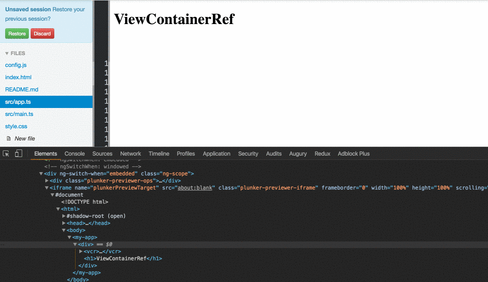
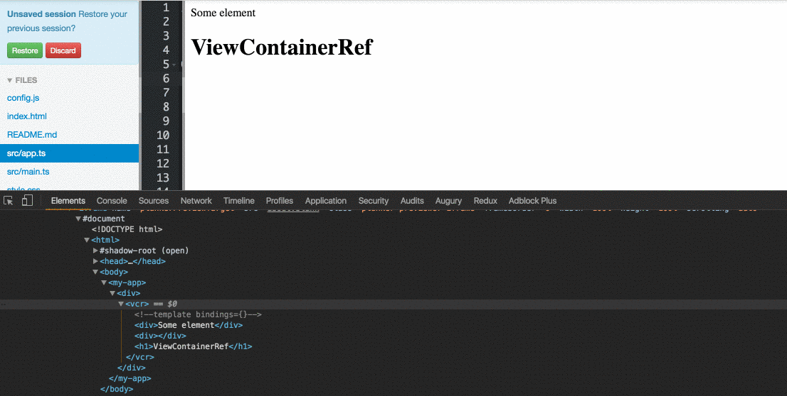
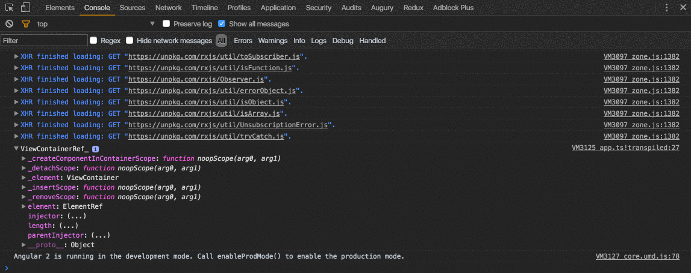

If you ever needed to insert new component or template programmatically, you probably used the `ViewContainerRef` service.

In reading articles and questions I see a lot of confusion about `ViewContainerRef` so let me try to explain to you what is `ViewContainerRef`.

**Note:** This article is not about how to programmatically create components.

Let’s start by going back to a pure JavaScript. Based on the markup below your task is to add a new paragraph as a sibling of the current one

```
<p class=”one”>Element one</p>
```

For the simplicity let’s use `JQuery`:

```
$('<p>Element two</p>').insertAfter('.one');
```

When you need to add new DOM element (i.e., component, template) you need a place to insert the element.

Angular is not magic; it’s just JavaScript. If you want to insert new component or template, you need to tell Angular where to put this element.

And that’s what ViewContainerRef is:

> A DOM element (container) where I can put your newly component as a sibling to this element.

#### Get ViewContainerRef with dependency injection:

<Embed src="https://gist.github.com/NetanelBasal/cead43251a3e36ad9a46483e5da93606.js" aspectRatio={0.357} caption="" />

We are injecting the service in the component. In this case, the container will refer to your `host` element ( the vcr element ) and the template will be inserted as a **sibling** of the vcr element.



#### Get ViewContainerRef with ViewChild:

<Embed src="https://gist.github.com/NetanelBasal/f3492fe0f29e81238c442784fd50424d.js" aspectRatio={0.357} caption="" />

We can use the `ViewChild` decorator to grab any element in our view and read him as `ViewContainerRef`.

In this example, the container element is the “div” element, and the template will be inserted as a **sibling** of this “div.”



You can also log the `ViewContainerRef` to see what the element is:



You can play with the code [here](https://plnkr.co/edit/lpTE2kjnQujW0Cprk3Pt?p=preview).

That’s all.

_☞_ **_Please tap or click “︎_**❤” _to help to promote this piece to others._
