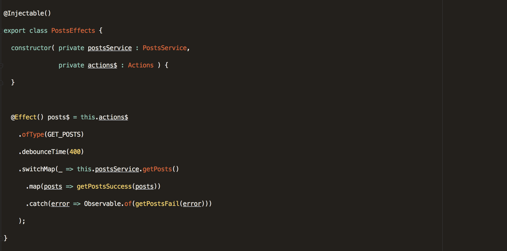

This post assumes that you at least have some working knowledge of Angular, Jasmine, and [@ngrx/effects](https://github.com/ngrx/effects).

If you have no prior knowledge on the subject, you can read my previous [articles](https://medium.com/front-end-hacking/managing-state-in-angular-apps-with-ngrx-store-and-ngrx-effects-part-1-a878addba622) and then come back.

Let’s start with a simple example that we can test. We’ll create a basic redux flow that will fetch blog posts from the server.

#### Build the Posts Reducer —

<Embed src="https://gist.github.com/NetanelBasal/d9c3431a20e9a20c860262bd1d050ee1.js" aspectRatio={0.357} caption="" />

#### Build the Posts Action Creators —

<Embed src="https://gist.github.com/NetanelBasal/d0e94cf7888fd144b1197ddaf590fda2.js" aspectRatio={0.357} caption="" />

Now let’s create the service that will be responsible for fetching the posts from the server.

#### Build the Posts Service —

<Embed src="https://gist.github.com/NetanelBasal/48016bfc974ca7c907a38b748d848b97.js" aspectRatio={0.357} caption="" />

#### Build the Posts Effects —

<Embed src="https://gist.github.com/NetanelBasal/cc3cadb741bc850073ae7f92ceb70cd7.js" aspectRatio={0.357} caption="" />

We need to listen to `GET_POSTS` action, then call our service and based on the response status to do the following thing:

-   If the response is successful, dispatch `GET_POSTS_SUCCESS` action with the result.
-   If the request fails, dispatch `GET_POSTS_FAIL` action with the error.

> These are the two cases we need to test

Let’s create the test and explain each part.

<Embed src="https://gist.github.com/NetanelBasal/01f942bbbc19a17d3d798b5ee7c34205.js" aspectRatio={0.357} caption="" />

`TestBed` creates an Angular testing module — an `@NgModule` class—that you configure with the `configureTestingModule` method to produce the module environment for the class you want to test.

The `configureTestingModule` method takes an `@NgModule`\-like metadata object. The metadata object can have most of the properties of a normal [Angular module](https://angular.io/docs/ts/latest/guide/ngmodule.html).

We need to import the `EffectsTestingModule` from `@ngrx/effects`. We also need two providers:

1.  The original `PostsEffects` .
2.  A mock of our `PostsService.get()` method.

_One of the reasons we want to mock the service_ `_get()_` _method is because we do not want to make an HTTP request. In addition to that, In this case, we do not care about the method implementation; we care about the result._

Let’s stop for a second to explain this piece.

<Embed src="https://gist.github.com/NetanelBasal/2a9b762055c04523e3655e1a4c1de74e.js" aspectRatio={0.357} caption="" />

`[jasmine.createSpyObj](https://jasmine.github.io/2.0/introduction.html#section-Spies:_%3Ccode%3EcreateSpyObj%3C/code%3E)` is used to create a mock that will spy on one or more methods. It returns an object that has a property for each string that is a spy.

What we are saying here is, Hey Angular when you need the `PostsService`, please provide this mock.

Next, we can get a reference to the `providers` with the help of the `[TestBed.get(provider)](https://angular.io/docs/ts/latest/guide/testing.html#!#testbed-get)` method.

<Embed src="https://gist.github.com/NetanelBasal/937afb35200e8e66abed55366a5f0e1f.js" aspectRatio={0.357} caption="" />

`EffectsRunner` is provided by the `EffectsTestingModule` .

Now we can write our first case.

<Embed src="https://gist.github.com/NetanelBasal/cf81094a54b93fb647212977b687b127.js" aspectRatio={0.357} caption="" />

`postsService.get()` is a jasmine spy, therefore we can control the return value. In this case, we are returning mock data.

Next, we are calling the `queue()` method that her job is to queue up actions.

The last thing we need to do is to subscribe to the `postEffects.get$` observable and check if the result is the same as our mock data.

Now, let’s test the second part.

<Embed src="https://gist.github.com/NetanelBasal/1ab4c285569162a3a773578e1e2725d4.js" aspectRatio={0.357} caption="" />

The same process as before, smooth and clean.

---

Let’s finish with a more advanced case, add `debounceTime` to our effect.

<Embed src="https://gist.github.com/NetanelBasal/6a6b5da6e552d968d4ad4d99bdb6dd68.js" aspectRatio={0.357} caption="" />

`[debounceTime](https://www.learnrxjs.io/operators/filtering/debouncetime.html)` discard emitted values that take less than the specified time between output.

> We need to control time

Luckily, Angular provides a function that does just that — `[fakeAsync](https://angular.io/docs/ts/latest/guide/testing.html#!#fake-async)`.

<Embed src="https://gist.github.com/NetanelBasal/192feb1858b7f707d383fa1a29996060.js" aspectRatio={0.357} caption="" />

We can “control” time with the `tick()` function. Calling `tick()` simulates the passage of time until all pending asynchronous activities finish.

When 400 milliseconds have not yet passed, the result should be `null`. Otherwise, the result should be what returns from the `getPostsFail('error')` function.

The final code.

<Embed src="https://gist.github.com/NetanelBasal/ea61c202ba0713f049ae85f4bc159ca2.js" aspectRatio={0.357} caption="" />

_Follow me on_ [_Medium_](https://medium.com/@NetanelBasal/) _or_ [_Twitter_](https://twitter.com/NetanelBasal) _to read more about Angular, Vue and JS!_
