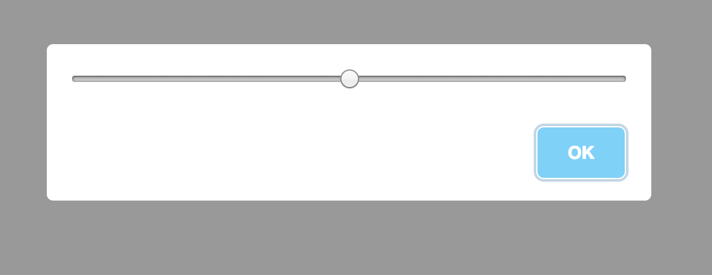
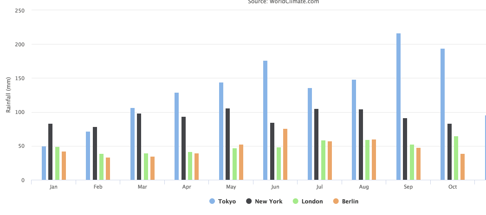

As developers, we aim to use existing libraries in order to avoid reinventing the wheel. Unfortunately, Angular is still relatively young, and we cannot find an Angular component for everything we need.

The purpose of this article is to demonstrate use cases in which Angular components can be connected with vanilla JS libraries.

### #Example One

For this example, we will use a 🆒 library called [Sweet Alert](https://sweetalert.js.org/).

> SweetAlert makes popup messages easy and pretty

One of the useful options that we can pass to the library is the `content` option, which is a **DOM element** that will be rendered inside the modal, for example:

<Embed src="https://gist.github.com/NetanelBasal/c2464450efeac41d80be7d43ebd9697d.js" aspectRatio={0.357} caption="" />

We can now take advantage of this and pass an Angular component as `content`. For this to work, we need to create a component [dynamically](https://netbasal.com/dynamically-creating-components-with-angular-a7346f4a982d). We create a simple component that can be passed to Sweet Alert.

<Embed src="https://gist.github.com/NetanelBasal/7bb510f0914f9a9fb556cf064e1c0437.js" aspectRatio={0.357} caption="" />

The next thing we need to do is to create the component.

<Embed src="https://gist.github.com/NetanelBasal/5b9bde2c89a41c0d2bbdee9475791365.js" aspectRatio={0.357} caption="" />

After we have created the component, we obtain a reference to the native DOM element, which is passed to the Sweet Alert `content` option.

In addition, of course, we can pass `Input()` if necessary.

<Embed src="https://gist.github.com/NetanelBasal/f9cb0e0110ce91d0a57153db24065694.js" aspectRatio={0.357} caption="" />

<Embed src="https://stackblitz.com/edit/angular-sweetalert?embed=1" aspectRatio={undefined} caption="Live demo from StackBlitz. Try editing the code yourself." />

### #Example Two

For this example, we will use a library called `highcharts`.

Many times we need to customize the chart tooltip with our markup. Various libraries like `highcharts` give us the option to pass an HTML **string** that will be rendered inside the tooltip.

Let’s create an Angular component and pass it to the library.

<Embed src="https://gist.github.com/NetanelBasal/4289373aae42a063c33d5cfc08ca838b.js" aspectRatio={0.357} caption="" />

We created a simple component that gets the data as `Input()` and displays it in a list. Now, let’s see how we can use it.

<Embed src="https://gist.github.com/NetanelBasal/e177d10a36c6f84e5ad04df54fea7df7.js" aspectRatio={0.357} caption="" />

First, we create the component once inside the `ngOnInit` hook. Inside the `formatter` callback, we have access to the chart `points` which pass to our component as `Input()`.

Next, we perform a change detection and returning the `innerHTML` that will be rendered inside the tooltip element.

<Embed src="https://stackblitz.com/edit/angular-qs6qpm?embed=1" aspectRatio={undefined} caption="Live demo from StackBlitz. Try editing the code yourself." />

### 👂🏻 **Last but Not Least, Have you Heard of Akita?**

Akita is a state management pattern that we’ve developed here in Datorama. It’s been successfully used in a big data production environment for over seven months, and we’re continually adding features to it.

Akita encourages simplicity. It saves you the hassle of creating boilerplate code and offers powerful tools with a moderate learning curve, suitable for both experienced and inexperienced developers alike.

I highly recommend checking it out.

[**🚀 Introducing Akita: A New State Management Pattern for Angular Applications**  
_Every developer knows state management is difficult. Continuously keeping track of what has been updated, why, and…_netbasal.com](https://netbasal.com/introducing-akita-a-new-state-management-pattern-for-angular-applications-f2f0fab5a8 "https://netbasal.com/introducing-akita-a-new-state-management-pattern-for-angular-applications-f2f0fab5a8")

_Follow me on_ [_Medium_](https://medium.com/@NetanelBasal/) _or_ [_Twitter_](https://twitter.com/NetanelBasal) _to read more about Angular, Akita and JS!_
