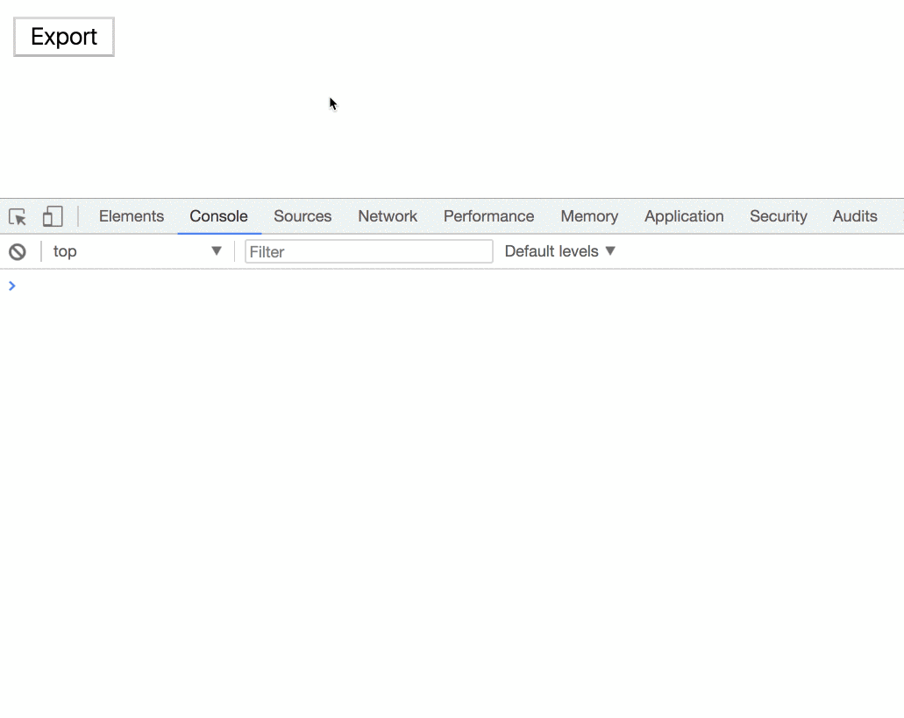

TypeScript 2.4 added support for dynamic `import()` expressions, which allow us to asynchronously load and execute **ECMAScript modules** on demand.

This means that we can conditionally and lazily import other modules and libraries.

In this article, we will see how we can leverage this feature in Angular, so we can produce a smaller bundle. Let’s take a real example from our application. ( [Datorama](https://datorama.com/) BTW )

We have a page full of widgets, and we provide our customers the ability to export them to Excel.

Under the hood, we are using a library called xlsx. It would be a waste to add the library to our initial bundle because each client will have to download and parse it even though he probably will not use it.

A better decision would be to lazy load the library when the user clicks on the export button.

Let’s see how we can do this.

<Embed src="https://gist.github.com/NetanelBasal/dc7e5de20f5c0905b4571d2850c406ff.js" aspectRatio={0.357} caption="With Promises" />

Assuming you’re working with the angular-cli, that’s all you have to do, otherwise, you will need to add the support yourself. ( webpack code splitting, etc. )

The cool thing is that we can use it with RxJS and add it to every stream. For example:

<Embed src="https://gist.github.com/NetanelBasal/cdd03f310d2d8d2e7d4afdf011d5ff38.js" aspectRatio={0.357} caption="With RXJS" />

The last thing that we need to do is simply [setting](https://ilikekillnerds.com/2017/07/module-es2015-typescript-2-4-dynamic-imports/) the `module` value in your `tsconfig.app.json` file to `esnext.`

_Follow me on_ [_Medium_](https://medium.com/@NetanelBasal/) _or_ [_Twitter_](https://twitter.com/NetanelBasal) _to read more about Angular, Vue and JS!_
