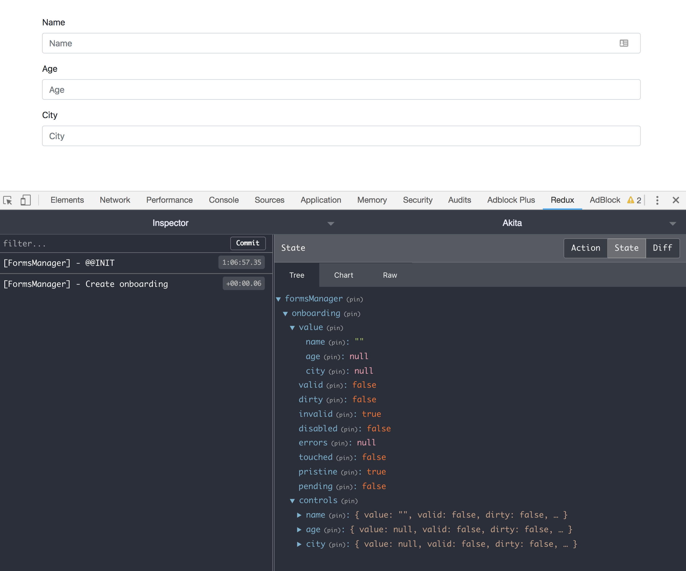
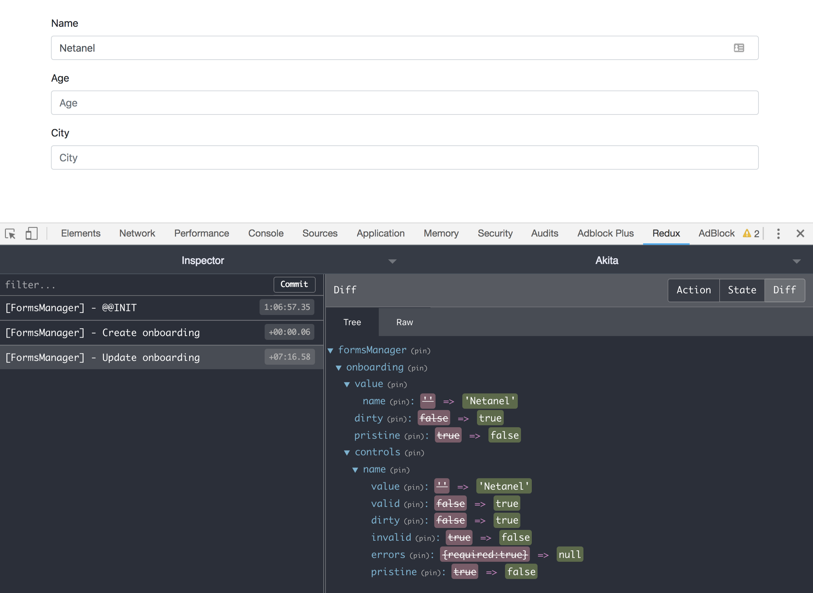

Seasons greetings from Datorama!

Our Akita elves have been hard at work adding tons of functionality based on your input. Here’s a list of all the new stuff we got:

### 🙌 Angular Forms Manager

The `AkitaNgFormsManager` let you sync Angular’s `formGroup`, `formControl`, and `formArray,` via a unique store created for that purpose. The store will hold the controls' data like values, validity, pristine status, errors, etc.

This is powerful, as it gives you the following abilities:

1.  It will automatically save the current control value and update the form value according to the value in the store when the user navigates back to the form.
2.  It provides an API so you can query a form’s values and properties from anywhere. This can be useful for things like multi-step forms, cross-component validation and more.

The goal in creating this was to work with the existing Angular form ecosystem, and save you the trouble of learning a new API. Let’s see how it works:

<Embed src="https://gist.github.com/NetanelBasal/f8ba46a62c58549cf1b081e7d60f2dff.js" aspectRatio={0.357} caption="" />

As you can see, we’re still working with the existing API in order to create a form in Angular. We’re injecting the `AkitaNgFormsManager` and calling the `upsert` method, giving it the form name and the `formGroup` (this will work also with a single `formControl` or `formArray`).

From that point on, `AkitaNgFormsManager` will track the form value changes and update the store accordingly.

For example, let’s type a name:

With this setup, you’ll have an extensive API to query the store from anywhere in your application. Here are a couple of examples:

<Embed src="https://gist.github.com/NetanelBasal/928ae7f96a34c6fe2dc09318543c8592.js" aspectRatio={0.357} caption="" />

You can find the source code including a playground [here](https://github.com/NetanelBasal/akita-ng-forms-manager). Check out the [documentation](https://netbasal.gitbook.io/akita/angular-plugins/angular-forms-manager) for further information.

### 🤠 Dynamic Stores

Starting from Akita’s latest version, we can pass the `storeName` in the constructor. This gives us the ability to create internal stores on the fly and also provide a store in a component's `[providers](https://netbasal.com/angular-services-do-not-have-to-be-singletons-ffa879e62082)` section, enabling us to get a new store instance for each component we create.

<Embed src="https://gist.github.com/NetanelBasal/a207e66cbabbbe2c189c97d9004cdc05.js" aspectRatio={0.357} caption="" />

<Embed src="https://gist.github.com/NetanelBasal/bb2d25e25b9c009916887ad59efc86a4.js" aspectRatio={0.357} caption="" />

And of course, you’ll see everything reflected in the redux dev-tools.

### 😎 Active Entity

It’s now possible to set the _next_ or _previous_ entity as active. For example:

<Embed src="https://gist.github.com/NetanelBasal/a704d1c9a95f51e9c25985d0f4d42afd.js" aspectRatio={0.357} caption="" />

By default, if the active entity is the last one and you select to activate the next entity, it will loop to the beginning and make the first one active. If you want to disable this behavior set the `wrap` parameter to `false`:

<Embed src="https://gist.github.com/NetanelBasal/aba5b18bfa164b7d7b07a491b1f73232.js" aspectRatio={0.357} caption="" />

### 😇 What’s More?

-   The `filterBy` option can now receive an `array` of filters as a parameter:

<Embed src="https://gist.github.com/NetanelBasal/f644cb6328c3dd7c1e1961358d523542.js" aspectRatio={0.357} caption="" />

-   There’s a new `upsert` (insert or update) method for entity store:

<Embed src="https://gist.github.com/NetanelBasal/bc7993cc6bc1d96a355719a0988e8c06.js" aspectRatio={0.357} caption="" />

-   We added [Reset stores functionality](https://engineering.datorama.com/how-to-secure-your-users-data-after-logout-in-akita-976e0a4ad84a).
-   It’s now possible to `prepend` an entity to the collection when adding a new one:

<Embed src="https://gist.github.com/NetanelBasal/673e01c58343f93c431e9696d85d6cc5.js" aspectRatio={0.357} caption="" />

-   `hasEntity()` can now receive an array of ids:

<Embed src="https://gist.github.com/NetanelBasal/a02dc9acb18f78c1b6d1e0fc23db643c.js" aspectRatio={0.357} caption="" />

Coming soon: a new `[FiltersPlugin](https://github.com/datorama/akita/pull/126)` that will give you the ability to easily manage multiple filters; Add, remove or update them.

### 😍 Join Akita’s Gitter Channel

As always, for any question or request, you’re welcome to join Akita’s Gitter Channel.
