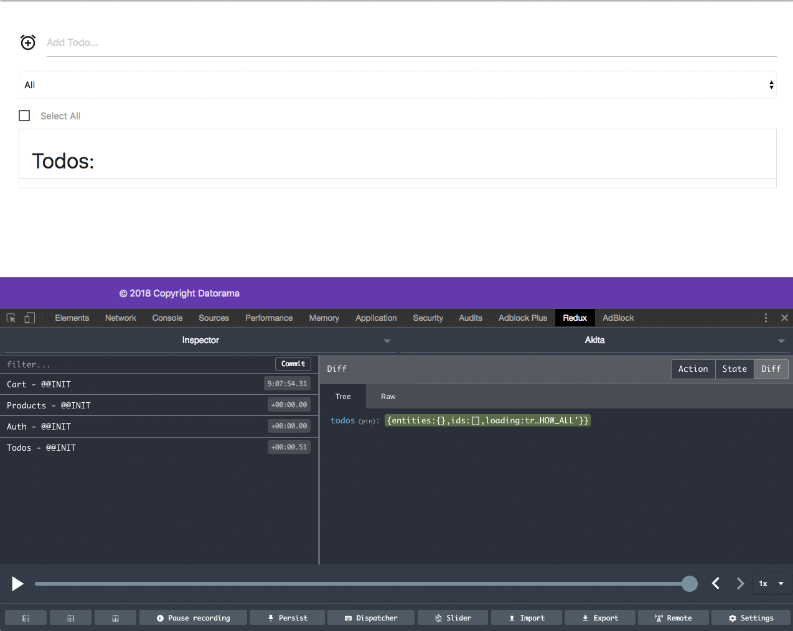
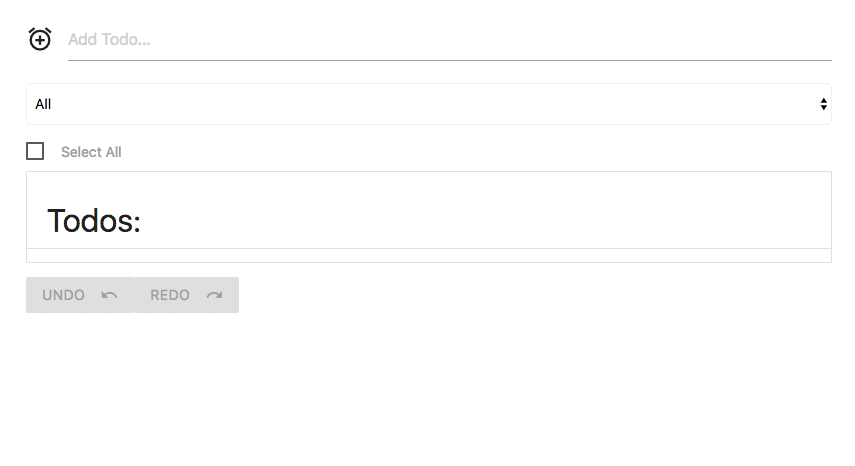
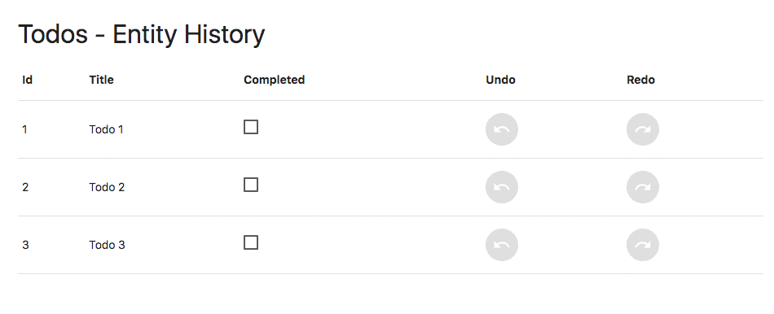
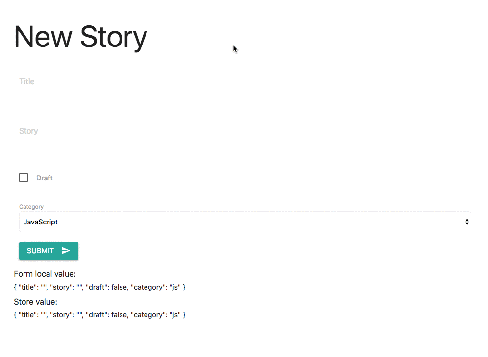
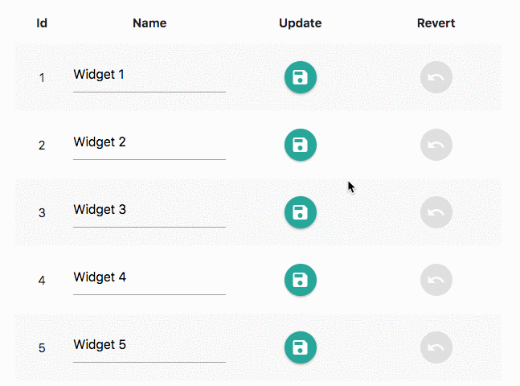

](./asset-1.png)

It’s only been three weeks since [Akita’s](https://github.com/datorama/akita) latest release and we’ve already come up with hot new features ! (v1.2.0)

### 😎 Redux Dev-tools

This was a feature that many of you requested and we are delivering. Akita provides integration with the Redux dev-tools chrome extension.

Install the Redux extension from the supported App stores ( [chrome](https://chrome.google.com/webstore/detail/redux-devtools/lmhkpmbekcpmknklioeibfkpmmfibljd?hl=en), [firefox](https://addons.mozilla.org/en-US/firefox/addon/remotedev/) ).

Call the `akitaDevtools()` function inside the app component, passing `ngZone`:

<Embed src="https://gist.github.com/NetanelBasal/29d6b8b4db04f2c27bae1c7d0de69116.js" aspectRatio={0.357} caption="" />

By default, Akita will do its best to describe the actions that occurred, but you can always define your own actions for **debugging purposes**. For example:

<Embed src="https://gist.github.com/NetanelBasal/4644dcd5cc1433d3018e277f9b796771.js" aspectRatio={0.357} caption="" />

You can also whitelist and blacklist actions, get a full log trace, and more. For further information check out the [docs](https://netbasal.gitbook.io/akita/enhancers/devtools).

### 💥 State History

The `StateHistoryPlugin` provides a convenient way for undo and redo functionality, saving you the trouble of maintaining a history in the app yourself.

To use it you should instantiate a new `StateHistoryPlugin` object, passing the `Query`:

<Embed src="https://gist.github.com/NetanelBasal/0e8ba5488dadae6a540fa3756fab1626.js" aspectRatio={0.357} caption="" />

From the moment you call it, Akita’s `StateHistory` tracks the history of the store and gives you functionality like `undo()`, `redo()`, `jumpToPast()`, `jumpToFuture()` and more.

#### **EntityStateHistoryPlugin**

In addition to the general history functionality, Akita also provides a powerful API to help keep track of one or many entities, instead of the entire store.

A good example is when you have a table or a list of entities that the users can modify, and you want to give them a way to undo/redo their changes per entity. Here is how you can do it:

<Embed src="https://gist.github.com/NetanelBasal/e760d20474b8de65655b182496d5b04a.js" aspectRatio={0.357} caption="" />

With this setup you will get the functionality mentioned above per entity.

For further information check out the [docs](https://netbasal.gitbook.io/akita/plugins/state-history).

### 💪🏻 Persist Form

The `PersistFormPlugin` helps to keep your form synced with your store. One common scenario is preventing your user from losing data he filled in a form, after navigating away without saving it.

Lets say we’re building a form for adding new stories:

<Embed src="https://gist.github.com/NetanelBasal/4738452c644a6f1863c26b7b3856238f.js" aspectRatio={0.357} caption="" />

We can call the `PersistNgFormPlugin`, passing the `StoriesQuery`, the `FormGroup`, and a factory function which knows how to create a story.

With this setup, Akita does the following:

1.  Creates a new key in your store’s root (called `akitaForm`) and initializes it with the result of the provided factory function.
2.  Listens to any change in the form and syncs it with the store.
3.  Updates the form value according to the store value when the user navigates back to the form.

For further information check out the [docs](https://netbasal.gitbook.io/akita/plugins/persist-form).

### ⭐️ Dirty Check

The `DirtyCheckPlugin` is useful for cases when you want an indication whether the state is dirty (data in the store has been modified). For example, you may want to display a save button only if the user changes something.

To activate the plugin you need to create a new instance of `DirtyCheckPlugin`, providing it with the `Query`:

<Embed src="https://gist.github.com/NetanelBasal/e2ebb22c88d41bb387e3688fe4eab1ef.js" aspectRatio={0.357} caption="" />

From the moment you call `setHead()`, Akita's `DirtyCheckPlugin` takes the current store snapshot and saves it as the head (the value that we compare against). With every change to the store the plugin will compare it to the head value and notify you whether the state is dirty.

<Embed src="https://gist.github.com/NetanelBasal/72bc687b7fa19f4f77b2536e2101dd07.js" aspectRatio={0.357} caption="" />

By calling `reset()` you are telling the plugin to update the store with the head value.

#### **EntityDirtyCheckPlugin**

As with the `StateHistoryPlugin`, this plugin also supports entity level functionality.

A good example is when you have a table or a list of entities that the users can modify, and you want to give them a way to revert it per entity. Here is how you can do it:

<Embed src="https://gist.github.com/NetanelBasal/dc8c4d48d2d8657fa290e699ed278034.js" aspectRatio={0.357} caption="" />

With this setup you can track the dirtiness per entity and revert it.

<Embed src="https://gist.github.com/NetanelBasal/549ec4325cec77c989475ec259022169.js" aspectRatio={0.357} caption="" />

For further information check out the [docs](https://netbasal.gitbook.io/akita/plugins/dirty-check).

### 👉🏻 Miscellaneous

-   `filterNil` — New operator that filters undefined and null values.

<Embed src="https://gist.github.com/NetanelBasal/3b14371cc3e3bf9e07ffc4904b85cee1.js" aspectRatio={0.357} caption="" />

-   `isEmpty()` — New entity query method that returns a boolean which indicates whether the entity store is empty.

<Embed src="https://gist.github.com/NetanelBasal/0caf70337274665f0f2c09373fa2b565.js" aspectRatio={0.357} caption="" />

-   **Plugins ecosystem** — We have new plugins ecosystem that all our current plugins are built on. We’ll explore this topic in another article, showing you how you can create your own plugins.

As always, we would ❤️ to hear more feedback and new feature requests from you.

Here is more great content about Akita:

[**🚀 Introducing Akita: A New State Management Pattern for Angular Applications**  
_Every developer knows state management is difficult. Continuously keeping track of what has been updated, why, and…_netbasal.com](https://netbasal.com/introducing-akita-a-new-state-management-pattern-for-angular-applications-f2f0fab5a8 "https://netbasal.com/introducing-akita-a-new-state-management-pattern-for-angular-applications-f2f0fab5a8")

[**👷 Building a Shopping Cart in Angular Using Akita**  
_This is the second part of the introduction to Akita (the first part can be found here). In this part, we’ll create…_engineering.datorama.com](https://engineering.datorama.com/building-a-shopping-cart-in-angular-using-akita-c41f6a6f7255 "https://engineering.datorama.com/building-a-shopping-cart-in-angular-using-akita-c41f6a6f7255")

[**Working with Normalized Data in Akita and Angular**  
_In this article, we’ll build an Angular application which lists movies which arrive from a nested API response. We’ll…_netbasal.com](https://netbasal.com/working-with-normalized-data-in-akita-e626d4c67ca4 "https://netbasal.com/working-with-normalized-data-in-akita-e626d4c67ca4")

[**🚀 What’s New in Akita v1.1.0 🔥**  
_It’s only been two weeks since Akita’s initial announcement, and the response has been tremendous. We want to thank…_engineering.datorama.com](https://engineering.datorama.com/whats-new-in-akita-v1-1-0-a9ec885ebfdc "https://engineering.datorama.com/whats-new-in-akita-v1-1-0-a9ec885ebfdc")

[**datorama/akita**  
_akita - 🚀 Simple and Effective State Management for Angular Applications_github.com](https://github.com/datorama/akita "https://github.com/datorama/akita")
